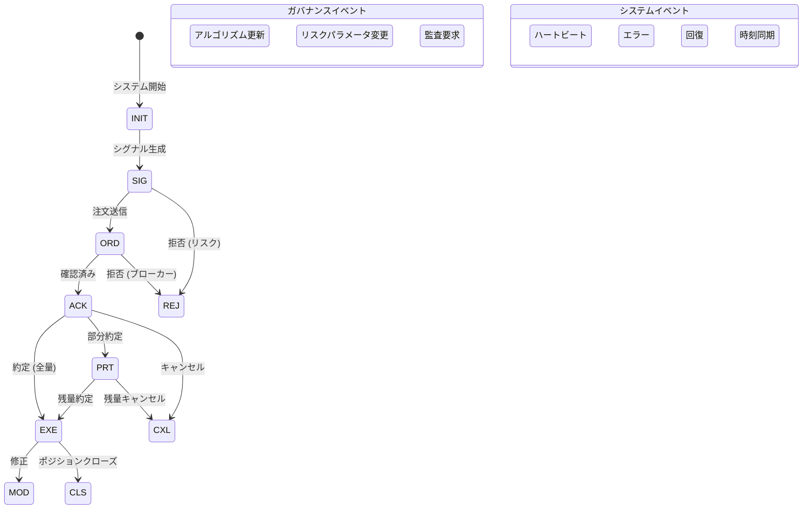

# VeritasChain Protocol (VCP) 仕様書
## バージョン 1.0

**ステータス:** 本番環境対応  
**カテゴリ:** 金融技術 / 監査標準  
**日付:** 2025-11-25  
**メンテナー:** VeritasChain Standards Organization (VSO)  
**ライセンス:** CC BY 4.0 International  
**ウェブサイト:** https://veritaschain.org

---

## 目次

1. [はじめに](#1-はじめに)
2. [準拠レベル](#2-準拠レベル)
3. [イベントライフサイクル](#3-イベントライフサイクル)
4. [データモデル](#4-データモデル)
5. [拡張モジュール](#5-拡張モジュール)
6. [完全性とセキュリティレイヤー](#6-完全性とセキュリティレイヤー)
7. [実装ガイドライン](#7-実装ガイドライン)
8. [規制コンプライアンス](#8-規制コンプライアンス)
9. [テスト要件](#9-テスト要件)
10. [レガシーシステムからの移行](#10-レガシーシステムからの移行)
11. [付録](#11-付録)
12. [参考文献](#12-参考文献)

---

## 1. はじめに

### 1.1 目的

VeritasChain Protocol (VCP) は、アルゴリズム取引における「意思決定」と「実行結果」を改ざん不可能かつ検証可能な形式で記録するグローバル標準仕様です。VCPは暗号学的に保護された証拠の連鎖を提供し、取引業務における真実（"Veritas"）を確立します。国際規制（MiFID II、GDPR、EU AI Act）および新興の耐量子セキュリティ要件への準拠を保証します。

### 1.2 適用範囲

VCPは以下のシステムに適用されます：
- **高頻度取引（HFT）**システム
- **アルゴリズムおよびAI駆動型取引**プラットフォーム
- **リテール取引システム**（MT4/MT5）
- **暗号通貨取引所**
- **規制報告システム**

### 1.3 バージョニング

VCPはセマンティックバージョニング2.0.0を採用：
- **MAJOR**バージョン：互換性のないAPI変更
- **MINOR**バージョン：後方互換性のある機能追加
- **PATCH**バージョン：後方互換性のあるバグ修正

v1.xシリーズ内では完全な後方互換性を保証します。

### 1.4 暗号アジリティ

VCPは将来を見据えたセキュリティのために暗号アジリティを実装：
- **現在のデフォルト**: Ed25519（パフォーマンスとセキュリティに最適化）
- **サポート済みアルゴリズム**: Ed25519、ECDSA_SECP256K1、RSA_2048
- **将来対応予定**: 耐量子アルゴリズム（DILITHIUM、FALCON）
- **移行パス**: 自動アルゴリズムアップグレード機能

### 1.5 標準列挙型

#### 1.5.1 SignAlgo列挙型

| 値 | アルゴリズム | 説明 | ステータス |
|-------|-----------|-------------|---------|
| **ED25519** | Ed25519 | Edwards曲線デジタル署名 | デフォルト |
| **ECDSA_SECP256K1** | ECDSA secp256k1 | Bitcoin/Ethereum互換 | サポート済み |
| **RSA_2048** | RSA 2048-bit | レガシーシステム | 非推奨 |
| **DILITHIUM2** | CRYSTALS-Dilithium | 耐量子（NISTレベル2） | 将来対応 |
| **FALCON512** | FALCON-512 | 耐量子（NISTレベル1） | 将来対応 |

#### 1.5.2 HashAlgo列挙型

| 値 | アルゴリズム | 説明 | ステータス |
|-------|-----------|-------------|---------|
| **SHA256** | SHA-256 | SHA-2ファミリー、256ビット | デフォルト |
| **SHA3_256** | SHA3-256 | SHA-3ファミリー、256ビット | サポート済み |
| **BLAKE3** | BLAKE3 | 高性能ハッシュ | サポート済み |
| **SHA3_512** | SHA3-512 | SHA-3ファミリー、512ビット | 将来対応 |

#### 1.5.3 ClockSyncStatus列挙型

| 値 | 説明 | 適用レベル |
|-------|-------------|-------------------|
| **PTP_LOCKED** | PTP同期（ロック状態） | Platinum |
| **NTP_SYNCED** | NTP同期済み | Gold |
| **BEST_EFFORT** | ベストエフォート同期 | Silver |
| **UNRELIABLE** | 信頼性の低い同期 | Silver（劣化） |

#### 1.5.4 TimestampPrecision列挙型

| 値 | 説明 | 小数点以下桁数 |
|-------|-------------|----------------|
| **NANOSECOND** | ナノ秒精度 | 9 |
| **MICROSECOND** | マイクロ秒精度 | 6 |
| **MILLISECOND** | ミリ秒精度 | 3 |

### 1.6 コアモジュール

- **VCP-CORE**: 標準ヘッダーとセキュリティレイヤー
- **VCP-TRADE**: 取引データペイロードスキーマ
- **VCP-GOV**: アルゴリズムガバナンスとAI透明性
- **VCP-RISK**: リスク管理パラメータ記録
- **VCP-PRIVACY**: 暗号シュレッディングによるプライバシー保護
- **VCP-RECOVERY**: チェーン中断回復メカニズム

### 1.7 標準化ロードマップ

**フェーズ1（2025年第1-2四半期）**: 業界標準化
- v1.0仕様リリース
- FIX Trading Communityとの提携
- 早期採用プログラムの確立

**フェーズ2（2025年第3-4四半期）**: 国際標準化
- ISO/TC 68（金融サービス）への提出
- IETF標準との整合
- 耐量子アップグレードパス

---

## 2. 準拠レベル

### 2.1 レベル定義

| レベル | 対象 | 時刻同期 | シリアライゼーション | 署名 | アンカー | 精度 |
|------|--------|------------|---------------|-----------|---------|-----------|
| **Platinum** | HFT/取引所 | PTPv2 (<1µs) | SBE | Ed25519（ハードウェア） | 10分 | NANOSECOND |
| **Gold** | プロップ/機関投資家 | NTP (<1ms) | JSON | Ed25519（クライアント） | 1時間 | MICROSECOND |
| **Silver** | リテール/MT4/5 | ベストエフォート | JSON | Ed25519（委任） | 24時間 | MILLISECOND |

### 2.2 レベル別要件

#### 2.2.1 Platinumレベル
```yaml
要件:
  時刻:
    プロトコル: PTPv2 (IEEE 1588-2019)
    精度: <1マイクロ秒
    ステータス: PTP_LOCKED必須
  パフォーマンス:
    スループット: >100万イベント/秒
    レイテンシ: <10µs/イベント
    ストレージ: バイナリ (SBE/FlatBuffers)
  実装:
    言語: [C++, Rust, FPGA]
    技術: [カーネルバイパス, RDMA, ゼロコピー]
```

#### 2.2.2 Goldレベル
```yaml
要件:
  時刻:
    プロトコル: NTP/Chrony
    精度: <1ミリ秒
    ステータス: NTP_SYNCED必須
  パフォーマンス:
    スループット: >10万イベント/秒
    レイテンシ: <100µs/イベント
    永続化: WAL/キュー必須 (Kafka, Redis)
  実装:
    言語: [Python, Java, C#]
    デプロイメント: クラウド対応 (AWS/GCP/Azure)
```

#### 2.2.3 Silverレベル
```yaml
要件:
  時刻:
    プロトコル: システム時刻
    精度: ベストエフォート
    ステータス: BEST_EFFORT/UNRELIABLE許容
  パフォーマンス:
    スループット: >1000イベント/秒
    レイテンシ: <1秒
    通信: 非同期推奨
  実装:
    言語: [MQL5, Python]
    互換性: MT4/MT5 DLL統合
```

---

## 3. イベントライフサイクル

### 3.1 イベント状態図



### 3.2 イベントタイプレジストリ

#### 3.2.1 固定イベントタイプコード

**重要**: これらのコードは後方互換性のため不変です。新しいコードは追加のみ可能で、修正は不可です。

```
取引イベント (1-19):
1  = SIG    // シグナル/決定生成
2  = ORD    // 注文送信
3  = ACK    // 注文確認
4  = EXE    // 全量約定
5  = PRT    // 部分約定
6  = REJ    // 注文拒否
7  = CXL    // 注文キャンセル
8  = MOD    // 注文修正
9  = CLS    // ポジションクローズ
10-19       // 将来の取引イベント用に予約

ガバナンスイベント (20-39):
20 = ALG    // アルゴリズム更新
21 = RSK    // リスクパラメータ変更
22 = AUD    // 監査要求
23-39       // 将来のガバナンスイベント用に予約

市場データイベント (40-59):
40-59       // 将来の市場データイベント用に予約

コンプライアンスイベント (60-79):
60-79       // 将来のコンプライアンスイベント用に予約

インフラストラクチャイベント (80-89):
80-89       // 将来のインフラストラクチャイベント用に予約

システムイベント (90-109):
98 = HBT    // ハートビート
99 = ERR    // エラー
100 = REC   // 回復
101 = SNC   // 時刻同期ステータス
102-109     // 将来のシステムイベント用に予約

拡張イベント (110-255):
110-255     // カスタム実装用に予約
```

---

## 4. データモデル

### 4.1 VCP-CORE: 標準ヘッダー

#### 4.1.1 必須ヘッダーフィールド

| タグ | フィールド | 型 | 説明 | 要件 |
|-----|-------|------|-------------|--------------|
| 1001 | **EventID** | UUID | 一意のイベント識別子 | UUID v7（時系列ソート可能）またはv4を使用必須 |
| 1002 | **TraceID** | UUID | トランザクショントレースID（CAT Rule 613） | UUID v7推奨 |
| 1010 | **Timestamp** | Int64 | Unixエポックからのナノ秒（UTC） | セッション内で単調増加必須 |
| 1011 | **EventType** | Int8 | イベントタイプコード | イベントタイプコード参照（セクション3.2.1） |
| 1012 | **TimestampPrecision** | Enum | タイムスタンプ精度レベル | TimestampPrecision列挙型参照（セクション1.5.4） |
| 1013 | **ClockSyncStatus** | Enum | 時刻同期ステータス | ClockSyncStatus列挙型参照（セクション1.5.3） |
| 1014 | **HashAlgo** | Enum | ハッシュアルゴリズム識別子 | HashAlgo列挙型参照（セクション1.5.2） |
| 1020 | **VenueID** | String | ブローカー/取引所識別子 | 該当する場合ISO 10383 MICコード |
| 1030 | **Symbol** | String | 取引シンボル | 正規化形式必須 |
| 1040 | **AccountID** | String | アカウント識別子 | 仮名化必須 |
| 1050 | **OperatorID** | String | オペレーター識別子（オプション） | 手動介入追跡用 |

#### 4.1.2 JSONスキーマ例

```json
{
  "EventID": "01934e3a-7b2c-7f93-8f2a-1234567890ab",
  "TraceID": "01934e3a-6a1b-7c82-9d1b-0987654321dc",
  "Timestamp": 1732358400000000000,
  "EventType": 2,
  "TimestampPrecision": "NANOSECOND",
  "ClockSyncStatus": "PTP_LOCKED",
  "HashAlgo": "SHA256",
  "VenueID": "XNAS",
  "Symbol": "AAPL",
  "AccountID": "acc_h7g8i9j0k1",
  "OperatorID": null
}
```

### 4.2 VCP-TRADE: 取引ペイロード

#### 4.2.1 標準取引フィールド

| タグ | フィールド | 型 | 説明 | フォーマット要件 |
|-----|-------|------|-------------|-------------------|
| 2001 | **OrderID** | String | クライアント注文ID | セッション内で一意 |
| 2002 | **BrokerOrderID** | String | ブローカー注文ID | ブローカー応答より |
| 2003 | **ExchangeOrderID** | String | 取引所注文ID | 取引所より |
| 2010 | **Side** | Enum | BUY/SELL | 大文字のみ |
| 2011 | **OrderType** | Enum | MARKET/LIMIT/STOP/STOP_LIMIT | 標準FIX値 |
| 2020 | **Price** | String | 注文価格 | **精度保持のため文字列必須** |
| 2021 | **Quantity** | String | 注文数量 | **精度保持のため文字列必須** |
| 2022 | **ExecutedQty** | String | 約定数量 | **精度保持のため文字列必須** |
| 2023 | **RemainingQty** | String | 残数量 | **精度保持のため文字列必須** |
| 2030 | **Currency** | String | 取引通貨 | ISO 4217コード |
| 2031 | **ExecutionPrice** | String | 実際の約定価格 | **精度保持のため文字列必須** |
| 2040 | **Commission** | String | 手数料額 | **精度保持のため文字列必須** |
| 2041 | **Slippage** | String | スリッページ額 | **精度保持のため文字列必須** |
| 2050 | **RejectReason** | String | 拒否理由 | 標準化コード |

#### 4.2.2 重要な精度要件

**IEEE 754精度問題**: RFC 8785（JCS）によるデータ整合性を維持するため、すべての金融数値はJSON シリアライゼーションで文字列としてエンコード必須：

```json
{
  "Price": "123.456789",        // ✓ 正しい: 文字列
  "Quantity": "1000.00",         // ✓ 正しい: 文字列
  "ExecutedQty": "750.50",       // ✓ 正しい: 文字列
  "Commission": "2.345678901"    // ✓ 正しい: 文字列が精度を保持
}
```

使用不可:
```json
{
  "Price": 123.456789,           // ✗ 誤り: 浮動小数点は精度を失う
  "Quantity": 1000               // ✗ 誤り: 数値型
}
```

---

## 5. 拡張モジュール

### 5.1 VCP-GOV: アルゴリズムガバナンスとAI透明性

AI説明可能性（XAI）、ルールベースロジック、およびガバナンス要件（EU AI Act）を統合。

#### 5.1.1 スキーマ定義

```json
{
  "VCP-GOV": {
    "Version": "1.0",
    "AlgorithmIdentification": {
      "AlgoID": "uuid",
      "AlgoVersion": "string",
      "AlgoType": "enum",              // AI_MODEL, RULE_BASED, HYBRID
      "ModelType": "string",            // NeuralNetwork, RandomForest, etc.
      "ModelHash": "string"             // モデルパラメータのSHA-256
    },
    "Governance": {
      "RiskClassification": "enum",    // HIGH/MEDIUM/LOW (EU AI Act)
      "LastApprovalBy": "OperatorID",  // 人間による監督
      "ApprovalTimestamp": "int64",
      "TestingRecordLink": "uri",      // バックテスト結果
      "AuditTrailID": "uuid"          // 監査記録へのリンク
    },
    "DecisionFactors": {
      "Features": [
        {
          "Name": "string",
          "Value": "string",            // 精度保持のため常に文字列
          "Weight": "string",
          "Contribution": "string"      // SHAP/LIME値
        }
      ],
      "ConfidenceScore": "string",     // 0.0-1.0を文字列として
      "ExplainabilityMethod": "enum",  // SHAP/LIME/GRADCAM/RULE_TRACE
      "RuleTrace": ["rule_id_1", "rule_id_2"]  // ルールベース用
    },
    "PerformanceMetadata": {
      "CalculationMethod": "enum",     // SYNC, ASYNC, SAMPLED
      "SamplingRate": "string",        // 1.0=100%, 0.1=10%
      "LatencyImpact": "string"        // 追加されたマイクロ秒
    }
  }
}
```

### 5.2 VCP-RISK: リスク管理スナップショット

イベント時のアクティブなリスク管理パラメータを記録。

#### 5.2.1 スキーマ定義

```json
{
  "VCP-RISK": {
    "Version": "1.0",
    "RiskProfile": {
      "ProfileID": "string",
      "ProfileVersion": "string",
      "LastModified": "int64"
    },
    "AppliedControls": [
      "ThrottleLimit",
      "MaxOrderSize",
      "FatFingerCheck",
      "PositionLimit",
      "VaRLimit"
    ],
    "ParametersSnapshot": {
      "MaxOrderSize": "1000000",
      "MaxPositionSize": "5000000",
      "DailyExposureLimit": "50000000",
      "ExposureUtilization": "0.75",
      "VaRLimit": "100000",
      "CurrentVaR": "67890.50",
      "ThrottleRate": "100",          // 注文数/秒
      "CircuitBreakerStatus": "NORMAL"
    },
    "TriggeredControls": [
      {
        "ControlName": "MaxOrderSize",
        "TriggerValue": "1500000",
        "Action": "REJECT",
        "Timestamp": "int64"
      }
    ]
  }
}
```

### 5.3 VCP-PRIVACY: 暗号シュレッディングによるプライバシー保護

GDPR準拠のプライバシーと暗号シュレッディング機能を実装。

#### 5.3.1 スキーマ定義

```json
{
  "VCP-PRIVACY": {
    "Version": "1.0",
    "DataClassification": "enum",      // PUBLIC/INTERNAL/CONFIDENTIAL/RESTRICTED
    "PrivacyMethod": "enum",           // CLEAR/PSEUDONYMIZED/ENCRYPTED/REDACTED
    "Pseudonymization": {
      "Method": "AES-256-GCM",
      "KeyID": "uuid",                 // 鍵管理への参照
      "Purpose": "string",             // Regulatory/Analytics/Audit
      "RetentionPeriod": "P7Y"         // ISO 8601期間
    },
    "ConsentReference": "uuid",        // GDPR同意追跡
    "DataSubjectRights": {
      "Erasure": "CRYPTO_SHREDDING",   // 削除方法
      "Portability": "JSON_EXPORT",
      "AccessLogID": "uuid"
    }
  }
}
```

### 5.4 VCP-RECOVERY: チェーン中断回復

チェーンブレークと回復シナリオを処理。

#### 5.4.1 スキーマ定義

```json
{
  "VCP-RECOVERY": {
    "Version": "1.0",
    "RecoveryType": "enum",            // CHAIN_BREAK/FORK/REORG/CHECKPOINT
    "BreakPoint": {
      "LastValidEventID": "uuid",
      "LastValidHash": "string",
      "BreakTimestamp": "int64",
      "BreakReason": "string"
    },
    "RecoveryAction": {
      "Method": "enum",                // REBUILD/SKIP/MERGE/CHECKPOINT
      "RecoveredEvents": 42,
      "ValidationMethod": "string",
      "OperatorID": "string"           // 回復を承認した者
    },
    "ChainValidation": {
      "PreBreakHash": "string",
      "PostRecoveryHash": "string",
      "MerkleProof": ["hash1", "hash2"],
      "AnchorReference": "string"      // 外部アンカーポイント
    }
  }
}
```

---

## 6. 完全性とセキュリティレイヤー (VCP-SEC)

### 6.1 ハッシュチェーン実装

#### 6.1.1 イベントハッシュ計算

```python
def calculate_event_hash(header: dict, payload: dict, prev_hash: str, algo: str = "SHA256") -> str:
    """
    RFC 8785正規化によるイベントハッシュ計算
    """
    # ステップ1: JSON正規化 (RFC 8785 JCS)
    canonical_header = canonicalize_json(header)
    canonical_payload = canonicalize_json(payload)
    
    # ステップ2: コンポーネント連結
    hash_input = canonical_header + canonical_payload + prev_hash
    
    # ステップ3: ハッシュ関数適用
    if algo == "SHA256":
        return hashlib.sha256(hash_input.encode()).hexdigest()
    elif algo == "SHA3_256":
        return hashlib.sha3_256(hash_input.encode()).hexdigest()
    elif algo == "BLAKE3":
        return blake3(hash_input.encode()).hexdigest()
    else:
        raise ValueError(f"サポートされていないハッシュアルゴリズム: {algo}")
```

#### 6.1.2 チェーン検証

```python
def validate_chain(events: List[dict]) -> bool:
    """
    ハッシュチェーン整合性の検証
    """
    prev_hash = GENESIS_HASH  # "0000000000000000..."
    
    for event in events:
        # ハッシュ再計算
        calculated_hash = calculate_event_hash(
            event["Header"],
            event["Payload"],
            prev_hash,
            event["Header"]["HashAlgo"]
        )
        
        # 保存されたハッシュと照合
        if calculated_hash != event["Security"]["EventHash"]:
            return False
            
        prev_hash = calculated_hash
        
    return True
```

### 6.2 デジタル署名

#### 6.2.1 署名要件

| SignAlgo列挙型 | 用途 | 鍵サイズ | パフォーマンス | 耐量子 |
|---------------|----------|----------|-------------|-------------------|
| **ED25519** | デフォルト | 256ビット | 最速 | いいえ |
| **ECDSA_SECP256K1** | Bitcoin互換性 | 256ビット | 高速 | いいえ |
| **RSA_2048** | レガシーシステム | 2048ビット | 低速 | いいえ |
| **DILITHIUM2** | 将来（予約） | 2420バイト | 中速 | はい |
| **FALCON512** | 将来（予約） | 897バイト | 高速 | はい |

#### 6.2.2 署名生成

```python
def sign_event(event_hash: str, private_key: bytes, algo: str = "ED25519") -> str:
    """
    デジタル署名生成
    """
    if algo == "ED25519":
        signing_key = Ed25519SigningKey(private_key)
        signature = signing_key.sign(event_hash.encode())
        return base64.b64encode(signature).decode()
    elif algo == "ECDSA_SECP256K1":
        # ECDSA実装
        pass
    elif algo == "RSA_2048":
        # RSA実装（レガシー）
        pass
    else:
        raise ValueError(f"サポートされていない署名アルゴリズム: {algo}")
```

### 6.3 マークルツリーアンカリング

#### 6.3.1 RFC 6962準拠（Certificate Transparency）

**必須**: マークルツリー構築は第二原像攻撃を防ぐため、RFC 6962に準拠必須：

```python
def merkle_hash(data: bytes, leaf: bool = True) -> bytes:
    """
    RFC 6962準拠のマークルツリーハッシング
    """
    if leaf:
        # リーフノード: 0x00プレフィックス
        return hashlib.sha256(b'\x00' + data).digest()
    else:
        # 内部ノード: 0x01プレフィックス
        return hashlib.sha256(b'\x01' + data).digest()
```

#### 6.3.2 アンカリングスケジュール

| レベル | 頻度 | アンカー対象 | 証明タイプ |
|------|-----------|---------------|------------|
| **Platinum** | 10分 | ブロックチェーン/TSA | 完全マークル証明 |
| **Gold** | 1時間 | TSA/データベース | マークルルート + パス |
| **Silver** | 24時間 | データベース/ファイル | マークルルートのみ |

---

## 7. 実装ガイドライン

### 7.1 言語別推奨事項

#### 7.1.1 C++ (Platinumレベル)

```cpp
// 推奨ライブラリ
#include <sbe/sbe.hpp>           // Simple Binary Encoding
#include <sodium.h>              // libsodium for Ed25519
#include <folly/futures.hpp>     // 非同期処理
#include <spdk/nvme.h>          // NVMeダイレクトアクセス

// パフォーマンス最適化
- ロックフリーデータ構造の使用 (boost::lockfree)
- ゼロコピーシリアライゼーションの実装
- コンパイラ最適化の有効化 (-O3, -march=native)
- メモリプールを使用した割り当て
```

#### 7.1.2 Python (Goldレベル)

```python
# 推奨パッケージ
import asyncio                  # 非同期I/O
import orjson                   # 高速JSON
import msgpack                  # バイナリシリアライゼーション
from cryptography.hazmat.primitives import serialization
from cryptography.hazmat.primitives.asymmetric import ed25519
import redis                    # 永続化キュー
import aiokafka                # 非同期Kafkaクライアント

# パフォーマンス最適化
- asyncioにuvloopを使用
- コネクションプーリングの実装
- WAL用にRedis streamsやKafkaを使用
- cProfile/py-spyでプロファイリング
```

#### 7.1.3 MQL5 (Silverレベル)

```mql5
// 推奨アプローチ
#import "VCP.dll"
   int  VCP_Initialize(string config);
   int  VCP_LogEvent(string event_json);
   void VCP_Shutdown();
#import

// 非同期通信パターン
void OnTimer() {
   // キューからイベントを処理
   string event;
   while(EventQueue.Dequeue(event)) {
      VCP_LogEvent(event);
   }
}

// 重要: ノンブロッキング用に非同期WebRequestまたはDLLを使用
```

### 7.2 パフォーマンス要件

#### 7.2.1 レイテンシ予算

| 操作 | Platinum | Gold | Silver |
|-----------|----------|------|--------|
| イベント作成 | <1µs | <10µs | <1ms |
| シリアライゼーション | <1µs | <5µs | <10ms |
| ハッシング | <500ns | <2µs | <5ms |
| 署名 | <5µs | <50µs | <100ms |
| 永続化 | <5µs | <100µs | <1s |
| 合計 | <10µs | <100µs | <1s |

#### 7.2.2 スループット要件

| メトリック | Platinum | Gold | Silver |
|--------|----------|------|--------|
| イベント/秒 | >100万 | >10万 | >1000 |
| バッチサイズ | 1000 | 100 | 1 |
| キュー深度 | 1000万 | 100万 | 1万 |
| メモリ使用量 | <10GB | <1GB | <100MB |

### 7.3 エラー処理

#### 7.3.1 エラーカテゴリ

```yaml
エラーカテゴリ:
  CLOCK_SYNC_FAILURE:
    重要度: CRITICAL
    アクション: UNRELIABLEステータスへ降格
    回復: 60秒ごとに再同期を試行
    
  HASH_CHAIN_BREAK:
    重要度: CRITICAL
    アクション: VCP-RECOVERYをトリガー
    回復: 最後のアンカーから再構築
    
  SIGNATURE_FAILURE:
    重要度: HIGH
    アクション: 鍵ローテーションでリトライ
    回復: オペレーターへエスカレーション
    
  SERIALIZATION_ERROR:
    重要度: MEDIUM
    アクション: 生データをログ
    回復: 修正して再実行
    
  NETWORK_TIMEOUT:
    重要度: LOW
    アクション: リトライ用にキュー
    回復: 指数バックオフ
```

---

## 8. 規制コンプライアンス

### 8.1 MiFID II準拠

| 要件 | 条項 | VCP実装 |
|-------------|---------|-------------------|
| 最良執行 | 第27条 | VCP-TRADE（執行価格、スリッページ） |
| アルゴ取引 | 第17条 | VCP-GOV（アルゴリズム識別） |
| 記録保持 | RTS 24 | VCP-CORE（7年間保持） |
| 時刻同期 | RTS 25 | ClockSyncStatusフィールド |

### 8.2 CAT Rule 613 (米国)

| 要件 | VCP実装 |
|-------------|-------------------|
| 顧客アカウントID | AccountID（仮名化） |
| 注文トレースID | TraceID (UUID v7) |
| タイムスタンプ粒度 | ナノ秒精度 |
| 注文ライフサイクル | 完全なイベントチェーン |

### 8.3 GDPR準拠

| 権利 | 条項 | VCP実装 |
|-------|---------|-------------------|
| 消去 | 第17条 | VCP-PRIVACYによる暗号シュレッディング |
| ポータビリティ | 第20条 | JSONエクスポート機能 |
| 訂正 | 第16条 | 追記のみの修正 |
| アクセス | 第15条 | フィルター付きデータエクスポート |

### 8.4 EU AI Act準拠

| 要件 | 条項 | VCP実装 |
|-------------|---------|-------------------|
| 記録保持 | 第12条 | VCP-CORE自動ロギング |
| リスク管理 | 第9条 | VCP-GOV RiskClassification, VCP-RISK |
| データガバナンス | 第10条 | VCP-GOV AlgorithmIdentification |
| 透明性 | 第13条 | VCP-GOV DecisionFactors |
| 人間の監督 | 第14条 | OperatorID, LastApprovalBy |

---

## 9. テスト要件

### 9.1 適合性テストスイート

#### 9.1.1 コアテスト

```yaml
コアテスト:
  - UUID生成:
      検証: UUID v7時刻順序
      反復: 100万回
      
  - タイムスタンプ単調性:
      検証: 厳密に増加するタイムスタンプ
      期間: 24時間
      
  - ハッシュチェーン整合性:
      検証: チェーン検証
      イベント: 1000万
      
  - 精度保持:
      検証: 数値の文字列エンコーディング
      値: ["0.00000001", "999999999999.999999999"]
```

#### 9.1.2 パフォーマンステスト

```yaml
パフォーマンステスト:
  Platinum:
    スループット: ">100万イベント/秒"
    レイテンシ: "p99 <10µs"
    期間: "24時間"
    
  Gold:
    スループット: ">10万イベント/秒"
    レイテンシ: "p99 <100µs"
    期間: "8時間"
    
  Silver:
    スループット: ">1000イベント/秒"
    レイテンシ: "p99 <1秒"
    期間: "1時間"
```

### 9.2 セキュリティテスト

```yaml
セキュリティテスト:
  - 暗号検証:
      アルゴリズム: [Ed25519, ECDSA, SHA-256, SHA3-256]
      ベクトル: NISTテストベクトル
      
  - チェーン操作:
      攻撃: [挿入, 削除, 並び替え, 改ざん]
      期待値: すべて検出
      
  - タイミング攻撃:
      対象: 署名検証
      要件: 定数時間操作
```

---

## 10. レガシーシステムからの移行

### 10.1 AUPからVCPへ

| AUPコンポーネント | VCP相当 | 移行アクション |
|---------------|----------------|------------------|
| AUP-CORE | VCP-CORE | ClockSyncStatus、HashAlgoを追加 |
| AUP-TRADE | VCP-TRADE | 文字列エンコーディングを保証 |
| AUP-AI + AUP-ALG | VCP-GOV | マージして強化 |
| (新規) | VCP-RISK | リスクスナップショットを追加 |
| AUP-PRIVACY | VCP-PRIVACY | 暗号シュレッディングを追加 |
| AUP-RECOVERY | VCP-RECOVERY | 検証を強化 |

### 10.2 移行戦略

```yaml
フェーズ1_並行実行:
  期間: 30日
  モード: シャドウロギング
  検証: 出力を比較
  
フェーズ2_段階的切り替え:
  期間: 30日
  モード: パーセンテージベース
  ロールバック: エラー時自動
  
フェーズ3_完全移行:
  検証: 99.99%互換性
  認証: VSO承認
```

---

## 11. 付録

### 付録A: 標準イベントコード

```yaml
イベントコード:
  取引:
    1-19: 注文ライフサイクル
    20-29: ポジション管理
    30-39: リスクイベント
    
  ガバナンス:
    40-49: アルゴリズム更新
    50-59: コンプライアンスイベント
    60-69: 監査証跡
    
  システム:
    90-99: インフラストラクチャ
    100-109: 回復
    110-119: モニタリング
```

### 付録B: エラーコード

```yaml
エラーコード:
  1xxx: 検証エラー
  2xxx: セキュリティエラー
  3xxx: システムエラー
  4xxx: ネットワークエラー
  5xxx: コンプライアンスエラー
```

### 付録C: タイムスタンプフォーマット例

```json
{
  "例": {
    "ナノ秒": 1732358400123456789,
    "マイクロ秒": 1732358400123456,
    "ミリ秒": 1732358400123,
    "ISO8601": "2025-11-25T12:00:00.123456789Z"
  }
}
```

---

## 12. 参考文献

### 標準
- **RFC 9562**: Universally Unique IDentifier (UUID) v7
- **RFC 8785**: JSON Canonicalization Scheme (JCS)
- **RFC 6962**: Certificate Transparency
- **RFC 3161**: Time-Stamp Protocol (TSP)
- **IEEE 1588-2019**: Precision Time Protocol (PTP)
- **ISO 20022**: Universal financial industry message scheme

### 規制
- **MiFID II**: 金融商品市場指令
- **RTS 24/25**: 規制技術基準
- **CAT Rule 613**: 統合監査証跡
- **GDPR**: 一般データ保護規則
- **EU AI Act**: 人工知能法（2024）

### 暗号
- **FIPS 186-5**: デジタル署名標準
- **NIST SP 800-208**: 耐量子暗号
- **RFC 8032**: Edwards曲線デジタル署名アルゴリズム (EdDSA)

### 実装
- **FIXプロトコル**: Financial Information eXchange
- **SBE**: Simple Binary Encoding
- **FlatBuffers**: メモリ効率的シリアライゼーションライブラリ
- **Apache Kafka**: 分散イベントストリーミング
- **Redis Streams**: インメモリデータ構造ストア

---

## バージョン履歴

| バージョン | 日付 | 変更内容 | 著者 |
|---------|------|---------|--------|
| 1.0 | 2025-11-25 | 固定イベントタイプコードと標準化列挙型定義による初期リリース | VSOテクニカル委員会 |

---

## 連絡先情報

**VeritasChain Standards Organization (VSO)**  
ウェブサイト: https://veritaschain.org  
メール: standards@veritaschain.org  
GitHub: https://github.com/veritaschain/vcp-spec  
技術サポート: https://support.veritaschain.org

---

## ライセンス

本仕様書はCreative Commons Attribution 4.0 International (CC BY 4.0)の下でライセンスされています。

以下の行為が許可されます:
- **共有**: いかなる媒体やフォーマットでも資料をコピーおよび再配布
- **翻案**: 資料のリミックス、変形、および構築

以下の条件の下で:
- **表示**: VSOへの適切なクレジット表示が必要

---

## 謝辞

VeritasChain Protocolは以下の方々の協力により開発されました:
- 金融業界実務者
- 規制コンプライアンス専門家
- 暗号研究者
- オープンソースコミュニティ貢献者

貴重なフィードバックを提供していただいた早期採用者およびベータテスターの皆様に感謝いたします。

---

*VeritasChain Protocol (VCP) 仕様書 v1.0 終了*