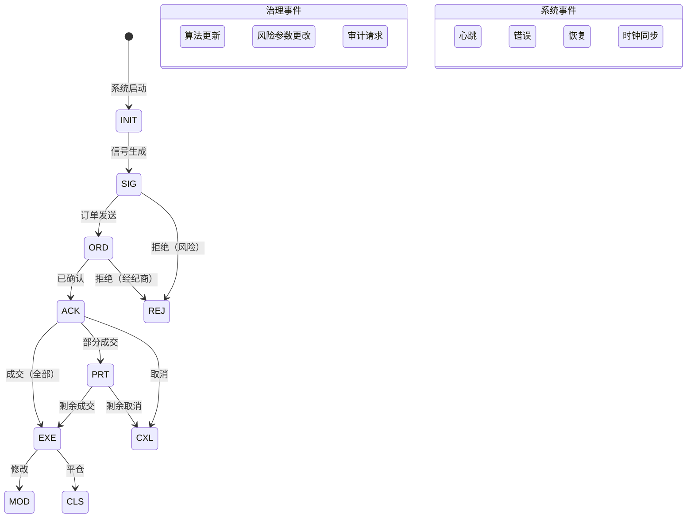

# VeritasChain Protocol (VCP) 规范
## 版本 1.0

**状态:** 生产就绪  
**类别:** 金融技术 / 审计标准  
**日期:** 2025-11-25  
**维护方:** VeritasChain Standards Organization (VSO)  
**许可证:** CC BY 4.0 International  
**网站:** https://veritaschain.org

---

## 目录

1. [简介](#1-简介)
2. [合规层级](#2-合规层级)
3. [事件生命周期](#3-事件生命周期)
4. [数据模型](#4-数据模型)
5. [扩展模块](#5-扩展模块)
6. [完整性和安全层](#6-完整性和安全层)
7. [实施指南](#7-实施指南)
8. [监管合规](#8-监管合规)
9. [测试要求](#9-测试要求)
10. [从遗留系统迁移](#10-从遗留系统迁移)
11. [附录](#11-附录)
12. [参考文献](#12-参考文献)

---

## 1. 简介

### 1.1 目的

VeritasChain Protocol (VCP) 是一个全球标准规范，用于以不可变和可验证的格式记录算法交易的"决策制定"和"执行结果"。VCP提供加密保护的证据链，在交易操作中建立真实性（"Veritas"），确保符合国际法规，包括MiFID II、GDPR、EU AI Act和新兴的抗量子安全要求。

### 1.2 范围

VCP适用于：
- **高频交易（HFT）**系统
- **算法和AI驱动交易**平台
- **零售交易系统**（MT4/MT5）
- **加密货币交易所**
- **监管报告系统**

### 1.3 版本控制

VCP采用语义化版本2.0.0：
- **主版本**：不兼容的API更改
- **次版本**：向后兼容的功能添加
- **补丁版本**：向后兼容的错误修复

在v1.x系列中保证完全向后兼容。

### 1.4 加密敏捷性

VCP实现加密敏捷性以确保未来证明的安全性：
- **当前默认**：Ed25519（性能和安全优化）
- **支持的算法**：Ed25519、ECDSA_SECP256K1、RSA_2048
- **未来预留**：后量子算法（DILITHIUM、FALCON）
- **迁移路径**：自动算法升级能力

### 1.5 标准枚举

#### 1.5.1 SignAlgo枚举

| 值 | 算法 | 描述 | 状态 |
|-------|-----------|-------------|---------|
| **ED25519** | Ed25519 | Edwards曲线数字签名 | 默认 |
| **ECDSA_SECP256K1** | ECDSA secp256k1 | Bitcoin/Ethereum兼容 | 支持 |
| **RSA_2048** | RSA 2048位 | 遗留系统 | 已弃用 |
| **DILITHIUM2** | CRYSTALS-Dilithium | 后量子（NIST级别2） | 未来 |
| **FALCON512** | FALCON-512 | 后量子（NIST级别1） | 未来 |

#### 1.5.2 HashAlgo枚举

| 值 | 算法 | 描述 | 状态 |
|-------|-----------|-------------|---------|
| **SHA256** | SHA-256 | SHA-2系列，256位 | 默认 |
| **SHA3_256** | SHA3-256 | SHA-3系列，256位 | 支持 |
| **BLAKE3** | BLAKE3 | 高性能哈希 | 支持 |
| **SHA3_512** | SHA3-512 | SHA-3系列，512位 | 未来 |

#### 1.5.3 ClockSyncStatus枚举

| 值 | 描述 | 层级适用性 |
|-------|-------------|-------------------|
| **PTP_LOCKED** | PTP同步锁定 | Platinum |
| **NTP_SYNCED** | NTP已同步 | Gold |
| **BEST_EFFORT** | 尽力而为同步 | Silver |
| **UNRELIABLE** | 无可靠同步 | Silver（降级） |

#### 1.5.4 TimestampPrecision枚举

| 值 | 描述 | 小数位数 |
|-------|-------------|----------------|
| **NANOSECOND** | 纳秒精度 | 9 |
| **MICROSECOND** | 微秒精度 | 6 |
| **MILLISECOND** | 毫秒精度 | 3 |

### 1.6 核心模块

- **VCP-CORE**：标准头和安全层
- **VCP-TRADE**：交易数据有效载荷模式
- **VCP-GOV**：算法治理和AI透明度
- **VCP-RISK**：风险管理参数记录
- **VCP-PRIVACY**：使用加密粉碎的隐私保护
- **VCP-RECOVERY**：链中断恢复机制

### 1.7 标准化路线图

**第一阶段（2025年Q1-Q2）**：行业标准化
- 发布v1.0规范
- 与FIX交易社区合作
- 建立早期采用者计划

**第二阶段（2025年Q3-Q4）**：国际标准化
- 提交给ISO/TC 68（金融服务）
- 与IETF标准对齐
- 量子抗性升级路径

---

## 2. 合规层级

### 2.1 层级定义

| 层级 | 目标 | 时钟同步 | 序列化 | 签名 | 锚定 | 精度 |
|------|--------|------------|---------------|-----------|---------|-----------|
| **Platinum** | HFT/交易所 | PTPv2 (<1µs) | SBE | Ed25519（硬件） | 10分钟 | NANOSECOND |
| **Gold** | 自营/机构 | NTP (<1ms) | JSON | Ed25519（客户端） | 1小时 | MICROSECOND |
| **Silver** | 零售/MT4/5 | 尽力而为 | JSON | Ed25519（委托） | 24小时 | MILLISECOND |

### 2.2 层级特定要求

#### 2.2.1 Platinum层级
```yaml
要求:
  时钟:
    协议: PTPv2 (IEEE 1588-2019)
    精度: <1微秒
    状态: 需要PTP_LOCKED
  性能:
    吞吐量: >100万事件/秒
    延迟: <10µs每事件
    存储: 二进制 (SBE/FlatBuffers)
  实施:
    语言: [C++, Rust, FPGA]
    技术: [内核旁路, RDMA, 零拷贝]
```

#### 2.2.2 Gold层级
```yaml
要求:
  时钟:
    协议: NTP/Chrony
    精度: <1毫秒
    状态: 需要NTP_SYNCED
  性能:
    吞吐量: >10万事件/秒
    延迟: <100µs每事件
    持久化: 需要WAL/队列 (Kafka, Redis)
  实施:
    语言: [Python, Java, C#]
    部署: 云就绪 (AWS/GCP/Azure)
```

#### 2.2.3 Silver层级
```yaml
要求:
  时钟:
    协议: 系统时间
    精度: 尽力而为
    状态: 接受BEST_EFFORT/UNRELIABLE
  性能:
    吞吐量: >1千事件/秒
    延迟: <1秒
    通信: 推荐异步
  实施:
    语言: [MQL5, Python]
    兼容性: MT4/MT5 DLL集成
```

---

## 3. 事件生命周期

### 3.1 事件状态图



### 3.2 事件类型注册表

#### 3.2.1 固定事件类型代码

**关键**：这些代码对于向后兼容性是不可变的。只能添加新代码，永不修改。

```
交易事件 (1-19):
1  = SIG    // 信号/决策生成
2  = ORD    // 订单发送
3  = ACK    // 订单确认
4  = EXE    // 全部执行
5  = PRT    // 部分成交
6  = REJ    // 订单拒绝
7  = CXL    // 订单取消
8  = MOD    // 订单修改
9  = CLS    // 平仓
10-19       // 为未来交易事件保留

治理事件 (20-39):
20 = ALG    // 算法更新
21 = RSK    // 风险参数更改
22 = AUD    // 审计请求
23-39       // 为未来治理事件保留

市场数据事件 (40-59):
40-59       // 为未来市场数据事件保留

合规事件 (60-79):
60-79       // 为未来合规事件保留

基础设施事件 (80-89):
80-89       // 为未来基础设施事件保留

系统事件 (90-109):
98 = HBT    // 心跳
99 = ERR    // 错误
100 = REC   // 恢复
101 = SNC   // 时钟同步状态
102-109     // 为未来系统事件保留

扩展事件 (110-255):
110-255     // 为自定义实施保留
```

---

## 4. 数据模型

### 4.1 VCP-CORE：标准头

#### 4.1.1 必需头字段

| 标签 | 字段 | 类型 | 描述 | 要求 |
|-----|-------|------|-------------|--------------|
| 1001 | **EventID** | UUID | 唯一事件标识符 | 必须使用UUID v7（时间可排序）或v4 |
| 1002 | **TraceID** | UUID | 交易跟踪ID（CAT规则613） | 推荐UUID v7 |
| 1010 | **Timestamp** | Int64 | 自Unix纪元以来的纳秒（UTC） | 会话内必须单调递增 |
| 1011 | **EventType** | Int8 | 事件类型代码 | 见事件类型代码（第3.2.1节） |
| 1012 | **TimestampPrecision** | 枚举 | 时间戳精度级别 | 见TimestampPrecision枚举（第1.5.4节） |
| 1013 | **ClockSyncStatus** | 枚举 | 时钟同步状态 | 见ClockSyncStatus枚举（第1.5.3节） |
| 1014 | **HashAlgo** | 枚举 | 哈希算法标识符 | 见HashAlgo枚举（第1.5.2节） |
| 1020 | **VenueID** | 字符串 | 经纪商/交易所标识符 | 适用时ISO 10383 MIC代码 |
| 1030 | **Symbol** | 字符串 | 交易符号 | 需要标准化格式 |
| 1040 | **AccountID** | 字符串 | 账户标识符 | 必须假名化 |
| 1050 | **OperatorID** | 字符串 | 操作员标识符（可选） | 用于手动干预跟踪 |

#### 4.1.2 JSON模式示例

```json
{
  "EventID": "01934e3a-7b2c-7f93-8f2a-1234567890ab",
  "TraceID": "01934e3a-6a1b-7c82-9d1b-0987654321dc",
  "Timestamp": 1732358400000000000,
  "EventType": 2,
  "TimestampPrecision": "NANOSECOND",
  "ClockSyncStatus": "PTP_LOCKED",
  "HashAlgo": "SHA256",
  "VenueID": "XNAS",
  "Symbol": "AAPL",
  "AccountID": "acc_h7g8i9j0k1",
  "OperatorID": null
}
```

### 4.2 VCP-TRADE：交易有效载荷

#### 4.2.1 标准交易字段

| 标签 | 字段 | 类型 | 描述 | 格式要求 |
|-----|-------|------|-------------|-------------------|
| 2001 | **OrderID** | 字符串 | 客户订单ID | 每会话唯一 |
| 2002 | **BrokerOrderID** | 字符串 | 经纪商订单ID | 来自经纪商响应 |
| 2003 | **ExchangeOrderID** | 字符串 | 交易所订单ID | 来自交易所 |
| 2010 | **Side** | 枚举 | BUY/SELL | 仅大写 |
| 2011 | **OrderType** | 枚举 | MARKET/LIMIT/STOP/STOP_LIMIT | 标准FIX值 |
| 2020 | **Price** | 字符串 | 订单价格 | **必须是字符串以保持精度** |
| 2021 | **Quantity** | 字符串 | 订单数量 | **必须是字符串以保持精度** |
| 2022 | **ExecutedQty** | 字符串 | 执行数量 | **必须是字符串以保持精度** |
| 2023 | **RemainingQty** | 字符串 | 剩余数量 | **必须是字符串以保持精度** |
| 2030 | **Currency** | 字符串 | 交易货币 | ISO 4217代码 |
| 2031 | **ExecutionPrice** | 字符串 | 实际成交价格 | **必须是字符串以保持精度** |
| 2040 | **Commission** | 字符串 | 佣金金额 | **必须是字符串以保持精度** |
| 2041 | **Slippage** | 字符串 | 滑点金额 | **必须是字符串以保持精度** |
| 2050 | **RejectReason** | 字符串 | 拒绝原因 | 标准化代码 |

#### 4.2.2 关键精度要求

**IEEE 754精度问题**：为了使用RFC 8785（JCS）保持数据完整性，所有金融数值必须在JSON序列化中编码为字符串：

```json
{
  "Price": "123.456789",        // ✓ 正确：字符串
  "Quantity": "1000.00",         // ✓ 正确：字符串
  "ExecutedQty": "750.50",       // ✓ 正确：字符串
  "Commission": "2.345678901"    // ✓ 正确：字符串保持精度
}
```

切勿使用：
```json
{
  "Price": 123.456789,           // ✗ 错误：浮点数失去精度
  "Quantity": 1000               // ✗ 错误：数字类型
}
```

---

## 5. 扩展模块

### 5.1 VCP-GOV：算法治理和AI透明度

集成AI可解释性（XAI）、基于规则的逻辑和治理要求（EU AI法案）。

#### 5.1.1 模式定义

```json
{
  "VCP-GOV": {
    "Version": "1.0",
    "AlgorithmIdentification": {
      "AlgoID": "uuid",
      "AlgoVersion": "string",
      "AlgoType": "enum",              // AI_MODEL, RULE_BASED, HYBRID
      "ModelType": "string",            // NeuralNetwork, RandomForest等
      "ModelHash": "string"             // 模型参数的SHA-256
    },
    "Governance": {
      "RiskClassification": "enum",    // HIGH/MEDIUM/LOW (EU AI法案)
      "LastApprovalBy": "OperatorID",  // 人工监督
      "ApprovalTimestamp": "int64",
      "TestingRecordLink": "uri",      // 回测结果
      "AuditTrailID": "uuid"          // 审计记录链接
    },
    "DecisionFactors": {
      "Features": [
        {
          "Name": "string",
          "Value": "string",            // 始终为字符串以保持精度
          "Weight": "string",
          "Contribution": "string"      // SHAP/LIME值
        }
      ],
      "ConfidenceScore": "string",     // 0.0-1.0作为字符串
      "ExplainabilityMethod": "enum",  // SHAP/LIME/GRADCAM/RULE_TRACE
      "RuleTrace": ["rule_id_1", "rule_id_2"]  // 用于基于规则
    },
    "PerformanceMetadata": {
      "CalculationMethod": "enum",     // SYNC, ASYNC, SAMPLED
      "SamplingRate": "string",        // 1.0=100%, 0.1=10%
      "LatencyImpact": "string"        // 添加的微秒数
    }
  }
}
```

### 5.2 VCP-RISK：风险管理快照

记录事件时的活动风险管理参数。

#### 5.2.1 模式定义

```json
{
  "VCP-RISK": {
    "Version": "1.0",
    "RiskProfile": {
      "ProfileID": "string",
      "ProfileVersion": "string",
      "LastModified": "int64"
    },
    "AppliedControls": [
      "ThrottleLimit",
      "MaxOrderSize",
      "FatFingerCheck",
      "PositionLimit",
      "VaRLimit"
    ],
    "ParametersSnapshot": {
      "MaxOrderSize": "1000000",
      "MaxPositionSize": "5000000",
      "DailyExposureLimit": "50000000",
      "ExposureUtilization": "0.75",
      "VaRLimit": "100000",
      "CurrentVaR": "67890.50",
      "ThrottleRate": "100",          // 每秒订单数
      "CircuitBreakerStatus": "NORMAL"
    },
    "TriggeredControls": [
      {
        "ControlName": "MaxOrderSize",
        "TriggerValue": "1500000",
        "Action": "REJECT",
        "Timestamp": "int64"
      }
    ]
  }
}
```

### 5.3 VCP-PRIVACY：使用加密粉碎的隐私保护

实施符合GDPR的隐私和加密粉碎能力。

#### 5.3.1 模式定义

```json
{
  "VCP-PRIVACY": {
    "Version": "1.0",
    "DataClassification": "enum",      // PUBLIC/INTERNAL/CONFIDENTIAL/RESTRICTED
    "PrivacyMethod": "enum",           // CLEAR/PSEUDONYMIZED/ENCRYPTED/REDACTED
    "Pseudonymization": {
      "Method": "AES-256-GCM",
      "KeyID": "uuid",                 // 密钥管理参考
      "Purpose": "string",             // Regulatory/Analytics/Audit
      "RetentionPeriod": "P7Y"         // ISO 8601持续时间
    },
    "ConsentReference": "uuid",        // GDPR同意跟踪
    "DataSubjectRights": {
      "Erasure": "CRYPTO_SHREDDING",   // 删除方法
      "Portability": "JSON_EXPORT",
      "AccessLogID": "uuid"
    }
  }
}
```

### 5.4 VCP-RECOVERY：链中断恢复

处理链断裂和恢复场景。

#### 5.4.1 模式定义

```json
{
  "VCP-RECOVERY": {
    "Version": "1.0",
    "RecoveryType": "enum",            // CHAIN_BREAK/FORK/REORG/CHECKPOINT
    "BreakPoint": {
      "LastValidEventID": "uuid",
      "LastValidHash": "string",
      "BreakTimestamp": "int64",
      "BreakReason": "string"
    },
    "RecoveryAction": {
      "Method": "enum",                // REBUILD/SKIP/MERGE/CHECKPOINT
      "RecoveredEvents": 42,
      "ValidationMethod": "string",
      "OperatorID": "string"           // 授权恢复者
    },
    "ChainValidation": {
      "PreBreakHash": "string",
      "PostRecoveryHash": "string",
      "MerkleProof": ["hash1", "hash2"],
      "AnchorReference": "string"      // 外部锚点
    }
  }
}
```

---

## 6. 完整性和安全层 (VCP-SEC)

### 6.1 哈希链实施

#### 6.1.1 事件哈希计算

```python
def calculate_event_hash(header: dict, payload: dict, prev_hash: str, algo: str = "SHA256") -> str:
    """
    使用RFC 8785规范化计算事件哈希
    """
    # 步骤1：JSON规范化（RFC 8785 JCS）
    canonical_header = canonicalize_json(header)
    canonical_payload = canonicalize_json(payload)
    
    # 步骤2：连接组件
    hash_input = canonical_header + canonical_payload + prev_hash
    
    # 步骤3：应用哈希函数
    if algo == "SHA256":
        return hashlib.sha256(hash_input.encode()).hexdigest()
    elif algo == "SHA3_256":
        return hashlib.sha3_256(hash_input.encode()).hexdigest()
    elif algo == "BLAKE3":
        return blake3(hash_input.encode()).hexdigest()
    else:
        raise ValueError(f"不支持的哈希算法：{algo}")
```

#### 6.1.2 链验证

```python
def validate_chain(events: List[dict]) -> bool:
    """
    验证哈希链完整性
    """
    prev_hash = GENESIS_HASH  # "0000000000000000..."
    
    for event in events:
        # 重新计算哈希
        calculated_hash = calculate_event_hash(
            event["Header"],
            event["Payload"],
            prev_hash,
            event["Header"]["HashAlgo"]
        )
        
        # 与存储的哈希验证
        if calculated_hash != event["Security"]["EventHash"]:
            return False
            
        prev_hash = calculated_hash
        
    return True
```

### 6.2 数字签名

#### 6.2.1 签名要求

| SignAlgo枚举 | 用例 | 密钥大小 | 性能 | 量子抗性 |
|---------------|----------|----------|-------------|-------------------|
| **ED25519** | 默认 | 256位 | 最快 | 否 |
| **ECDSA_SECP256K1** | Bitcoin兼容性 | 256位 | 快速 | 否 |
| **RSA_2048** | 遗留系统 | 2048位 | 慢速 | 否 |
| **DILITHIUM2** | 未来（保留） | 2420字节 | 中等 | 是 |
| **FALCON512** | 未来（保留） | 897字节 | 快速 | 是 |

#### 6.2.2 签名生成

```python
def sign_event(event_hash: str, private_key: bytes, algo: str = "ED25519") -> str:
    """
    生成数字签名
    """
    if algo == "ED25519":
        signing_key = Ed25519SigningKey(private_key)
        signature = signing_key.sign(event_hash.encode())
        return base64.b64encode(signature).decode()
    elif algo == "ECDSA_SECP256K1":
        # ECDSA实施
        pass
    elif algo == "RSA_2048":
        # RSA实施（遗留）
        pass
    else:
        raise ValueError(f"不支持的签名算法：{algo}")
```

### 6.3 Merkle树锚定

#### 6.3.1 RFC 6962合规（证书透明度）

**强制**：Merkle树构建必须遵循RFC 6962以防止第二原像攻击：

```python
def merkle_hash(data: bytes, leaf: bool = True) -> bytes:
    """
    RFC 6962合规的Merkle树哈希
    """
    if leaf:
        # 叶节点：0x00前缀
        return hashlib.sha256(b'\x00' + data).digest()
    else:
        # 内部节点：0x01前缀
        return hashlib.sha256(b'\x01' + data).digest()
```

#### 6.3.2 锚定计划

| 层级 | 频率 | 锚定目标 | 证明类型 |
|------|-----------|---------------|------------|
| **Platinum** | 10分钟 | 区块链/TSA | 完整Merkle证明 |
| **Gold** | 1小时 | TSA/数据库 | Merkle根+路径 |
| **Silver** | 24小时 | 数据库/文件 | 仅Merkle根 |

---

## 7. 实施指南

### 7.1 特定语言建议

#### 7.1.1 C++ (Platinum层级)

```cpp
// 推荐库
#include <sbe/sbe.hpp>           // Simple Binary Encoding
#include <sodium.h>              // libsodium for Ed25519
#include <folly/futures.hpp>     // 异步处理
#include <spdk/nvme.h>          // NVMe直接访问

// 性能优化
- 使用无锁数据结构 (boost::lockfree)
- 实施零拷贝序列化
- 启用编译器优化 (-O3, -march=native)
- 使用内存池进行分配
```

#### 7.1.2 Python (Gold层级)

```python
# 推荐包
import asyncio                  # 异步I/O
import orjson                   # 快速JSON
import msgpack                  # 二进制序列化
from cryptography.hazmat.primitives import serialization
from cryptography.hazmat.primitives.asymmetric import ed25519
import redis                    # 持久化队列
import aiokafka                # 异步Kafka客户端

# 性能优化
- 为asyncio使用uvloop
- 实施连接池
- 为WAL使用Redis流或Kafka
- 使用cProfile/py-spy进行分析
```

#### 7.1.3 MQL5 (Silver层级)

```mql5
// 推荐方法
#import "VCP.dll"
   int  VCP_Initialize(string config);
   int  VCP_LogEvent(string event_json);
   void VCP_Shutdown();
#import

// 异步通信模式
void OnTimer() {
   // 从队列处理事件
   string event;
   while(EventQueue.Dequeue(event)) {
      VCP_LogEvent(event);
   }
}

// 关键：使用异步WebRequest或DLL进行非阻塞
```

### 7.2 性能要求

#### 7.2.1 延迟预算

| 操作 | Platinum | Gold | Silver |
|-----------|----------|------|--------|
| 事件创建 | <1µs | <10µs | <1ms |
| 序列化 | <1µs | <5µs | <10ms |
| 哈希 | <500ns | <2µs | <5ms |
| 签名 | <5µs | <50µs | <100ms |
| 持久化 | <5µs | <100µs | <1s |
| 总计 | <10µs | <100µs | <1s |

#### 7.2.2 吞吐量要求

| 度量 | Platinum | Gold | Silver |
|--------|----------|------|--------|
| 事件/秒 | >100万 | >10万 | >1千 |
| 批处理大小 | 1000 | 100 | 1 |
| 队列深度 | 1000万 | 100万 | 1万 |
| 内存使用 | <10GB | <1GB | <100MB |

### 7.3 错误处理

#### 7.3.1 错误类别

```yaml
错误类别:
  CLOCK_SYNC_FAILURE:
    严重性: 关键
    操作: 降级到UNRELIABLE状态
    恢复: 每60秒尝试重新同步
    
  HASH_CHAIN_BREAK:
    严重性: 关键
    操作: 触发VCP-RECOVERY
    恢复: 从最后锚点重建
    
  SIGNATURE_FAILURE:
    严重性: 高
    操作: 使用密钥轮换重试
    恢复: 升级到操作员
    
  SERIALIZATION_ERROR:
    严重性: 中
    操作: 记录原始数据
    恢复: 修复并重放
    
  NETWORK_TIMEOUT:
    严重性: 低
    操作: 排队重试
    恢复: 指数退避
```

---

## 8. 监管合规

### 8.1 MiFID II合规

| 要求 | 条款 | VCP实施 |
|-------------|---------|-------------------|
| 最佳执行 | 第27条 | VCP-TRADE（执行价格、滑点） |
| 算法交易 | 第17条 | VCP-GOV（算法识别） |
| 记录保存 | RTS 24 | VCP-CORE（7年保留） |
| 时钟同步 | RTS 25 | ClockSyncStatus字段 |

### 8.2 CAT规则613（美国）

| 要求 | VCP实施 |
|-------------|-------------------|
| 客户账户ID | AccountID（假名化） |
| 订单跟踪ID | TraceID (UUID v7) |
| 时间戳粒度 | 纳秒精度 |
| 订单生命周期 | 完整事件链 |

### 8.3 GDPR合规

| 权利 | 条款 | VCP实施 |
|-------|---------|-------------------|
| 删除 | 第17条 | 通过VCP-PRIVACY加密粉碎 |
| 可移植性 | 第20条 | JSON导出能力 |
| 纠正 | 第16条 | 仅追加修正 |
| 访问 | 第15条 | 过滤数据导出 |

### 8.4 EU AI法案合规

| 要求 | 条款 | VCP实施 |
|-------------|---------|-------------------|
| 记录保存 | 第12条 | VCP-CORE自动记录 |
| 风险管理 | 第9条 | VCP-GOV RiskClassification, VCP-RISK |
| 数据治理 | 第10条 | VCP-GOV AlgorithmIdentification |
| 透明度 | 第13条 | VCP-GOV DecisionFactors |
| 人工监督 | 第14条 | OperatorID, LastApprovalBy |

---

## 9. 测试要求

### 9.1 合规性测试套件

#### 9.1.1 核心测试

```yaml
核心测试:
  - UUID生成:
      验证: UUID v7时间排序
      迭代: 100万
      
  - 时间戳单调性:
      验证: 严格递增时间戳
      持续时间: 24小时
      
  - 哈希链完整性:
      验证: 链验证
      事件: 1000万
      
  - 精度保存:
      验证: 数字的字符串编码
      值: ["0.00000001", "999999999999.999999999"]
```

#### 9.1.2 性能测试

```yaml
性能测试:
  Platinum:
    吞吐量: ">100万事件/秒"
    延迟: "p99 <10µs"
    持续时间: "24小时"
    
  Gold:
    吞吐量: ">10万事件/秒"
    延迟: "p99 <100µs"
    持续时间: "8小时"
    
  Silver:
    吞吐量: ">1千事件/秒"
    延迟: "p99 <1秒"
    持续时间: "1小时"
```

### 9.2 安全测试

```yaml
安全测试:
  - 加密验证:
      算法: [Ed25519, ECDSA, SHA-256, SHA3-256]
      向量: NIST测试向量
      
  - 链操作:
      攻击: [插入, 删除, 重新排序, 篡改]
      预期: 全部检测到
      
  - 定时攻击:
      目标: 签名验证
      要求: 恒定时间操作
```

---

## 10. 从遗留系统迁移

### 10.1 从AUP到VCP

| AUP组件 | VCP等效 | 迁移操作 |
|---------------|----------------|------------------|
| AUP-CORE | VCP-CORE | 添加ClockSyncStatus, HashAlgo |
| AUP-TRADE | VCP-TRADE | 确保字符串编码 |
| AUP-AI + AUP-ALG | VCP-GOV | 合并并增强 |
| (新) | VCP-RISK | 添加风险快照 |
| AUP-PRIVACY | VCP-PRIVACY | 添加加密粉碎 |
| AUP-RECOVERY | VCP-RECOVERY | 增强验证 |

### 10.2 迁移策略

```yaml
第1阶段_并行运行:
  持续时间: 30天
  模式: 影子记录
  验证: 比较输出
  
第2阶段_逐步切换:
  持续时间: 30天
  模式: 基于百分比
  回滚: 错误时自动
  
第3阶段_完全迁移:
  验证: 99.99%兼容性
  认证: VSO批准
```

---

## 11. 附录

### 附录A：标准事件代码

```yaml
事件代码:
  交易:
    1-19: 订单生命周期
    20-29: 仓位管理
    30-39: 风险事件
    
  治理:
    40-49: 算法更新
    50-59: 合规事件
    60-69: 审计轨迹
    
  系统:
    90-99: 基础设施
    100-109: 恢复
    110-119: 监控
```

### 附录B：错误代码

```yaml
错误代码:
  1xxx: 验证错误
  2xxx: 安全错误
  3xxx: 系统错误
  4xxx: 网络错误
  5xxx: 合规错误
```

### 附录C：时间戳格式示例

```json
{
  "示例": {
    "纳秒": 1732358400123456789,
    "微秒": 1732358400123456,
    "毫秒": 1732358400123,
    "ISO8601": "2025-11-25T12:00:00.123456789Z"
  }
}
```

---

## 12. 参考文献

### 标准
- **RFC 9562**: 通用唯一标识符（UUID）v7
- **RFC 8785**: JSON规范化方案（JCS）
- **RFC 6962**: 证书透明度
- **RFC 3161**: 时间戳协议（TSP）
- **IEEE 1588-2019**: 精确时间协议（PTP）
- **ISO 20022**: 通用金融行业消息方案

### 法规
- **MiFID II**: 金融工具市场指令
- **RTS 24/25**: 监管技术标准
- **CAT规则613**: 综合审计跟踪
- **GDPR**: 通用数据保护条例
- **EU AI法案**: 人工智能法案（2024）

### 密码学
- **FIPS 186-5**: 数字签名标准
- **NIST SP 800-208**: 后量子密码学
- **RFC 8032**: Edwards曲线数字签名算法（EdDSA）

### 实施
- **FIX协议**: 金融信息交换
- **SBE**: 简单二进制编码
- **FlatBuffers**: 内存高效序列化库
- **Apache Kafka**: 分布式事件流
- **Redis Streams**: 内存数据结构存储

---

## 版本历史

| 版本 | 日期 | 更改 | 作者 |
|---------|------|---------|--------|
| 1.0 | 2025-11-25 | 初始版本，包含固定事件类型代码和标准化枚举定义 | VSO技术委员会 |

---

## 联系信息

**VeritasChain Standards Organization (VSO)**  
网站: https://veritaschain.org  
电子邮件: standards@veritaschain.org  
GitHub: https://github.com/veritaschain/vcp-spec  
技术支持: https://support.veritaschain.org

---

## 许可证

本规范根据知识共享署名4.0国际许可证（CC BY 4.0）授权。

您可以自由地：
- **分享**：以任何媒介或格式复制和重新分发材料
- **改编**：重新混合、转换和基于该材料进行创作

在以下条款下：
- **署名**：您必须给予VSO适当的署名

---

## 致谢

VeritasChain Protocol通过以下各方的合作努力开发：
- 金融行业从业者
- 监管合规专家
- 密码学研究人员
- 开源社区贡献者

特别感谢早期采用者和测试人员提供的宝贵反馈。

---

*VeritasChain Protocol (VCP) 规范 v1.0 结束*