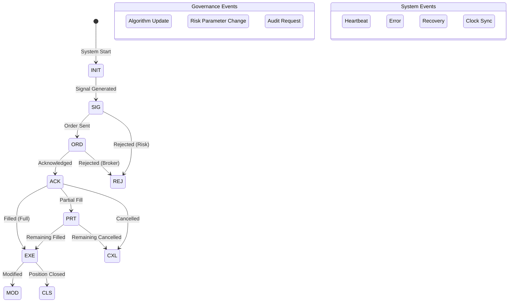

# VeritasChain Protocol (VCP) Specification
## Version 1.0

**Status:** Production Ready  
**Category:** Financial Technology / Audit Standards  
**Date:** 2025-11-25  
**Maintainer:** VeritasChain Standards Organization (VSO)  
**License:** CC BY 4.0 International  
**Website:** https://veritaschain.org

---

## Table of Contents

1. [Introduction](#1-introduction)
2. [Compliance Tiers](#2-compliance-tiers)
3. [Event Lifecycle](#3-event-lifecycle)
4. [Data Model](#4-data-model)
5. [Extension Modules](#5-extension-modules)
6. [Integrity and Security Layer](#6-integrity-and-security-layer)
7. [Implementation Guidelines](#7-implementation-guidelines)
8. [Regulatory Compliance](#8-regulatory-compliance)
9. [Testing Requirements](#9-testing-requirements)
10. [Migration from Legacy Systems](#10-migration-from-legacy-systems)
11. [Appendices](#11-appendices)
12. [References](#12-references)

---

## 1. Introduction

### 1.1 Purpose

The VeritasChain Protocol (VCP) is a global standard specification for recording the "decision-making" and "execution results" of algorithmic trading in an immutable and verifiable format. VCP provides a cryptographically secured chain of evidence that establishes truth ("Veritas") in trading operations, ensuring compliance with international regulations including MiFID II, GDPR, EU AI Act, and emerging quantum-resistant security requirements.

### 1.2 Scope

VCP applies to:
- **High-Frequency Trading (HFT)** systems
- **Algorithmic and AI-driven trading** platforms
- **Retail trading systems** (MT4/MT5)
- **Cryptocurrency exchanges**
- **Regulatory reporting systems**

### 1.3 Versioning

VCP adopts Semantic Versioning 2.0.0:
- **MAJOR** version: Incompatible API changes
- **MINOR** version: Backwards-compatible functionality additions
- **PATCH** version: Backwards-compatible bug fixes

Full backward compatibility is guaranteed within the v1.x series.

### 1.4 Crypto Agility

VCP implements crypto agility to ensure future-proof security:
- **Current Default**: Ed25519 (performance and security optimized)
- **Supported Algorithms**: Ed25519, ECDSA_SECP256K1, RSA_2048
- **Future Reserved**: Post-quantum algorithms (DILITHIUM, FALCON)
- **Migration Path**: Automated algorithm upgrade capability

### 1.5 Standard Enumerations

#### 1.5.1 SignAlgo Enum

| Value | Algorithm | Description | Status |
|-------|-----------|-------------|---------|
| **ED25519** | Ed25519 | Edwards-curve Digital Signature | DEFAULT |
| **ECDSA_SECP256K1** | ECDSA secp256k1 | Bitcoin/Ethereum compatible | SUPPORTED |
| **RSA_2048** | RSA 2048-bit | Legacy systems | DEPRECATED |
| **DILITHIUM2** | CRYSTALS-Dilithium | Post-quantum (NIST Level 2) | FUTURE |
| **FALCON512** | FALCON-512 | Post-quantum (NIST Level 1) | FUTURE |

#### 1.5.2 HashAlgo Enum

| Value | Algorithm | Description | Status |
|-------|-----------|-------------|---------|
| **SHA256** | SHA-256 | SHA-2 family, 256-bit | DEFAULT |
| **SHA3_256** | SHA3-256 | SHA-3 family, 256-bit | SUPPORTED |
| **BLAKE3** | BLAKE3 | High-performance hash | SUPPORTED |
| **SHA3_512** | SHA3-512 | SHA-3 family, 512-bit | FUTURE |

#### 1.5.3 ClockSyncStatus Enum

| Value | Description | Tier Applicability |
|-------|-------------|-------------------|
| **PTP_LOCKED** | PTP synchronized with lock | Platinum |
| **NTP_SYNCED** | NTP synchronized | Gold |
| **BEST_EFFORT** | Best-effort synchronization | Silver |
| **UNRELIABLE** | No reliable synchronization | Silver (degraded) |

#### 1.5.4 TimestampPrecision Enum

| Value | Description | Decimal Places |
|-------|-------------|----------------|
| **NANOSECOND** | Nanosecond precision | 9 |
| **MICROSECOND** | Microsecond precision | 6 |
| **MILLISECOND** | Millisecond precision | 3 |

### 1.6 Core Modules

- **VCP-CORE**: Standard header and security layer
- **VCP-TRADE**: Trading data payload schema
- **VCP-GOV**: Algorithm governance and AI transparency
- **VCP-RISK**: Risk management parameter recording
- **VCP-PRIVACY**: Privacy protection with crypto-shredding
- **VCP-RECOVERY**: Chain disruption recovery mechanism

### 1.7 Standardization Roadmap

**Phase 1 (2025 Q1-Q2)**: Industry Standardization
- Release v1.0 specification
- Partner with FIX Trading Community
- Establish early adopter program

**Phase 2 (2025 Q3-Q4)**: International Standardization
- Submit to ISO/TC 68 (Financial Services)
- Align with IETF standards
- Quantum-resistant upgrade path

---

## 2. Compliance Tiers

### 2.1 Tier Definitions

| Tier | Target | Clock Sync | Serialization | Signature | Anchor | Precision |
|------|--------|------------|---------------|-----------|---------|-----------|
| **Platinum** | HFT/Exchange | PTPv2 (<1µs) | SBE | Ed25519 (Hardware) | 10 min | NANOSECOND |
| **Gold** | Prop/Institutional | NTP (<1ms) | JSON | Ed25519 (Client) | 1 hour | MICROSECOND |
| **Silver** | Retail/MT4/5 | Best-effort | JSON | Ed25519 (Delegated) | 24 hours | MILLISECOND |

### 2.2 Tier-Specific Requirements

#### 2.2.1 Platinum Tier
```yaml
Requirements:
  Clock:
    Protocol: PTPv2 (IEEE 1588-2019)
    Accuracy: <1 microsecond
    Status: PTP_LOCKED required
  Performance:
    Throughput: >1M events/second
    Latency: <10µs per event
    Storage: Binary (SBE/FlatBuffers)
  Implementation:
    Languages: [C++, Rust, FPGA]
    Techniques: [Kernel bypass, RDMA, Zero-copy]
```

#### 2.2.2 Gold Tier
```yaml
Requirements:
  Clock:
    Protocol: NTP/Chrony
    Accuracy: <1 millisecond
    Status: NTP_SYNCED required
  Performance:
    Throughput: >100K events/second
    Latency: <100µs per event
    Persistence: WAL/Queue required (Kafka, Redis)
  Implementation:
    Languages: [Python, Java, C#]
    Deployment: Cloud-ready (AWS/GCP/Azure)
```

#### 2.2.3 Silver Tier
```yaml
Requirements:
  Clock:
    Protocol: System time
    Accuracy: Best-effort
    Status: BEST_EFFORT/UNRELIABLE accepted
  Performance:
    Throughput: >1K events/second
    Latency: <1 second
    Communication: Async recommended
  Implementation:
    Languages: [MQL5, Python]
    Compatibility: MT4/MT5 DLL integration
```

---

## 3. Event Lifecycle

### 3.1 Event State Diagram



### 3.2 Event Type Registry

#### 3.2.1 Fixed Event Type Codes

**CRITICAL**: These codes are immutable for backward compatibility. New codes may only be added, never modified.

```
Trading Events (1-19):
1  = SIG    // Signal/Decision generated
2  = ORD    // Order sent
3  = ACK    // Order acknowledged
4  = EXE    // Full execution
5  = PRT    // Partial fill
6  = REJ    // Order rejected
7  = CXL    // Order cancelled
8  = MOD    // Order modified
9  = CLS    // Position closed
10-19       // Reserved for future trading events

Governance Events (20-39):
20 = ALG    // Algorithm update
21 = RSK    // Risk parameter change
22 = AUD    // Audit request
23-39       // Reserved for future governance events

Market Data Events (40-59):
40-59       // Reserved for future market data events

Compliance Events (60-79):
60-79       // Reserved for future compliance events

Infrastructure Events (80-89):
80-89       // Reserved for future infrastructure events

System Events (90-109):
98 = HBT    // Heartbeat
99 = ERR    // Error
100 = REC   // Recovery
101 = SNC   // Clock sync status
102-109     // Reserved for future system events

Extension Events (110-255):
110-255     // Reserved for custom implementations
```

#### 3.2.2 Event Type Table

| EventType | Code | Category | Description | Required Extensions |
|-----------|------|----------|-------------|-------------------|
| **SIG** | 1 | Trading | Signal/Decision generated | VCP-GOV |
| **ORD** | 2 | Trading | Order sent | VCP-TRADE, VCP-RISK |
| **ACK** | 3 | Trading | Order acknowledged | VCP-TRADE |
| **EXE** | 4 | Trading | Full execution | VCP-TRADE |
| **PRT** | 5 | Trading | Partial fill | VCP-TRADE |
| **REJ** | 6 | Trading | Order rejected | VCP-TRADE, VCP-RISK |
| **CXL** | 7 | Trading | Order cancelled | VCP-TRADE |
| **MOD** | 8 | Trading | Order modified | VCP-TRADE, VCP-GOV |
| **CLS** | 9 | Trading | Position closed | VCP-TRADE |
| **ALG** | 20 | Governance | Algorithm update | VCP-GOV |
| **RSK** | 21 | Governance | Risk parameter change | VCP-RISK |
| **AUD** | 22 | Governance | Audit request | VCP-GOV |
| **HBT** | 98 | System | Heartbeat | VCP-CORE |
| **ERR** | 99 | System | Error | VCP-CORE |
| **REC** | 100 | System | Recovery | VCP-RECOVERY |
| **SNC** | 101 | System | Clock sync status | VCP-CORE |

---

## 4. Data Model

### 4.1 VCP-CORE: Standard Header

#### 4.1.1 Required Header Fields

| Tag | Field | Type | Description | Requirements |
|-----|-------|------|-------------|--------------|
| 1001 | **EventID** | UUID | Unique event identifier | MUST use UUID v7 (time-sortable) or v4 |
| 1002 | **TraceID** | UUID | Transaction trace ID (CAT Rule 613) | UUID v7 recommended |
| 1010 | **Timestamp** | Int64 | Nanoseconds since Unix epoch (UTC) | MUST be monotonic within session |
| 1011 | **EventType** | Int8 | Event type code | See Event Type Codes (Section 3.2.1) |
| 1012 | **TimestampPrecision** | Enum | Timestamp precision level | See TimestampPrecision Enum (Section 1.5.4) |
| 1013 | **ClockSyncStatus** | Enum | Clock synchronization status | See ClockSyncStatus Enum (Section 1.5.3) |
| 1014 | **HashAlgo** | Enum | Hash algorithm identifier | See HashAlgo Enum (Section 1.5.2) |
| 1020 | **VenueID** | String | Broker/Exchange identifier | ISO 10383 MIC code when applicable |
| 1030 | **Symbol** | String | Trading symbol | Normalized format required |
| 1040 | **AccountID** | String | Account identifier | MUST be pseudonymized |
| 1050 | **OperatorID** | String | Operator identifier (optional) | For manual intervention tracking |

#### 4.1.2 JSON Schema Example

```json
{
  "EventID": "01934e3a-7b2c-7f93-8f2a-1234567890ab",
  "TraceID": "01934e3a-6a1b-7c82-9d1b-0987654321dc",
  "Timestamp": 1732358400000000000,
  "EventType": 2,
  "TimestampPrecision": "NANOSECOND",
  "ClockSyncStatus": "PTP_LOCKED",
  "HashAlgo": "SHA256",
  "VenueID": "XNAS",
  "Symbol": "AAPL",
  "AccountID": "acc_h7g8i9j0k1",
  "OperatorID": null
}
```

### 4.2 VCP-TRADE: Trading Payload

#### 4.2.1 Standard Trading Fields

| Tag | Field | Type | Description | Format Requirements |
|-----|-------|------|-------------|-------------------|
| 2001 | **OrderID** | String | Client order ID | Unique per session |
| 2002 | **BrokerOrderID** | String | Broker order ID | From broker response |
| 2003 | **ExchangeOrderID** | String | Exchange order ID | From exchange |
| 2010 | **Side** | Enum | BUY/SELL | Uppercase only |
| 2011 | **OrderType** | Enum | MARKET/LIMIT/STOP/STOP_LIMIT | Standard FIX values |
| 2020 | **Price** | String | Order price | **MUST be string for precision** |
| 2021 | **Quantity** | String | Order quantity | **MUST be string for precision** |
| 2022 | **ExecutedQty** | String | Executed quantity | **MUST be string for precision** |
| 2023 | **RemainingQty** | String | Remaining quantity | **MUST be string for precision** |
| 2030 | **Currency** | String | Trading currency | ISO 4217 code |
| 2031 | **ExecutionPrice** | String | Actual fill price | **MUST be string for precision** |
| 2040 | **Commission** | String | Commission amount | **MUST be string for precision** |
| 2041 | **Slippage** | String | Slippage amount | **MUST be string for precision** |
| 2050 | **RejectReason** | String | Rejection reason | Standardized codes |

#### 4.2.2 Critical Precision Requirement

**IEEE 754 Precision Issue**: To maintain data integrity with RFC 8785 (JCS), all financial numeric values MUST be encoded as strings in JSON serialization:

```json
{
  "Price": "123.456789",        // ✓ Correct: String
  "Quantity": "1000.00",         // ✓ Correct: String
  "ExecutedQty": "750.50",       // ✓ Correct: String
  "Commission": "2.345678901"    // ✓ Correct: String preserves precision
}
```

Never use:
```json
{
  "Price": 123.456789,           // ✗ Wrong: Float loses precision
  "Quantity": 1000               // ✗ Wrong: Number type
}
```

---

## 5. Extension Modules

### 5.1 VCP-GOV: Algorithm Governance and AI Transparency

Integrates AI explainability (XAI), rule-based logic, and governance requirements (EU AI Act).

#### 5.1.1 Schema Definition

```json
{
  "VCP-GOV": {
    "Version": "1.0",
    "AlgorithmIdentification": {
      "AlgoID": "uuid",
      "AlgoVersion": "string",
      "AlgoType": "enum",              // AI_MODEL, RULE_BASED, HYBRID
      "ModelType": "string",            // NeuralNetwork, RandomForest, etc.
      "ModelHash": "string"             // SHA-256 of model parameters
    },
    "Governance": {
      "RiskClassification": "enum",    // HIGH/MEDIUM/LOW (EU AI Act)
      "LastApprovalBy": "OperatorID",  // Human oversight
      "ApprovalTimestamp": "int64",
      "TestingRecordLink": "uri",      // Backtesting results
      "AuditTrailID": "uuid"          // Link to audit records
    },
    "DecisionFactors": {
      "Features": [
        {
          "Name": "string",
          "Value": "string",            // Always string for precision
          "Weight": "string",
          "Contribution": "string"      // SHAP/LIME value
        }
      ],
      "ConfidenceScore": "string",     // 0.0-1.0 as string
      "ExplainabilityMethod": "enum",  // SHAP/LIME/GRADCAM/RULE_TRACE
      "RuleTrace": ["rule_id_1", "rule_id_2"]  // For rule-based
    },
    "PerformanceMetadata": {
      "CalculationMethod": "enum",     // SYNC, ASYNC, SAMPLED
      "SamplingRate": "string",        // 1.0=100%, 0.1=10%
      "LatencyImpact": "string"        // Microseconds added
    }
  }
}
```

### 5.2 VCP-RISK: Risk Management Snapshot

Records active risk management parameters at event time.

#### 5.2.1 Schema Definition

```json
{
  "VCP-RISK": {
    "Version": "1.0",
    "RiskProfile": {
      "ProfileID": "string",
      "ProfileVersion": "string",
      "LastModified": "int64"
    },
    "AppliedControls": [
      "ThrottleLimit",
      "MaxOrderSize",
      "FatFingerCheck",
      "PositionLimit",
      "VaRLimit"
    ],
    "ParametersSnapshot": {
      "MaxOrderSize": "1000000",
      "MaxPositionSize": "5000000",
      "DailyExposureLimit": "50000000",
      "ExposureUtilization": "0.75",
      "VaRLimit": "100000",
      "CurrentVaR": "67890.50",
      "ThrottleRate": "100",          // Orders per second
      "CircuitBreakerStatus": "NORMAL"
    },
    "TriggeredControls": [
      {
        "ControlName": "MaxOrderSize",
        "TriggerValue": "1500000",
        "Action": "REJECT",
        "Timestamp": "int64"
      }
    ]
  }
}
```

### 5.3 VCP-PRIVACY: Privacy Protection with Crypto-Shredding

Implements GDPR-compliant privacy with crypto-shredding capability.

#### 5.3.1 Schema Definition

```json
{
  "VCP-PRIVACY": {
    "Version": "1.0",
    "DataClassification": "enum",      // PUBLIC/INTERNAL/CONFIDENTIAL/RESTRICTED
    "PrivacyMethod": "enum",           // CLEAR/PSEUDONYMIZED/ENCRYPTED/REDACTED
    "Pseudonymization": {
      "Method": "AES-256-GCM",
      "KeyID": "uuid",                 // Reference to key management
      "Purpose": "string",             // Regulatory/Analytics/Audit
      "RetentionPeriod": "P7Y"         // ISO 8601 duration
    },
    "ConsentReference": "uuid",        // GDPR consent tracking
    "DataSubjectRights": {
      "Erasure": "CRYPTO_SHREDDING",   // Method for deletion
      "Portability": "JSON_EXPORT",
      "AccessLogID": "uuid"
    }
  }
}
```

### 5.4 VCP-RECOVERY: Chain Disruption Recovery

Handles chain breaks and recovery scenarios.

#### 5.4.1 Schema Definition

```json
{
  "VCP-RECOVERY": {
    "Version": "1.0",
    "RecoveryType": "enum",            // CHAIN_BREAK/FORK/REORG/CHECKPOINT
    "BreakPoint": {
      "LastValidEventID": "uuid",
      "LastValidHash": "string",
      "BreakTimestamp": "int64",
      "BreakReason": "string"
    },
    "RecoveryAction": {
      "Method": "enum",                // REBUILD/SKIP/MERGE/CHECKPOINT
      "RecoveredEvents": 42,
      "ValidationMethod": "string",
      "OperatorID": "string"           // Who authorized recovery
    },
    "ChainValidation": {
      "PreBreakHash": "string",
      "PostRecoveryHash": "string",
      "MerkleProof": ["hash1", "hash2"],
      "AnchorReference": "string"      // External anchor point
    }
  }
}
```

---

## 6. Integrity and Security Layer (VCP-SEC)

### 6.1 Hash Chain Implementation

#### 6.1.1 Event Hash Calculation

```python
def calculate_event_hash(header: dict, payload: dict, prev_hash: str, algo: str = "SHA256") -> str:
    """
    Calculate event hash with RFC 8785 canonicalization
    """
    # Step 1: Canonicalize JSON (RFC 8785 JCS)
    canonical_header = canonicalize_json(header)
    canonical_payload = canonicalize_json(payload)
    
    # Step 2: Concatenate components
    hash_input = canonical_header + canonical_payload + prev_hash
    
    # Step 3: Apply hash function
    if algo == "SHA256":
        return hashlib.sha256(hash_input.encode()).hexdigest()
    elif algo == "SHA3_256":
        return hashlib.sha3_256(hash_input.encode()).hexdigest()
    elif algo == "BLAKE3":
        return blake3(hash_input.encode()).hexdigest()
    else:
        raise ValueError(f"Unsupported hash algorithm: {algo}")
```

#### 6.1.2 Chain Validation

```python
def validate_chain(events: List[dict]) -> bool:
    """
    Validate hash chain integrity
    """
    prev_hash = GENESIS_HASH  # "0000000000000000..."
    
    for event in events:
        # Recalculate hash
        calculated_hash = calculate_event_hash(
            event["Header"],
            event["Payload"],
            prev_hash,
            event["Header"]["HashAlgo"]
        )
        
        # Verify against stored hash
        if calculated_hash != event["Security"]["EventHash"]:
            return False
            
        prev_hash = calculated_hash
        
    return True
```

### 6.2 Digital Signatures

#### 6.2.1 Signature Requirements

| SignAlgo Enum | Use Case | Key Size | Performance | Quantum-Resistant |
|---------------|----------|----------|-------------|-------------------|
| **ED25519** | Default | 256-bit | Fastest | No |
| **ECDSA_SECP256K1** | Bitcoin compatibility | 256-bit | Fast | No |
| **RSA_2048** | Legacy systems | 2048-bit | Slow | No |
| **DILITHIUM2** | Future (reserved) | 2420 bytes | Medium | Yes |
| **FALCON512** | Future (reserved) | 897 bytes | Fast | Yes |

#### 6.2.2 Signature Generation

```python
def sign_event(event_hash: str, private_key: bytes, algo: str = "ED25519") -> str:
    """
    Generate digital signature
    """
    if algo == "ED25519":
        signing_key = Ed25519SigningKey(private_key)
        signature = signing_key.sign(event_hash.encode())
        return base64.b64encode(signature).decode()
    elif algo == "ECDSA_SECP256K1":
        # ECDSA implementation
        pass
    elif algo == "RSA_2048":
        # RSA implementation (legacy)
        pass
    else:
        raise ValueError(f"Unsupported signature algorithm: {algo}")
```

### 6.3 Merkle Tree Anchoring

#### 6.3.1 RFC 6962 Compliance (Certificate Transparency)

**MANDATORY**: Merkle tree construction MUST follow RFC 6962 to prevent second preimage attacks:

```python
def merkle_hash(data: bytes, leaf: bool = True) -> bytes:
    """
    RFC 6962 compliant Merkle tree hashing
    """
    if leaf:
        # Leaf nodes: 0x00 prefix
        return hashlib.sha256(b'\x00' + data).digest()
    else:
        # Internal nodes: 0x01 prefix
        return hashlib.sha256(b'\x01' + data).digest()
```

#### 6.3.2 Anchoring Schedule

| Tier | Frequency | Anchor Target | Proof Type |
|------|-----------|---------------|------------|
| **Platinum** | 10 minutes | Blockchain/TSA | Full Merkle proof |
| **Gold** | 1 hour | TSA/Database | Merkle root + path |
| **Silver** | 24 hours | Database/File | Merkle root only |

---

## 7. Implementation Guidelines

### 7.1 Language-Specific Recommendations

#### 7.1.1 C++ (Platinum Tier)

```cpp
// Recommended libraries
#include <sbe/sbe.hpp>           // Simple Binary Encoding
#include <sodium.h>              // libsodium for Ed25519
#include <folly/futures.hpp>     // Async processing
#include <spdk/nvme.h>          // NVMe direct access

// Performance optimizations
- Use lock-free data structures (boost::lockfree)
- Implement zero-copy serialization
- Enable compiler optimizations (-O3, -march=native)
- Use memory pools for allocation
```

#### 7.1.2 Python (Gold Tier)

```python
# Recommended packages
import asyncio                  # Async I/O
import orjson                   # Fast JSON
import msgpack                  # Binary serialization
from cryptography.hazmat.primitives import serialization
from cryptography.hazmat.primitives.asymmetric import ed25519
import redis                    # Persistence queue
import aiokafka                # Async Kafka client

# Performance optimizations
- Use uvloop for asyncio
- Implement connection pooling
- Use Redis streams or Kafka for WAL
- Profile with cProfile/py-spy
```

#### 7.1.3 MQL5 (Silver Tier)

```mql5
// Recommended approach
#import "VCP.dll"
   int  VCP_Initialize(string config);
   int  VCP_LogEvent(string event_json);
   void VCP_Shutdown();
#import

// Async communication pattern
void OnTimer() {
   // Process events from queue
   string event;
   while(EventQueue.Dequeue(event)) {
      VCP_LogEvent(event);
   }
}

// Critical: Use async WebRequest or DLL for non-blocking
```

### 7.2 Performance Requirements

#### 7.2.1 Latency Budgets

| Operation | Platinum | Gold | Silver |
|-----------|----------|------|--------|
| Event creation | <1µs | <10µs | <1ms |
| Serialization | <1µs | <5µs | <10ms |
| Hashing | <500ns | <2µs | <5ms |
| Signature | <5µs | <50µs | <100ms |
| Persistence | <5µs | <100µs | <1s |
| Total | <10µs | <100µs | <1s |

#### 7.2.2 Throughput Requirements

| Metric | Platinum | Gold | Silver |
|--------|----------|------|--------|
| Events/second | >1M | >100K | >1K |
| Batch size | 1000 | 100 | 1 |
| Queue depth | 10M | 1M | 10K |
| Memory usage | <10GB | <1GB | <100MB |

### 7.3 Error Handling

#### 7.3.1 Error Categories

```yaml
ErrorCategories:
  CLOCK_SYNC_FAILURE:
    Severity: CRITICAL
    Action: Degrade to UNRELIABLE status
    Recovery: Attempt resync every 60s
    
  HASH_CHAIN_BREAK:
    Severity: CRITICAL
    Action: Trigger VCP-RECOVERY
    Recovery: Rebuild from last anchor
    
  SIGNATURE_FAILURE:
    Severity: HIGH
    Action: Retry with key rotation
    Recovery: Escalate to operator
    
  SERIALIZATION_ERROR:
    Severity: MEDIUM
    Action: Log raw data
    Recovery: Fix and replay
    
  NETWORK_TIMEOUT:
    Severity: LOW
    Action: Queue for retry
    Recovery: Exponential backoff
```

---

## 8. Regulatory Compliance

### 8.1 MiFID II Compliance

| Requirement | Article | VCP Implementation |
|-------------|---------|-------------------|
| Best Execution | Art. 27 | VCP-TRADE (execution prices, slippage) |
| Algo Trading | Art. 17 | VCP-GOV (algorithm identification) |
| Record Keeping | RTS 24 | VCP-CORE (7-year retention) |
| Clock Synchronization | RTS 25 | ClockSyncStatus field |

### 8.2 CAT Rule 613 (US)

| Requirement | VCP Implementation |
|-------------|-------------------|
| Customer Account ID | AccountID (pseudonymized) |
| Order Trace ID | TraceID (UUID v7) |
| Timestamp Granularity | Nanosecond precision |
| Order Lifecycle | Complete event chain |

### 8.3 GDPR Compliance

| Right | Article | VCP Implementation |
|-------|---------|-------------------|
| Erasure | Art. 17 | Crypto-shredding via VCP-PRIVACY |
| Portability | Art. 20 | JSON export capability |
| Rectification | Art. 16 | Append-only corrections |
| Access | Art. 15 | Filtered data export |

### 8.4 EU AI Act Compliance

| Requirement | Article | VCP Implementation |
|-------------|---------|-------------------|
| Record Keeping | Art. 12 | VCP-CORE automatic logging |
| Risk Management | Art. 9 | VCP-GOV RiskClassification, VCP-RISK |
| Data Governance | Art. 10 | VCP-GOV AlgorithmIdentification |
| Transparency | Art. 13 | VCP-GOV DecisionFactors |
| Human Oversight | Art. 14 | OperatorID, LastApprovalBy |

---

## 9. Testing Requirements

### 9.1 Conformance Test Suite

#### 9.1.1 Core Tests

```yaml
CoreTests:
  - UUID_Generation:
      Verify: UUID v7 time ordering
      Iterations: 1M
      
  - Timestamp_Monotonicity:
      Verify: Strictly increasing timestamps
      Duration: 24 hours
      
  - Hash_Chain_Integrity:
      Verify: Chain validation
      Events: 10M
      
  - Precision_Preservation:
      Verify: String encoding for numerics
      Values: ["0.00000001", "999999999999.999999999"]
```

#### 9.1.2 Performance Tests

```yaml
PerformanceTests:
  Platinum:
    Throughput: ">1M events/sec"
    Latency: "p99 <10µs"
    Duration: "24 hours"
    
  Gold:
    Throughput: ">100K events/sec"
    Latency: "p99 <100µs"
    Duration: "8 hours"
    
  Silver:
    Throughput: ">1K events/sec"
    Latency: "p99 <1s"
    Duration: "1 hour"
```

### 9.2 Security Tests

```yaml
SecurityTests:
  - Cryptographic_Validation:
      Algorithms: [Ed25519, ECDSA, SHA-256, SHA3-256]
      Vectors: NIST test vectors
      
  - Chain_Manipulation:
      Attacks: [Insertion, Deletion, Reordering, Tampering]
      Expected: All detected
      
  - Timing_Attacks:
      Target: Signature verification
      Requirement: Constant-time operations
```

---

## 10. Migration from Legacy Systems

### 10.1 From AUP to VCP

| AUP Component | VCP Equivalent | Migration Action |
|---------------|----------------|------------------|
| AUP-CORE | VCP-CORE | Add ClockSyncStatus, HashAlgo |
| AUP-TRADE | VCP-TRADE | Ensure string encoding |
| AUP-AI + AUP-ALG | VCP-GOV | Merge and enhance |
| (new) | VCP-RISK | Add risk snapshots |
| AUP-PRIVACY | VCP-PRIVACY | Add crypto-shredding |
| AUP-RECOVERY | VCP-RECOVERY | Enhanced validation |

### 10.2 Migration Strategy

```yaml
Phase1_Parallel_Run:
  Duration: 30 days
  Mode: Shadow logging
  Validation: Compare outputs
  
Phase2_Gradual_Cutover:
  Duration: 30 days
  Mode: Percentage-based
  Rollback: Automatic on error
  
Phase3_Full_Migration:
  Validation: 99.99% compatibility
  Certification: VSO approved
```

---

## 11. Appendices

### Appendix A: Standard Event Codes

```yaml
EventCodes:
  Trading:
    1-19: Order lifecycle
    20-29: Position management
    30-39: Risk events
    
  Governance:
    40-49: Algorithm updates
    50-59: Compliance events
    60-69: Audit trail
    
  System:
    90-99: Infrastructure
    100-109: Recovery
    110-119: Monitoring
```

### Appendix B: Error Codes

```yaml
ErrorCodes:
  1xxx: Validation errors
  2xxx: Security errors
  3xxx: System errors
  4xxx: Network errors
  5xxx: Compliance errors
```

### Appendix C: Timestamp Format Examples

```json
{
  "Examples": {
    "Nanosecond": 1732358400123456789,
    "Microsecond": 1732358400123456,
    "Millisecond": 1732358400123,
    "ISO8601": "2025-11-25T12:00:00.123456789Z"
  }
}
```

---

## 12. References

### Standards
- **RFC 9562**: Universally Unique IDentifier (UUID) v7
- **RFC 8785**: JSON Canonicalization Scheme (JCS)
- **RFC 6962**: Certificate Transparency
- **RFC 3161**: Time-Stamp Protocol (TSP)
- **IEEE 1588-2019**: Precision Time Protocol (PTP)
- **ISO 20022**: Universal financial industry message scheme

### Regulations
- **MiFID II**: Markets in Financial Instruments Directive
- **RTS 24/25**: Regulatory Technical Standards
- **CAT Rule 613**: Consolidated Audit Trail
- **GDPR**: General Data Protection Regulation
- **EU AI Act**: Artificial Intelligence Act (2024)

### Cryptography
- **FIPS 186-5**: Digital Signature Standard
- **NIST SP 800-208**: Post-Quantum Cryptography
- **RFC 8032**: Edwards-Curve Digital Signature Algorithm (EdDSA)

### Implementation
- **FIX Protocol**: Financial Information eXchange
- **SBE**: Simple Binary Encoding
- **FlatBuffers**: Memory Efficient Serialization Library
- **Apache Kafka**: Distributed Event Streaming
- **Redis Streams**: In-memory data structure store

---

## Version History

| Version | Date | Changes | Author |
|---------|------|---------|--------|
| 1.0 | 2025-11-25 | Initial release with fixed Event Type codes and standardized Enum definitions | VSO Technical Committee |

---

## Contact Information

**VeritasChain Standards Organization (VSO)**  
Website: https://veritaschain.org  
Email: standards@veritaschain.org  
GitHub: https://github.com/veritaschain/vcp-spec  
Technical Support: https://support.veritaschain.org

---

## License

This specification is licensed under Creative Commons Attribution 4.0 International (CC BY 4.0).

You are free to:
- **Share**: Copy and redistribute the material in any medium or format
- **Adapt**: Remix, transform, and build upon the material

Under the following terms:
- **Attribution**: You must give appropriate credit to VSO

---

## Acknowledgments

The VeritasChain Protocol was developed through collaborative efforts of:
- Financial industry practitioners
- Regulatory compliance experts
- Cryptography researchers
- Open-source community contributors

Special thanks to the early adopters and beta testers who provided invaluable feedback.

---

*End of VeritasChain Protocol (VCP) Specification v1.0*