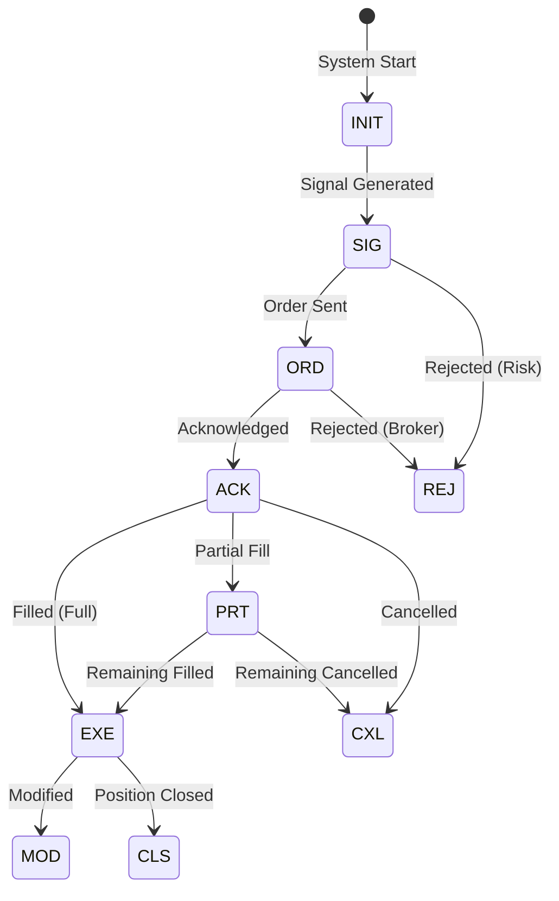

# VeritasChain Protocol (VCP) Specification
## Version 1.2

**Status:** Release Candidate (RC1)  
**Category:** Financial Technology / Audit Standards  
**Date:** 2026-05-31  
**Maintainer:** VeritasChain Standards Organization (VSO)  
**License:** CC BY 4.0 International  
**Website:** https://veritaschain.org

---

## Revision History

| Version | Date | Changes | Author |
|---------|------|---------|--------|
| 1.2 | 2026-05-31 | RECOVERY operational constraints, ERASURE event (GDPR / crypto-shredding), Version Compatibility Matrix, SCITT alignment fields, latency budgets, anchor continuity, multi-actor XREF, Silver-tier guidance | VSO Technical Committee |
| 1.1 | 2025-12-30 | Three-layer architecture, External Anchor mandatory, Policy Identification, VCP-XREF, Completeness Guarantees | VSO Technical Committee |
| 1.0 | 2025-11-25 | Initial release | VSO Technical Committee |

---

## Summary of Changes from v1.1

VCP v1.2 is a **protocol-compatible / certification-stricter** update. It introduces **zero breaking changes**: all v1.0 and v1.1 event data remains fully interoperable with v1.2 verifiers. v1.2 tightens VC-Certified requirements (notably VCP-RECOVERY constraints) and adds opt-in capabilities for GDPR erasure, SCITT interoperability, and multi-party audit chains.

> The complete normative specification of every v1.2 change is provided in the companion document **[VSO-SPEC-CHANGE-001](VSO-SPEC-CHANGE-001.md)** ("VCP v1.2 Change Proposal"), included in this directory as a **normative annex**. This section summarizes those changes; where this summary and the annex differ in detail, the annex prevails.

### Change Classification

| Category | Count | Impact |
|----------|-------|--------|
| Normative (REQUIRED) | 7 | VC-Certified requirements tightened |
| Informative (RECOMMENDED) | 2 | Documentation / guidance |
| Breaking Changes | 0 | Full backward compatibility maintained |

### Changes at a Glance

| # | Change | Type | Module / Section | Annex |
|---|--------|------|------------------|-------|
| 1 | VCP-RECOVERY constraint strengthening (SKIP/REBUILD/MERGE/CHECKPOINT bounds, Emergency Override) | Normative | VCP-RECOVERY | §1 |
| 2 | External Anchor blockchain selection criteria | Normative | Layer 3 (§6.3) | §2 |
| 3 | ERASURE event type (GDPR Art. 17 / crypto-shredding) | Normative | VCP-PRIVACY, Event Registry (§3.2.2) | §3 |
| 4 | Version Compatibility Matrix | Informative | Migration (§10.5) | §4 |
| 5 | SCITT alignment fields (COSE Receipts, transparency service) | Normative (opt-in) | VCP-CORE / §6 | §5 |
| 6 | Latency budget clarification | Informative | Tiers (§2) / §7 | §6 |
| 7 | Anchor target continuity plan | Normative | Layer 3 (§6.3) | §7 |
| 8 | Reference implementation benchmarks | Informative | §7 | §8 |
| 9 | Multi-actor chain linking (cross-party VCP-XREF) | Normative (when used) | VCP-XREF (§5.6) | §9 |

> **Note**: Multi-Actor Chain Linking (#9) is classified as Normative because, when used, it imposes MUST-level requirements; its adoption itself remains OPTIONAL.

### Certification & Algorithm Notes

- **VC-Certified v1.2** additionally requires conformance to the strengthened VCP-RECOVERY constraints (Annex §1) and a documented anchor continuity plan (Annex §7). v1.0/v1.1-certified implementations remain protocol-compatible but must meet these constraints for v1.2 certification.
- **Post-quantum signatures** (`DILITHIUM2`, `FALCON512`) advance from *FUTURE* (reserved) to *EXPERIMENTAL* in v1.2 — available for testing and hybrid (classical + PQC) deployments, **not yet a certification requirement**. `Ed25519` remains the DEFAULT. See §1.5.1 and Appendix E.

---

## Summary of Changes from v1.0

### Breaking Changes

**Certification-level breaking changes only.**

VCP v1.1 introduces new mandatory certification requirements (External Anchor and Policy Identification) that affect VC-Certified status.

| Change | Protocol Compatibility | Certification Impact |
|--------|----------------------|---------------------|
| PrevHash → OPTIONAL | ✅ Fully compatible | No impact (relaxation) |
| External Anchor → REQUIRED | ✅ Fully compatible | ⚠️ Silver tier must add anchoring |
| Policy Identification → REQUIRED | ✅ Fully compatible | ⚠️ All tiers must add field |

**Summary**: Existing v1.0 implementations remain **protocol-compatible** (can interoperate with v1.1 systems), but may require additional components to obtain **v1.1 VC-Certified status**.

> ※ v1.1 is a **protocol-compatible / certification-stricter** update.

### Major Changes

| # | Change | Impact | Migration |
|---|--------|--------|-----------|
| 1 | **Three-Layer Architecture** | Section 6 restructured | Documentation only |
| 2 | **PrevHash now OPTIONAL** | Hash chain linking no longer required | None (relaxation) |
| 3 | **External Anchor REQUIRED for all tiers** | Silver tier must implement daily anchoring | Implementation required |
| 4 | **Policy Identification added** | New Section 5.5 | Implementation required |
| 5 | **VCP-XREF Dual Logging added** | New Section 5.6 | OPTIONAL extension |

### Rationale

The v1.0 specification prioritized flexibility for Silver tier implementations by making External Anchor optional. However, community feedback identified that without mandatory external anchoring, the "Verify, Don't Trust" principle could not be fully realized—log producers could theoretically modify Merkle Roots before anchoring.

v1.1 strengthens this by:
1. Making External Anchor REQUIRED for all tiers (with tier-appropriate frequencies and lightweight options for Silver)
2. Clarifying that hash chains (PrevHash) are an OPTIONAL local integrity mechanism that complements, but does not replace, external verifiability
3. Establishing a clear three-layer architecture that separates concerns and clarifies where integrity guarantees originate

---

## Table of Contents

1. [Introduction](#1-introduction)
2. [Compliance Tiers](#2-compliance-tiers)
3. [Event Lifecycle](#3-event-lifecycle)
4. [Data Model](#4-data-model)
5. [Extension Modules](#5-extension-modules)
6. [Integrity and Security Layer (Three-Layer Architecture)](#6-integrity-and-security-layer-three-layer-architecture)
7. [Implementation Guidelines](#7-implementation-guidelines)
8. [Regulatory Compliance](#8-regulatory-compliance)
9. [Testing Requirements](#9-testing-requirements)
10. [Migration](#10-migration)
11. [Appendices](#11-appendices)
12. [References](#12-references)

---

## 1. Introduction

### 1.1 Purpose

The VeritasChain Protocol (VCP) is a global standard specification for recording the "decision-making" and "execution results" of algorithmic trading in an immutable and verifiable format. VCP provides a cryptographically secured chain of evidence that establishes truth ("Veritas") in trading operations, ensuring compliance with international regulations including MiFID II, GDPR, EU AI Act, and emerging quantum-resistant security requirements.

> **Completeness Guarantees (NEW in v1.1):** VCP v1.1 extends tamper-evidence to **completeness guarantees**, enabling third parties to cryptographically verify not only that events were not altered, but that **no required events were omitted** (omission / split-view attacks). This is achieved through mandatory Merkle Tree construction and external anchoring for all tiers, ensuring that event batches are provably complete at the time of anchoring.

### 1.2 Scope

VCP applies to:
- **High-Frequency Trading (HFT)** systems
- **Algorithmic and AI-driven trading** platforms
- **Retail trading systems** (MT4/MT5)
- **Cryptocurrency exchanges**
- **Regulatory reporting systems**

### 1.3 Versioning

VCP adopts Semantic Versioning 2.0.0:
- **MAJOR** version: Incompatible API changes
- **MINOR** version: Backwards-compatible functionality additions
- **PATCH** version: Backwards-compatible bug fixes

Full backward compatibility is guaranteed within the v1.x series.

### 1.4 Crypto Agility

VCP implements crypto agility to ensure future-proof security:
- **Current Default**: Ed25519 (performance and security optimized)
- **Supported Algorithms**: Ed25519, ECDSA_SECP256K1, RSA_2048
- **Experimental (NEW in v1.2)**: Post-quantum algorithms (DILITHIUM2 / ML-DSA, FALCON512 / FN-DSA) — available for testing and hybrid (classical + PQC) deployments; not yet a certification requirement
- **Migration Path**: Automated algorithm upgrade capability (see Appendix E for the PQC migration roadmap)

### 1.5 Standard Enumerations

#### 1.5.1 SignAlgo Enum

| Value | Algorithm | Description | Status |
|-------|-----------|-------------|---------|
| **ED25519** | Ed25519 | Edwards-curve Digital Signature | DEFAULT |
| **ECDSA_SECP256K1** | ECDSA secp256k1 | Bitcoin/Ethereum compatible | SUPPORTED |
| **RSA_2048** | RSA 2048-bit | Legacy systems | DEPRECATED |
| **DILITHIUM2** | ML-DSA (FIPS 204) | Post-quantum (NIST Level 2) | EXPERIMENTAL |
| **FALCON512** | FN-DSA (FIPS 206, draft) | Post-quantum (NIST Level 1) | EXPERIMENTAL |

#### 1.5.2 HashAlgo Enum

| Value | Algorithm | Description | Status |
|-------|-----------|-------------|---------|
| **SHA256** | SHA-256 | SHA-2 family, 256-bit | DEFAULT |
| **SHA3_256** | SHA3-256 | SHA-3 family, 256-bit | SUPPORTED |
| **BLAKE3** | BLAKE3 | High-performance hash | SUPPORTED |
| **SHA3_512** | SHA3-512 | SHA-3 family, 512-bit | FUTURE |

#### 1.5.3 ClockSyncStatus Enum

| Value | Description | Tier Applicability |
|-------|-------------|-------------------|
| **PTP_LOCKED** | PTP synchronized with lock | Platinum |
| **NTP_SYNCED** | NTP synchronized | Gold |
| **BEST_EFFORT** | Best-effort synchronization | Silver |
| **UNRELIABLE** | No reliable synchronization | Silver (degraded) |

#### 1.5.4 TimestampPrecision Enum

| Value | Description | Decimal Places |
|-------|-------------|----------------|
| **NANOSECOND** | Nanosecond precision | 9 |
| **MICROSECOND** | Microsecond precision | 6 |
| **MILLISECOND** | Millisecond precision | 3 |

### 1.6 Core Modules

- **VCP-CORE**: Standard header and security layer
- **VCP-TRADE**: Trading data payload schema
- **VCP-GOV**: Algorithm governance and AI transparency
- **VCP-RISK**: Risk management parameter recording
- **VCP-PRIVACY**: Privacy protection with crypto-shredding
- **VCP-RECOVERY**: Chain disruption recovery mechanism
- **VCP-XREF**: Cross-reference and dual logging (NEW in v1.1)

---

## 2. Compliance Tiers

### 2.1 Tier Definitions

| Tier | Target | Clock Sync | Serialization | Signature | External Anchor | Precision |
|------|--------|------------|---------------|-----------|-----------------|-----------|
| **Platinum** | HFT/Exchange | PTPv2 (<1µs) | SBE | Ed25519 (Hardware) | **REQUIRED (10 min)** | NANOSECOND |
| **Gold** | Prop/Institutional | NTP (<1ms) | JSON | Ed25519 (Client) | **REQUIRED (1 hour)** | MICROSECOND |
| **Silver** | Retail/MT4/5 | Best-effort | JSON | Ed25519 (Delegated) | **REQUIRED (24 hours)** | MILLISECOND |

> **CHANGE FROM v1.0**: External Anchor is now REQUIRED for all tiers to ensure externally verifiable integrity. For Silver tier, lightweight mechanisms (e.g., OpenTimestamps, FreeTSA) are explicitly acceptable. This change aligns all tiers with VCP's "Verify, Don't Trust" principle.

### 2.2 Tier-Specific Requirements

#### 2.2.1 Platinum Tier
```yaml
Requirements:
  Clock:
    Protocol: PTPv2 (IEEE 1588-2019)
    Accuracy: <1 microsecond
    Status: PTP_LOCKED required
  Performance:
    Throughput: >1M events/second
    Latency: <10µs per event
    Storage: Binary (SBE/FlatBuffers)
  ExternalAnchor:
    Frequency: Every 10 minutes
    Target: Blockchain or RFC 3161 TSA
    ProofType: Full Merkle proof
  Implementation:
    Languages: [C++, Rust, FPGA]
    Techniques: [Kernel bypass, RDMA, Zero-copy]
```

#### 2.2.2 Gold Tier
```yaml
Requirements:
  Clock:
    Protocol: NTP/Chrony
    Accuracy: <1 millisecond
    Status: NTP_SYNCED required
  Performance:
    Throughput: >100K events/second
    Latency: <100µs per event
    Persistence: WAL/Queue required (Kafka, Redis)
  ExternalAnchor:
    Frequency: Every 1 hour
    Target: RFC 3161 TSA or Database with third-party attestation
    ProofType: Merkle root + audit path
  Implementation:
    Languages: [Python, Java, C#]
    Deployment: Cloud-ready (AWS/GCP/Azure)
```

#### 2.2.3 Silver Tier
```yaml
Requirements:
  Clock:
    Protocol: System time
    Accuracy: Best-effort
    Status: BEST_EFFORT/UNRELIABLE accepted
  Performance:
    Throughput: >1K events/second
    Latency: <1 second
    Communication: Async recommended
  ExternalAnchor:
    Frequency: Every 24 hours (daily)
    Target: Database with integrity proof or public timestamping service
    ProofType: Merkle root only
  Implementation:
    Languages: [MQL5, Python]
    Compatibility: MT4/MT5 DLL integration
```

> **NOTE**: Silver tier is NOT intended for regulatory-grade algorithmic trading systems subject to MiFID II RTS 25, SEC Rule 17a-4, or equivalent clock synchronization requirements. Silver tier is appropriate for development, testing, backtesting analysis, and non-regulated trading scenarios.

> **GUIDANCE on Silver Tier for Semi-Regulatory Use Cases**: In practice, Silver tier logs may be used in contexts with indirect regulatory implications (e.g., presenting backtesting results to supervisory authorities, internal audit documentation). In such cases:
> 
> | Aspect | Silver Tier Capability | Reasonable Assurance Level |
> |--------|----------------------|---------------------------|
> | **Timestamp accuracy** | BEST_EFFORT (system clock) | Indicative only; not suitable for latency disputes |
> | **Event completeness** | Daily Merkle anchor | Batch-level integrity; gaps possible within 24h window |
> | **Chain continuity** | PrevHash OPTIONAL | No real-time gap detection unless enabled |
> 
> For higher assurance within the 24-hour window, implementations MAY perform **intraday manual anchoring** (e.g., at end of trading session) or reduce the anchor interval to 12 hours. This does not change the tier classification but improves auditability.
>
> **Completeness Guarantee Scope:** Silver tier provides batch-level completeness guarantees at anchor time, not continuous real-time completeness.
>
> Organizations using Silver tier logs for regulatory explanations should clearly disclose these limitations to authorities. For higher assurance, upgrade to Gold tier.

---

## 3. Event Lifecycle

*[Section 3 unchanged from v1.0]*

### 3.1 Event State Diagram



### 3.2 Event Type Registry

*[Core event types inherited from v1.0]*

#### 3.2.1 Error Event Types (NEW in v1.1)

VCP v1.1 introduces standardized error event types to ensure consistent error recording across implementations.

| EventType | Category | Description | Severity |
|-----------|----------|-------------|----------|
| **ERR_CONN** | Connection | Connection failure (broker, exchange, data feed) | CRITICAL |
| **ERR_AUTH** | Authentication | Authentication/authorization failure | CRITICAL |
| **ERR_TIMEOUT** | Timeout | Operation timeout (order, query, heartbeat) | WARNING |
| **ERR_REJECT** | Rejection | Order/request rejected by counterparty | WARNING |
| **ERR_PARSE** | Data | Message parsing or validation failure | WARNING |
| **ERR_SYNC** | Synchronization | Clock sync lost, sequence gap detected | WARNING |
| **ERR_RISK** | Risk | Risk limit breach, position limit exceeded | CRITICAL |
| **ERR_SYSTEM** | System | Internal system error, resource exhaustion | CRITICAL |
| **ERR_RECOVER** | Recovery | Recovery action initiated (reconnect, resync) | INFO |

##### Error Event Schema Extension

```json
{
  "Header": {
    "EventType": "ERR_CONN",
    "Timestamp": 1735520400000000,
    "TimestampISO": "2025-12-30T00:00:00.000000Z"
  },
  "ErrorDetails": {
    "ErrorCode": "string",           // Implementation-specific code
    "ErrorMessage": "string",        // Human-readable description
    "Severity": "enum",              // CRITICAL | WARNING | INFO
    "AffectedComponent": "string",   // e.g., "broker-gateway", "price-feed"
    "RecoveryAction": "string",      // OPTIONAL: Action taken or recommended
    "CorrelatedEventID": "uuid"      // OPTIONAL: Related event that caused error
  }
}
```

##### Requirements

| Requirement | Level | Notes |
|-------------|-------|-------|
| Error event logging | REQUIRED | All tiers must log error events |
| ErrorDetails.Severity | REQUIRED | Must classify all errors |
| ErrorDetails.ErrorMessage | REQUIRED | Human-readable description |
| ErrorDetails.RecoveryAction | RECOMMENDED | Aids incident analysis |
| CorrelatedEventID | OPTIONAL | Link to triggering event |

> **Implementation Note**: Error events follow the same integrity requirements as all VCP events (EventHash, Merkle inclusion, anchoring). Error events MUST NOT be filtered from anchor batches.

#### 3.2.2 ERASURE Event Type (NEW in v1.2)

VCP v1.2 introduces the **ERASURE** event type to reconcile the GDPR right to erasure (Art. 17) with append-only, tamper-evident audit trails. ERASURE does **not** delete or rewrite any prior event. It records, as a new immutable event, that the *plaintext* of specified protected fields has been rendered irrecoverable via **crypto-shredding** (destruction of the per-subject data-encryption key), while the original EventHash, Merkle inclusion, and external anchor of the target events remain verifiable.

| Field | Type | Requirement | Notes |
|-------|------|-------------|-------|
| `ErasureTargetEventIDs` | ["uuid"] | REQUIRED | Events whose protected fields are crypto-shredded |
| `ErasureReason` | enum | REQUIRED | `SUBJECT_REQUEST` \| `RETENTION_EXPIRED` \| `LEGAL_ORDER` |
| `KeyDestructionProof` | string | REQUIRED | Evidence the DEK was destroyed (e.g., HSM/KMS attestation) |
| `RetentionExemption` | string | OPTIONAL | Legal basis if retention overrides erasure (e.g., MiFID II Art. 16(7)) |
| `OperatorID` | string | REQUIRED | Actor authorizing the erasure |

> **Scope & legal note (honest scoping):** ERASURE provides a *technical* mechanism (crypto-shredding) that supports erasure obligations; it is **not** a legal determination. Whether crypto-shredding qualifies as "erasure" under GDPR is jurisdiction- and case-dependent (cf. EDPB Guidelines 01/2025 on pseudonymisation; CJEU C-413/23 P, pending as of this writing). Note also the tension with reproducibility-style requirements such as SEC Rule 17a-4 audit-trail controls: once a DEK is destroyed, the original plaintext is, by design, **not re-creatable**. See **Annex §3** for the complete specification, including retention-exemption handling.

---

## 4. Data Model

*[Section 4 unchanged from v1.0]*

---

## 5. Extension Modules

*[Sections 5.1-5.4 unchanged from v1.0]*

### 5.5 Policy Identification (NEW in v1.1)

#### 5.5.1 Purpose

Policy Identification ensures that every VCP event explicitly declares its conformance tier and registration policy. This enables verifiers to apply appropriate validation rules and supports multi-tier deployments.

#### 5.5.2 Schema Definition

```json
{
  "PolicyIdentification": {
    "Version": "1.1",
    "PolicyID": "string",           // REQUIRED: Unique policy identifier
    "ConformanceTier": "enum",      // REQUIRED: SILVER | GOLD | PLATINUM
    "RegistrationPolicy": {
      "Issuer": "string",           // Organization operating the policy
      "PolicyURI": "string",        // URI to policy document
      "EffectiveDate": "int64",     // Policy effective timestamp
      "ExpirationDate": "int64"     // Policy expiration (optional)
    },
    "VerificationDepth": {
      "HashChainValidation": "boolean",   // Whether hash chain is used
      "MerkleProofRequired": "boolean",   // Always true in v1.1
      "ExternalAnchorRequired": "boolean" // Always true in v1.1
    }
  }
}
```

#### 5.5.3 Requirements

| Field | Requirement | Description |
|-------|-------------|-------------|
| PolicyID | REQUIRED | Unique identifier for the registration policy |
| ConformanceTier | REQUIRED | Must be one of: SILVER, GOLD, PLATINUM |
| RegistrationPolicy.Issuer | REQUIRED | Organization name or identifier |
| VerificationDepth | REQUIRED | Declares verification capabilities |

#### 5.5.4 PolicyID Naming Convention (NEW in v1.1)

To ensure global uniqueness without requiring a central registry, PolicyID SHOULD follow the **Issuer Domain + Local ID** format:

```
PolicyID = <reverse_domain>:<local_identifier>

Examples:
  org.veritaschain.prod:hft-system-001
  com.example.trading:gold-algo-v2
  jp.co.broker:silver-mt5-bridge
```

| Component | Format | Example |
|-----------|--------|---------|
| **Reverse Domain** | Reverse DNS notation of Issuer's domain | `org.veritaschain` |
| **Separator** | Colon (`:`) | `:` |
| **Local Identifier** | Issuer-defined, alphanumeric with hyphens | `prod-hft-001` |

> **NOTE**: VSO does not operate a PolicyID registry. Uniqueness is achieved through domain ownership. Organizations without domains MAY use `local:<organization_name>:<local_id>` format, but this provides weaker uniqueness guarantees.

#### 5.5.5 Relationship to Conformance Tiers

Conformance tiers (Silver/Gold/Platinum) represent **verification depth**, not separate registration policies. A single organization may operate multiple policies at different tiers for different use cases:

- **Platinum**: Production HFT systems
- **Gold**: Standard algorithmic trading
- **Silver**: Development, testing, backtesting

The Registration Policy identifier MUST be explicitly included in the payload or metadata of every VCP event.

### 5.6 VCP-XREF: Cross-Reference and Dual Logging (NEW in v1.1)

#### 5.6.1 Purpose

VCP-XREF enables **Dual Logging**—independent VCP event streams from multiple parties that can be cross-referenced to detect discrepancies. This provides a higher level of assurance than single-party logging by ensuring that collusion between parties is required to manipulate records undetected.

```
┌──────────────────┐          ┌──────────────────┐
│  Trading Algo    │─────────▶│     Broker       │
└────────┬─────────┘          └────────┬─────────┘
         │                             │
         ▼                             ▼
┌──────────────────┐          ┌──────────────────┐
│   VCP Sidecar    │          │   Broker VCP     │
│  (Trader-side)   │          │  (Broker-side)   │
└────────┬─────────┘          └────────┬─────────┘
         │                             │
         └───────────┬─────────────────┘
                     ▼
            ┌─────────────────┐
            │ Cross-Reference │
            │   Verification  │
            └─────────────────┘

Guarantee: Unless both parties collude, 
           omission or modification by one party 
           is detectable by the other.
```

#### 5.6.2 Use Cases

| Scenario | Party A | Party B | Benefit |
|----------|---------|---------|---------|
| **Prop Firm Trading** | Trader | Prop Firm | Prevent payout disputes |
| **Broker Execution** | Algo Provider | Broker | Verify best execution |
| **Multi-Venue** | Smart Order Router | Exchange | Cross-venue audit |
| **Regulatory Audit** | Trading Firm | Regulator | Independent verification |

#### 5.6.3 Schema Definition

```json
{
  "VCP-XREF": {
    "Version": "1.1",
    "CrossReferenceID": "uuid",          // REQUIRED: Shared reference ID
    "PartyRole": "enum",                  // REQUIRED: INITIATOR | COUNTERPARTY | OBSERVER
    "CounterpartyID": "string",           // REQUIRED: Identifier of the other party
    "SharedEventKey": {
      "OrderID": "string",                // Primary correlation key
      "AlternateKeys": ["string"],        // Additional correlation keys
      "Timestamp": "int64",               // Event timestamp for matching
      "ToleranceMs": "int32"              // Timestamp matching tolerance
    },
    "ExpectedCounterpartyHash": "string", // OPTIONAL: Expected hash from counterparty
    "ReconciliationStatus": "enum",       // PENDING | MATCHED | DISCREPANCY | TIMEOUT
    "DiscrepancyDetails": {
      "Field": "string",
      "LocalValue": "string",
      "CounterpartyValue": "string",
      "Severity": "enum"                  // INFO | WARNING | CRITICAL
    }
  }
}
```

#### 5.6.4 Party Roles

| Role | Description | Responsibilities |
|------|-------------|------------------|
| **INITIATOR** | Party that initiates the transaction | Generate CrossReferenceID, log first |
| **COUNTERPARTY** | Party that receives/executes the transaction | Reference CrossReferenceID, log response |
| **OBSERVER** | Third-party observer (e.g., regulator) | Read-only cross-reference access |

#### 5.6.5 Cross-Reference Protocol

**Step 1: Initiator Logs Event**

```json
{
  "Header": {
    "EventID": "019abc...",
    "EventType": "ORD"
  },
  "VCP-XREF": {
    "CrossReferenceID": "550e8400-e29b-41d4-a716-446655440000",
    "PartyRole": "INITIATOR",
    "CounterpartyID": "broker.example.com",
    "SharedEventKey": {
      "OrderID": "ORD-2025-001234",
      "Timestamp": 1735084800123456789,
      "ToleranceMs": 100
    },
    "ReconciliationStatus": "PENDING"
  }
}
```

**Step 2: Counterparty Logs Event**

```json
{
  "Header": {
    "EventID": "019def...",
    "EventType": "ACK"
  },
  "VCP-XREF": {
    "CrossReferenceID": "550e8400-e29b-41d4-a716-446655440000",
    "PartyRole": "COUNTERPARTY",
    "CounterpartyID": "trader.example.com",
    "SharedEventKey": {
      "OrderID": "ORD-2025-001234",
      "Timestamp": 1735084800123789012,
      "ToleranceMs": 100
    },
    "ExpectedCounterpartyHash": "sha256:abc123...",
    "ReconciliationStatus": "MATCHED"
  }
}
```

**Step 3: Cross-Reference Verification**

Either party (or a third-party auditor) can verify:

```python
def verify_cross_reference(initiator_event, counterparty_event):
    """
    Verify that both parties logged consistent events
    """
    # Check CrossReferenceID matches
    if initiator_event["VCP-XREF"]["CrossReferenceID"] != \
       counterparty_event["VCP-XREF"]["CrossReferenceID"]:
        return "DISCREPANCY: CrossReferenceID mismatch"
    
    # Check SharedEventKey matches within tolerance
    time_diff = abs(
        initiator_event["VCP-XREF"]["SharedEventKey"]["Timestamp"] -
        counterparty_event["VCP-XREF"]["SharedEventKey"]["Timestamp"]
    )
    tolerance = initiator_event["VCP-XREF"]["SharedEventKey"]["ToleranceMs"] * 1_000_000
    
    if time_diff > tolerance:
        return "DISCREPANCY: Timestamp outside tolerance"
    
    # Check order details match
    if initiator_event["VCP-XREF"]["SharedEventKey"]["OrderID"] != \
       counterparty_event["VCP-XREF"]["SharedEventKey"]["OrderID"]:
        return "DISCREPANCY: OrderID mismatch"
    
    return "MATCHED"
```

#### 5.6.6 Discrepancy Handling

When cross-reference verification detects a discrepancy:

| Severity | Example | Action |
|----------|---------|--------|
| **INFO** | Timestamp diff within 2x tolerance | Log for monitoring |
| **WARNING** | Minor field difference (e.g., rounding) | Alert operations |
| **CRITICAL** | Order existence dispute, price mismatch | Escalate to dispute resolution |

#### 5.6.7 Security Considerations

| Threat | Mitigation |
|--------|------------|
| **Single-party manipulation** | Counterparty log provides independent evidence |
| **Collusion** | External anchoring makes post-hoc collusion detectable |
| **Replay attacks** | CrossReferenceID + Timestamp uniqueness |
| **Denial of logging** | Missing counterparty record is itself evidence |

> **KEY GUARANTEE**: If Party A claims an event occurred and Party B denies it, the presence or absence of VCP-XREF records from both parties provides **non-repudiable evidence**. Manipulation requires collusion between both parties AND compromise of external anchors.

#### 5.6.8 Requirements

| Requirement | Level | Notes |
|-------------|-------|-------|
| VCP-XREF Extension | OPTIONAL | RECOMMENDED for dispute-prone scenarios |
| CrossReferenceID format | UUID v4 or v7 | MUST be globally unique |
| SharedEventKey | At least one key | OrderID recommended as primary |
| External Anchor | REQUIRED | Both parties must anchor independently |
| Retention | Match regulatory minimum | Typically 7 years |

#### 5.6.9 Relationship to External Anchor

VCP-XREF is **complementary** to External Anchoring, not a replacement:

| Mechanism | Provides | Limitation |
|-----------|----------|------------|
| **External Anchor** | Tamper evidence for single party | Single party could omit events before anchoring |
| **VCP-XREF** | Cross-party verification | Requires counterparty cooperation |
| **Both combined** | Maximum assurance | Collusion + anchor compromise required to manipulate |

---

## 6. Integrity and Security Layer (Three-Layer Architecture)

### 6.0 Architectural Overview (NEW in v1.1)

VCP v1.1 introduces a clear three-layer architecture for integrity and security. This structure clarifies the relationship between different cryptographic mechanisms and their roles in ensuring audit trail integrity.

```
┌─────────────────────────────────────────────────────────────────────┐
│                                                                     │
│  LAYER 3: External Verifiability                                    │
│  ─────────────────────────────────                                  │
│  Purpose: Third-party verification without trusting the producer    │
│                                                                     │
│  Components:                                                        │
│  ├─ Digital Signature (Ed25519/Dilithium): REQUIRED                │
│  ├─ Timestamp (dual format ISO+int64): REQUIRED                    │
│  └─ External Anchor (Blockchain/TSA): REQUIRED                     │
│                                                                     │
│  Frequency: Tier-dependent (10min / 1hr / 24hr)                    │
│                                                                     │
├─────────────────────────────────────────────────────────────────────┤
│                                                                     │
│  LAYER 2: Collection Integrity    ← Core for external verifiability │
│  ────────────────────────────────                                   │
│  Purpose: Prove completeness of event batches                       │
│                                                                     │
│  Components:                                                        │
│  ├─ Merkle Tree (RFC 6962): REQUIRED                               │
│  ├─ Merkle Root: REQUIRED                                          │
│  └─ Audit Path (for verification): REQUIRED                        │
│                                                                     │
│  Note: Enables third-party verification of batch completeness      │
│                                                                     │
├─────────────────────────────────────────────────────────────────────┤
│                                                                     │
│  LAYER 1: Event Integrity                                           │
│  ────────────────────────                                           │
│  Purpose: Individual event completeness                             │
│                                                                     │
│  Components:                                                        │
│  ├─ EventHash (SHA-256 of canonical event): REQUIRED               │
│  └─ PrevHash (link to previous event): OPTIONAL                    │
│                                                                     │
│  Note: PrevHash provides real-time detection (OPTIONAL in v1.1)    │
│                                                                     │
└─────────────────────────────────────────────────────────────────────┘
```

#### 6.0.1 Layer Responsibilities

| Layer | Purpose | REQUIRED Components | OPTIONAL Components |
|-------|---------|---------------------|---------------------|
| **Layer 3** | External Verifiability | Signature, Timestamp, External Anchor | Dual signatures (PQC) |
| **Layer 2** | Collection Integrity | Merkle Tree, Merkle Root, Audit Path | - |
| **Layer 1** | Event Integrity | EventHash | PrevHash (hash chain) |

#### 6.0.2 Why This Architecture?

**Question**: Why is hash chain (PrevHash) OPTIONAL in v1.1 while it was REQUIRED in v1.0?

**Answer**: 

PrevHash-based hash chaining was REQUIRED in v1.0 to prioritize real-time, in-process tamper detection. This remains a valid and valuable integrity mechanism.

In v1.1, PrevHash is OPTIONAL because equivalent or stronger integrity guarantees can be achieved through Merkle-based collection integrity (Layer 2) combined with mandatory external anchoring (Layer 3).

This change:
1. **Simplifies Silver tier implementations** without sacrificing external verifiability
2. **Aligns with the "Verify, Don't Trust" principle** by emphasizing externally verifiable proofs
3. **Maintains full backward compatibility** with v1.0 implementations that use hash chains

Implementations that benefit from real-time tamper detection (e.g., HFT systems) SHOULD continue to use PrevHash.

---

### 6.1 Layer 1: Event Integrity

#### 6.1.1 EventHash Calculation (REQUIRED)

Every VCP event MUST include an EventHash computed over its canonical form.

```python
def calculate_event_hash(header: dict, payload: dict, algo: str = "SHA256") -> str:
    """
    Calculate event hash with RFC 8785 canonicalization
    
    REQUIRED for all VCP events
    """
    # Step 1: Canonicalize JSON (RFC 8785 JCS)
    canonical_header = canonicalize_json(header)
    canonical_payload = canonicalize_json(payload)
    
    # Step 2: Concatenate components
    hash_input = canonical_header + canonical_payload
    
    # Step 3: Apply hash function
    if algo == "SHA256":
        return hashlib.sha256(hash_input.encode()).hexdigest()
    elif algo == "SHA3_256":
        return hashlib.sha3_256(hash_input.encode()).hexdigest()
    elif algo == "BLAKE3":
        return blake3(hash_input.encode()).hexdigest()
    else:
        raise ValueError(f"Unsupported hash algorithm: {algo}")
```

#### 6.1.2 Hash Chain Linking (OPTIONAL)

Implementations MAY include PrevHash to create a hash chain for real-time tamper detection.

```python
def calculate_event_hash_with_chain(
    header: dict, 
    payload: dict, 
    prev_hash: str,  # OPTIONAL: "0"*64 if not using chain
    algo: str = "SHA256"
) -> str:
    """
    Calculate event hash with optional chain linking
    
    OPTIONAL: Use when real-time tamper detection is desired
    """
    canonical_header = canonicalize_json(header)
    canonical_payload = canonicalize_json(payload)
    
    # Include prev_hash in calculation if provided
    if prev_hash and prev_hash != "0" * 64:
        hash_input = canonical_header + canonical_payload + prev_hash
    else:
        hash_input = canonical_header + canonical_payload
    
    return hash_function(hash_input, algo)
```

#### 6.1.3 When to Use Hash Chains

| Use Case | Hash Chain Recommended? | Rationale |
|----------|------------------------|-----------|
| HFT Systems | Yes | Real-time detection of event loss |
| Regulatory Submission | Yes | Familiar to auditors |
| Development/Testing | No | Simplifies implementation |
| Backtesting Analysis | No | Events may be generated out of order |
| MT4/MT5 Integration | No | Reduces DLL complexity |

---

### 6.2 Layer 2: Collection Integrity

#### 6.2.1 Merkle Tree Construction (REQUIRED)

All VCP implementations MUST construct Merkle Trees over event batches.

**MANDATORY**: Merkle tree construction MUST follow RFC 6962 to prevent second preimage attacks:

```python
def merkle_hash(data: bytes, leaf: bool = True) -> bytes:
    """
    RFC 6962 compliant Merkle tree hashing
    
    REQUIRED for all VCP implementations
    """
    if leaf:
        # Leaf nodes: 0x00 prefix
        return hashlib.sha256(b'\x00' + data).digest()
    else:
        # Internal nodes: 0x01 prefix
        return hashlib.sha256(b'\x01' + data).digest()


def build_merkle_tree(event_hashes: List[str]) -> MerkleTree:
    """
    Build RFC 6962 compliant Merkle tree from event hashes
    
    REQUIRED for all VCP implementations
    """
    # Convert hex strings to bytes
    leaves = [bytes.fromhex(h) for h in event_hashes]
    
    # Build tree with domain separation
    tree = []
    current_level = [merkle_hash(leaf, leaf=True) for leaf in leaves]
    tree.append(current_level)
    
    while len(current_level) > 1:
        next_level = []
        for i in range(0, len(current_level), 2):
            if i + 1 < len(current_level):
                combined = current_level[i] + current_level[i + 1]
            else:
                combined = current_level[i] + current_level[i]  # Duplicate odd node
            next_level.append(merkle_hash(combined, leaf=False))
        tree.append(next_level)
        current_level = next_level
    
    return MerkleTree(root=current_level[0], levels=tree)
```

#### 6.2.2 Merkle Root (REQUIRED)

Every batch of VCP events MUST produce a Merkle Root that is externally anchored according to the tier requirements.

```python
def get_merkle_root(tree: MerkleTree) -> str:
    """
    Get the Merkle root as hex string
    
    REQUIRED for external anchoring
    """
    return tree.root.hex()
```

#### 6.2.3 Audit Path Generation (REQUIRED)

Implementations MUST be able to generate audit paths for individual event verification.

```python
def generate_audit_path(tree: MerkleTree, leaf_index: int) -> List[str]:
    """
    Generate RFC 6962 audit path for a specific event
    
    REQUIRED for verification
    """
    path = []
    index = leaf_index
    
    for level in tree.levels[:-1]:  # Exclude root level
        sibling_index = index ^ 1  # XOR to get sibling
        if sibling_index < len(level):
            path.append({
                "hash": level[sibling_index].hex(),
                "position": "left" if sibling_index < index else "right"
            })
        index //= 2
    
    return path
```

---

### 6.3 Layer 3: External Verifiability

#### 6.3.1 Digital Signatures (REQUIRED)

All VCP events MUST be digitally signed.

| SignAlgo Enum | Use Case | Key Size | Performance | Quantum-Resistant |
|---------------|----------|----------|-------------|-------------------|
| **ED25519** | Default | 256-bit | Fastest | No |
| **ECDSA_SECP256K1** | Bitcoin compatibility | 256-bit | Fast | No |
| **RSA_2048** | Legacy systems | 2048-bit | Slow | No |
| **DILITHIUM2** | Future (reserved) | 2420 bytes | Medium | Yes |
| **FALCON512** | Future (reserved) | 897 bytes | Fast | Yes |

> **NOTE on Quantum Resistance**: Post-quantum mechanisms are OPTIONAL and intended for experimental or high-assurance deployments. DILITHIUM2 and FALCON512 are reserved for future use pending wider ecosystem support.

```python
def sign_merkle_root(merkle_root: str, private_key: bytes, algo: str = "ED25519") -> str:
    """
    Sign the Merkle root for external anchoring
    
    REQUIRED for all VCP implementations
    """
    if algo == "ED25519":
        signing_key = Ed25519SigningKey(private_key)
        signature = signing_key.sign(bytes.fromhex(merkle_root))
        return base64.b64encode(signature).decode()
    else:
        raise ValueError(f"Unsupported signature algorithm: {algo}")
```

#### 6.3.2 Timestamps (REQUIRED)

VCP requires dual-format timestamps for maximum compatibility:

```json
{
  "TimestampISO": "2025-12-25T12:00:00.123456789Z",
  "TimestampInt": 1735128000123456789
}
```

> **Precision vs. Accuracy**: This specification distinguishes timestamp resolution from clock accuracy. Nanosecond-resolution timestamps represent the storage format capability, while actual clock accuracy is explicitly recorded in the ClockSyncStatus field and enforced per tier.

#### 6.3.3 External Anchoring (REQUIRED - Changed in v1.1)

**CRITICAL CHANGE**: External Anchoring is REQUIRED for all tiers to achieve externally verifiable integrity.

For Silver tier, lightweight or delegated anchoring mechanisms are explicitly acceptable and expected. The requirement ensures that even the simplest VCP implementation provides third-party verifiable proof of integrity.

| Tier | Frequency | Anchor Target | Proof Type |
|------|-----------|---------------|------------|
| **Platinum** | 10 minutes | Blockchain (Ethereum, etc.) or RFC 3161 TSA | Full Merkle proof |
| **Gold** | 1 hour | RFC 3161 TSA or attested database | Merkle root + audit path |
| **Silver** | 24 hours | Public timestamping service or attested database | Merkle root only |

##### Acceptable Anchor Targets

| Target Type | Description | Tier Applicability |
|-------------|-------------|-------------------|
| **Public Blockchain** | Ethereum, Bitcoin, etc. | Platinum |
| **RFC 3161 TSA** | Qualified Time Stamp Authority | Platinum, Gold |
| **Attested Database** | Database with third-party attestation | Gold, Silver |
| **Public Timestamping Service** | Free/public services (e.g., OpenTimestamps) | Silver |

##### Attested Database Requirements (NEW in v1.1)

For "Attested Database" to qualify as an anchor target, it MUST meet the following minimum criteria:

| Criterion | Requirement | Verification |
|-----------|-------------|--------------|
| **Third-Party Audit** | Annual audit by independent party | Audit report available |
| **Tamper Detection** | Cryptographic integrity checks (hash chain, Merkle, or equivalent) | Technical documentation |
| **Access Controls** | Role-based access with audit logging | SOC 2 Type II or equivalent |
| **Retention Policy** | Data retention ≥ regulatory minimum (typically 7 years) | Policy documentation |
| **Availability SLA** | ≥ 99.9% uptime commitment | SLA documentation |

> **NOTE**: "Public Timestamping Service" (Silver tier) has no attestation requirement but provides weaker assurance. For regulatory use cases, Attested Database or higher is recommended.

##### Attested Database Examples (Non-Exhaustive)

| Example | Attestation Level | Notes |
|---------|------------------|-------|
| AWS QLDB + SOC 2 Type II | High | Immutable ledger with annual audit |
| Azure SQL Ledger + SOC 2 | High | Cryptographic verification built-in |
| Google Cloud Spanner + SOC 2 | High | Distributed database with audit trail |
| Self-hosted PostgreSQL + annual crypto audit | Medium | Requires third-party hash verification |
| Internal database without attestation | **Not acceptable** | Does not meet "Attested" criteria |

For detailed attestation acceptance criteria, see: **VSO-CAB-REQ-001** (CAB Accreditation Requirements)

##### Anchor Target Unavailability (NEW in v1.1)

Implementations MUST handle anchor target unavailability:

| Scenario | Required Action |
|----------|-----------------|
| **Temporary outage** | Queue anchoring requests; retry with exponential backoff |
| **Permanent discontinuation** | Migrate to alternative anchor target within 30 days |
| **Anchor verification failure** | Retain local AnchorRecord copy as backup proof |

Implementations SHOULD maintain a local complete copy of all AnchorRecords to enable verification even if the original anchor target becomes unavailable.

##### Anchoring Record Schema

```json
{
  "AnchorRecord": {
    "MerkleRoot": "string",           // REQUIRED: Hex-encoded root
    "Signature": "string",            // REQUIRED: Base64-encoded signature
    "SignAlgo": "ED25519",            // REQUIRED: Signature algorithm
    "Timestamp": "int64",             // REQUIRED: Anchor time
    "AnchorTarget": {
      "Type": "enum",                 // BLOCKCHAIN | TSA | DATABASE | PUBLIC_SERVICE
      "Identifier": "string",         // Chain ID, TSA URL, etc.
      "Proof": "string"               // Transaction hash, TSA token, etc.
    },
    "EventCount": "int32",            // Number of events in batch
    "FirstEventID": "uuid",           // First event in batch
    "LastEventID": "uuid",            // Last event in batch
    "PolicyID": "string"              // Reference to Policy Identification
  }
}
```

##### Silver Tier Anchoring Options

For Silver tier implementations with limited infrastructure, the following simplified anchoring options are acceptable:

1. **OpenTimestamps**: Free, Bitcoin-backed timestamping
2. **FreeTSA**: Free RFC 3161 compliant service
3. **OriginStamp**: Commercial service with free tier
4. **Self-hosted with attestation**: Database with periodic third-party audit

```python
def anchor_silver_tier(merkle_root: str, signature: str) -> AnchorRecord:
    """
    Example: Silver tier anchoring with OpenTimestamps
    """
    import opentimestamps
    
    # Create timestamp
    timestamp = opentimestamps.create_timestamp(bytes.fromhex(merkle_root))
    
    return AnchorRecord(
        merkle_root=merkle_root,
        signature=signature,
        anchor_target={
            "type": "PUBLIC_SERVICE",
            "identifier": "opentimestamps.org",
            "proof": timestamp.serialize().hex()
        }
    )
```

---

### 6.4 Security Object Schema (Updated in v1.1)

```json
{
  "Security": {
    "Version": "1.1",
    "EventHash": "string",            // REQUIRED: SHA-256 of canonical event
    "PrevHash": "string",             // OPTIONAL: Hash of previous event (v1.1 change)
    "HashAlgo": "SHA256",             // REQUIRED: Hash algorithm used
    "Signature": "string",            // REQUIRED: Base64-encoded signature
    "SignAlgo": "ED25519",            // REQUIRED: Signature algorithm
    "MerkleRoot": "string",           // REQUIRED: Current batch Merkle root
    "MerkleIndex": "int32",           // REQUIRED: Position in Merkle tree
    "AnchorReference": "string"       // REQUIRED: Reference to anchor record
  }
}
```

#### 6.4.1 Field Requirements by Version

| Field | v1.0 | v1.1 | Notes |
|-------|------|------|-------|
| EventHash | REQUIRED | REQUIRED | No change |
| PrevHash | REQUIRED (except INIT) | **OPTIONAL** | Relaxed in v1.1 |
| HashAlgo | REQUIRED | REQUIRED | No change |
| Signature | REQUIRED | REQUIRED | No change |
| SignAlgo | REQUIRED | REQUIRED | No change |
| MerkleRoot | OPTIONAL (Gold/Platinum) | **REQUIRED** | Strengthened in v1.1 |
| MerkleIndex | OPTIONAL | **REQUIRED** | New in v1.1 |
| AnchorReference | OPTIONAL | **REQUIRED** | Strengthened in v1.1 |

---

## 7. Implementation Guidelines

*[Section 7 largely unchanged from v1.0, with updates for three-layer architecture]*

### 7.1 Minimum Viable Implementation by Tier

#### 7.1.1 Silver Tier Minimum

```python
class SilverTierVCP:
    """
    Minimum viable Silver tier implementation
    
    REQUIRED:
    - EventHash calculation
    - Merkle Tree construction (daily)
    - Digital signature
    - External anchor (daily)
    
    OPTIONAL:
    - Hash chain (PrevHash)
    """
    
    def __init__(self, private_key: bytes, policy_id: str):
        self.private_key = private_key
        self.policy_id = policy_id
        self.pending_events = []
        self.last_anchor_time = None
    
    def log_event(self, header: dict, payload: dict) -> dict:
        # Calculate EventHash (REQUIRED)
        event_hash = calculate_event_hash(header, payload)
        
        # Create security object (no PrevHash - OPTIONAL)
        security = {
            "Version": "1.1",
            "EventHash": event_hash,
            "HashAlgo": "SHA256",
            "SignAlgo": "ED25519"
        }
        
        event = {
            "Header": header,
            "Payload": payload,
            "Security": security,
            "PolicyIdentification": {
                "PolicyID": self.policy_id,
                "ConformanceTier": "SILVER"
            }
        }
        
        # Sign event (REQUIRED)
        event["Security"]["Signature"] = sign_event(event_hash, self.private_key)
        
        self.pending_events.append(event)
        return event
    
    def anchor_batch(self) -> AnchorRecord:
        """
        REQUIRED: Must be called at least daily for Silver tier
        """
        if not self.pending_events:
            return None
        
        # Build Merkle tree (REQUIRED)
        event_hashes = [e["Security"]["EventHash"] for e in self.pending_events]
        merkle_tree = build_merkle_tree(event_hashes)
        merkle_root = get_merkle_root(merkle_tree)
        
        # Sign Merkle root (REQUIRED)
        root_signature = sign_merkle_root(merkle_root, self.private_key)
        
        # External anchor (REQUIRED in v1.1)
        anchor = anchor_silver_tier(merkle_root, root_signature)
        
        # Update events with Merkle info
        for i, event in enumerate(self.pending_events):
            event["Security"]["MerkleRoot"] = merkle_root
            event["Security"]["MerkleIndex"] = i
            event["Security"]["AnchorReference"] = anchor.id
        
        self.pending_events = []
        self.last_anchor_time = time.time()
        
        return anchor
```

---

## 8. Regulatory Compliance

*[Core requirements unchanged from v1.0]*

### 8.1 ClockSyncStatus Usage in Regulatory Context (NEW in v1.1)

VCP distinguishes between timestamp **precision** (storage format) and **accuracy** (clock synchronization). Regulatory evaluation should consider both:

#### 8.1.1 Interpreting ClockSyncStatus for Compliance

| ClockSyncStatus | Regulatory Interpretation | Applicable Standards |
|-----------------|--------------------------|---------------------|
| **PTP_LOCKED** | Authoritative timestamp; suitable for latency disputes | MiFID II RTS 25 (gateway-level) |
| **NTP_SYNCED** | Reliable timestamp; suitable for order sequencing | MiFID II RTS 25 (general), CAT Rule 613 |
| **BEST_EFFORT** | Indicative timestamp; not suitable for precise sequencing | Internal audit only |
| **UNRELIABLE** | Timestamp may be significantly inaccurate | Development/testing only |

#### 8.1.2 Example: MiFID II RTS 25 Compliance Assessment

```
Event Log:
  Timestamp: 2025-12-25T10:30:00.123456789Z
  TimestampPrecision: NANOSECOND
  ClockSyncStatus: NTP_SYNCED

Assessment:
  ✓ Precision: Nanosecond (exceeds RTS 25 microsecond requirement)
  ✓ Accuracy: NTP synced (~1ms) - acceptable for general trading
  ⚠ Note: For gateway timestamps, PTP_LOCKED may be required
```

#### 8.1.3 Accuracy Degradation Handling

When ClockSyncStatus degrades (e.g., NTP_SYNCED → BEST_EFFORT), implementations SHOULD:

1. Log a SNC (Clock Sync) event with the status change
2. Continue logging events with the degraded status
3. Alert operations team for remediation
4. Document the degradation period for regulatory inquiry

---

## 9. Testing Requirements

### 9.1 Conformance Test Suite (Updated for v1.1)

#### 9.1.1 Tier Requirements Matrix

| Test Category | Silver | Gold | Platinum |
|--------------|--------|------|----------|
| Schema Validation | Required | Required | Required |
| UUID v7 Format | Required | Required | Required |
| Timestamp (MILLISECOND) | Required | Required | Required |
| Timestamp (MICROSECOND) | Optional | Required | Required |
| Timestamp (NANOSECOND) | Optional | Optional | Required |
| EventHash Calculation | Required | Required | Required |
| Hash Chain (PrevHash) | **Optional** | **Optional** | **Optional** |
| Digital Signature | Required | Required | Required |
| Merkle Tree Construction | Required | Required | Required |
| Merkle Proof Verification | Required | Required | Required |
| **External Anchor** | **Required** | **Required** | **Required** |
| **Policy Identification** | **Required** | **Required** | **Required** |
| Clock Sync (BEST_EFFORT) | Required | Required | Required |
| Clock Sync (NTP_SYNCED) | Optional | Required | Required |
| Clock Sync (PTP_LOCKED) | Optional | Optional | Required |

> **CHANGES FROM v1.0**:
> - Hash Chain: Changed from Required to Optional for all tiers
> - External Anchor: Changed from Optional/Recommended/Required to Required for all tiers
> - Policy Identification: New requirement for all tiers

> **NOTE on Merkle Proof Verification for Silver Tier**: For Silver tier, "Merkle Proof Verification" refers to the ability to verify that a given EventHash is included in the anchored Merkle Root (batch-level verification). Per-event audit path **storage** MAY be omitted; however, implementations MUST retain sufficient data to **generate audit paths on-demand** when requested for audit or regulatory inquiry. Gold and Platinum tiers MUST support full per-event audit path generation and storage.

#### 9.1.2 Critical Tests

Some tests are marked **CRITICAL**. Any failure in a critical test results in automatic certification failure.

Critical tests in v1.1:

| Test ID | Description | v1.0 | v1.1 |
|---------|-------------|------|------|
| SCH-001 | Event structure validation | Critical | Critical |
| UID-001 | UUID v7 format | Critical | Critical |
| HCH-001 | Genesis event prev_hash | Critical | **Removed** |
| HCH-003 | Hash calculation algorithm | Critical | Critical (EventHash only) |
| SIG-001 | Signature algorithm compliance | Critical | Critical |
| **MKL-001** | Merkle tree construction | - | **Critical (New)** |
| **MKL-002** | Merkle proof verification | - | **Critical (New)** |
| **ANC-001** | External anchor presence | - | **Critical (New)** |
| **POL-001** | Policy Identification | - | **Critical (New)** |

#### 9.1.3 Non-Critical Tests (NEW in v1.1)

Non-critical tests do not cause automatic certification failure but are reported in the certification report. Repeated non-critical failures may affect certification renewal.

| Test ID | Description | Silver | Gold | Platinum | Notes |
|---------|-------------|--------|------|----------|-------|
| **HCH-002** | Hash chain enabled (PrevHash) | Optional | Recommended | Recommended | For RTS25/CAT alignment |
| **ANC-002** | Anchoring delay threshold | Warning >24h | Warning >1h | Warning >10min | Violation at 2x threshold |
| **ANC-003** | Anchor target availability | Check | Check | Check | Backup anchor recommended |
| **CLK-001** | Clock sync status consistency | Report | Verify NTP | Verify PTP | See Section 8.1 |
| **XREF-001** | Cross-reference ID uniqueness | Optional | Optional | Optional | If VCP-XREF enabled |
| **XREF-002** | Cross-reference reconciliation | Optional | Optional | Optional | If VCP-XREF enabled |

> **NOTE on HCH-002**: While PrevHash is OPTIONAL in v1.1, implementations targeting regulatory use cases (MiFID II RTS 25, SEC CAT Rule 613) SHOULD enable hash chain linking. Gold and Platinum tier implementations are RECOMMENDED to enable this feature.

### 9.2 Certification Governance

VC-Certified certification is issued by VSO-accredited Conformity Assessment Bodies (CABs), not by VSO directly. VSO functions as the **Scheme Owner**, responsible for standard development and CAB accreditation.

```
VSO (Scheme Owner)
  │
  │  Accreditation
  ▼
Accredited CABs (multiple)
  │
  │  Certification
  ▼
VCP Adopters
```

| Entity | Role | Responsibilities |
|--------|------|------------------|
| **VSO** | Scheme Owner | Standard development, CAB accreditation, test criteria |
| **Accredited CAB** | Certification Body | Certification issuance, conformance assessment |

For detailed governance structure, see: **VSO-GOV-SCHEME-001** (VC-Certified Scheme Governance Structure)

---

## 10. Migration

### 10.1 Backward Compatibility

VCP v1.1 is fully backward compatible with v1.0:

| v1.0 Feature | v1.1 Behavior |
|--------------|---------------|
| Events with PrevHash | Fully supported, continues to work |
| Events without External Anchor | **Must add anchoring** (grace period available) |
| Events without Policy ID | **Must add Policy ID** (grace period available) |

### 10.2 Migration Steps

#### For Silver Tier Implementations

1. **Add External Anchoring** (REQUIRED)
   - Implement daily Merkle root anchoring
   - Choose anchor target (OpenTimestamps recommended for simplicity)
   - Update Security object with MerkleRoot and AnchorReference

2. **Add Policy Identification** (REQUIRED)
   - Define PolicyID for your implementation
   - Add PolicyIdentification to all events

3. **Optional: Remove Hash Chain**
   - If hash chain adds complexity, it can now be removed
   - Set PrevHash to null or omit entirely

#### For Gold/Platinum Tier Implementations

1. **Update External Anchoring**
   - Ensure anchoring meets frequency requirements
   - Add AnchorReference to Security object

2. **Add Policy Identification** (REQUIRED)
   - Define PolicyID for your implementation
   - Add PolicyIdentification to all events

3. **Update Conformance Tests**
   - Remove HCH-001 (Genesis prev_hash) from critical tests
   - Add MKL-001, MKL-002, ANC-001, POL-001 to test suite

### 10.3 Grace Period

Implementations have the following grace period to comply with v1.1:

| Requirement | Grace Period | Hard Deadline |
|-------------|--------------|---------------|
| External Anchor (Silver) | 6 months | 2026-06-25 |
| Policy Identification | 3 months | 2026-03-25 |
| Merkle fields in Security | 3 months | 2026-03-25 |

After the hard deadline, VCP v1.0-only implementations will not receive VC-Certified status.

### 10.4 Migration from v1.1 to v1.2

v1.2 introduces **no breaking changes**. Existing v1.1 implementations interoperate with v1.2 verifiers without modification, and all v1.1 events remain valid v1.2 events. To obtain **VC-Certified v1.2**, implementations must additionally:

1. **Adopt VCP-RECOVERY constraints** (REQUIRED) — enforce tier-specific SKIP / REBUILD / MERGE / CHECKPOINT bounds and Emergency Override approval (Annex §1).
2. **Document anchor continuity** (REQUIRED) — declare a fallback anchor target and failover procedure (Annex §7).
3. **Optionally adopt** ERASURE (GDPR), SCITT alignment fields, and multi-actor XREF as needed (Annex §3, §5, §9).

No data migration is required.

### 10.5 Version Compatibility Matrix

#### Data Format Compatibility

| Producer | Consumer | Compatibility | Notes |
|----------|----------|---------------|-------|
| v1.0 | v1.2 | Full | v1.2 accepts all v1.0 events |
| v1.1 | v1.2 | Full | v1.2 accepts all v1.1 events |
| v1.2 | v1.0 | Partial | ERASURE and new fields ignored |
| v1.2 | v1.1 | Partial | ERASURE events unknown to v1.1 |
| v1.2 | v1.2 | Full | — |

#### Verification Compatibility

| Proof | Verifier | Compatibility | Notes |
|-------|----------|---------------|-------|
| v1.0 / v1.1 proof | v1.2 verifier | Full | All prior proofs verify |
| v1.2 proof | v1.0 / v1.1 verifier | Partial | New proof types fail gracefully |

> See **Annex §4** for the complete matrix, including certification compatibility and the algorithm deprecation timeline (Ed25519 DEFAULT; RSA_2048 DEPRECATED, planned removal in v2.0; DILITHIUM2 / FALCON512 EXPERIMENTAL).

---

## 11. Appendices

*[Appendices largely unchanged from v1.0]*

### Appendix D: Three-Layer Architecture Summary (NEW)

```
┌─────────────────────────────────────────────────────────────┐
│  VCP v1.1 Three-Layer Architecture                         │
├─────────────────────────────────────────────────────────────┤
│                                                             │
│  "Verify, Don't Trust"                                      │
│                                                             │
│  Layer 3: EXTERNAL VERIFIABILITY                           │
│  ┌─────────────────────────────────────────────────────┐   │
│  │ • Signature: REQUIRED                               │   │
│  │ • Timestamp: REQUIRED                               │   │
│  │ • External Anchor: REQUIRED (Tier-dependent freq)   │   │
│  │                                                     │   │
│  │ → Third-party can verify without trusting producer  │   │
│  └─────────────────────────────────────────────────────┘   │
│                           │                                 │
│                           ▼                                 │
│  Layer 2: COLLECTION INTEGRITY ← Core for external verifiability   │
│  ┌─────────────────────────────────────────────────────┐   │
│  │ • Merkle Tree (RFC 6962): REQUIRED                  │   │
│  │ • Merkle Root: REQUIRED                             │   │
│  │ • Audit Path: REQUIRED                              │   │
│  │                                                     │   │
│  │ → Proves batch completeness                         │   │
│  └─────────────────────────────────────────────────────┘   │
│                           │                                 │
│                           ▼                                 │
│  Layer 1: EVENT INTEGRITY                                  │
│  ┌─────────────────────────────────────────────────────┐   │
│  │ • EventHash: REQUIRED                               │   │
│  │ • PrevHash (hash chain): OPTIONAL                   │   │
│  │                                                     │   │
│  │ → Individual event completeness                     │   │
│  └─────────────────────────────────────────────────────┘   │
│                                                             │
└─────────────────────────────────────────────────────────────┘
```

### Appendix E: Post-Quantum Cryptography Migration Guidance (Non-Normative)

This appendix provides non-binding guidance for implementations planning post-quantum cryptography (PQC) migration. These recommendations are informational and do not constitute v1.1 requirements.

#### E.1 Dual Signature Strategy

During the PQC transition period, implementations MAY use dual signatures to maintain backward compatibility while adding quantum resistance:

```json
{
  "Security": {
    "Signature": "base64(Ed25519_signature)",
    "SignAlgo": "ED25519",
    "PQCSignature": "base64(Dilithium2_signature)",
    "PQCSignAlgo": "DILITHIUM2"
  }
}
```

#### E.2 Recommended Algorithm Combinations

| Use Case | Classical | Post-Quantum | Notes |
|----------|-----------|--------------|-------|
| **Standard** | ED25519 | DILITHIUM2 | Balanced security/performance |
| **Compact** | ED25519 | FALCON512 | Smaller signatures |
| **High Assurance** | ED25519 | DILITHIUM3 | NIST Level 3 |

#### E.3 AnchorRecord PQC Extension

For external anchoring with PQC, extend the AnchorRecord schema:

```json
{
  "AnchorRecord": {
    "MerkleRoot": "string",
    "Signature": "string",
    "SignAlgo": "ED25519",
    "PQCSignature": "string",
    "PQCSignAlgo": "DILITHIUM2",
    "Timestamp": "int64",
    "AnchorTarget": { ... }
  }
}
```

#### E.4 Migration Timeline Recommendation

| Phase | Timeline | Action |
|-------|----------|--------|
| **Preparation** | 2025-2026 | Implement dual-signature capability |
| **Hybrid** | 2027-2029 | Deploy dual signatures in production |
| **Transition** | 2030+ | Phase out classical-only signatures |

> **NOTE**: This timeline is advisory. Actual migration should be aligned with NIST PQC standardization progress and regulatory guidance.

---

### Appendix F: Sidecar Architecture Reference (NEW in v1.1)

VCP is designed as a **sidecar** component that runs alongside existing trading systems without requiring modifications to core trading logic or infrastructure.

#### F.1 Architecture Overview

```
┌─────────────────────────────────────────────────────────────────────────────┐
│                        EXISTING TRADING INFRASTRUCTURE                       │
│                          (NO MODIFICATIONS REQUIRED)                         │
├─────────────────────────────────────────────────────────────────────────────┤
│                                                                             │
│  ┌─────────────┐    ┌─────────────┐    ┌─────────────┐    ┌─────────────┐  │
│  │  Trading    │    │   Risk      │    │   Order     │    │   Market    │  │
│  │  Algorithm  │    │  Management │    │  Management │    │    Data     │  │
│  └──────┬──────┘    └──────┬──────┘    └──────┬──────┘    └──────┬──────┘  │
│         │                  │                  │                  │         │
│         └──────────────────┴────────┬─────────┴──────────────────┘         │
│                                     │                                       │
│                            [Event Stream / API]                             │
│                                     │                                       │
├─────────────────────────────────────┼───────────────────────────────────────┤
│                                     │                                       │
│                                     ▼                                       │
│  ┌─────────────────────────────────────────────────────────────────────┐   │
│  │                         VCP SIDECAR                                  │   │
│  │  ┌─────────────┐  ┌─────────────┐  ┌─────────────┐  ┌────────────┐  │   │
│  │  │   Event     │  │  Canonical  │  │   Merkle    │  │  External  │  │   │
│  │  │  Capture    │→ │  Transform  │→ │    Tree     │→ │  Anchor    │  │   │
│  │  │             │  │  + Hash     │  │  Builder    │  │  Service   │  │   │
│  │  └─────────────┘  └─────────────┘  └─────────────┘  └────────────┘  │   │
│  │         │                                                ↓          │   │
│  │         │         ┌─────────────┐              ┌────────────────┐   │   │
│  │         └────────→│   Local     │              │   Blockchain   │   │   │
│  │                   │  Storage    │              │   / TSA        │   │   │
│  │                   └─────────────┘              └────────────────┘   │   │
│  └─────────────────────────────────────────────────────────────────────┘   │
│                                                                             │
│                              VCP LAYER                                      │
└─────────────────────────────────────────────────────────────────────────────┘
```

#### F.2 Integration Patterns

##### Pattern A: API Interception (Recommended)

```
Trading System ──[REST/FIX]──> Broker
       │
       └──[Copy]──> VCP Sidecar ──> Audit Trail
```

- **Pros**: Zero latency impact on trading path
- **Cons**: Requires API access or network tap
- **Best for**: Gold/Platinum tier, latency-sensitive systems

##### Pattern B: In-Process Hook

```
┌─────────────────────────────────┐
│  Trading Application            │
│  ┌───────────┐  ┌────────────┐  │
│  │  Trading  │──│ VCP Hook   │  │──> Audit Trail
│  │  Logic    │  │ (Library)  │  │
│  └───────────┘  └────────────┘  │
└─────────────────────────────────┘
```

- **Pros**: Simplest integration, single deployment
- **Cons**: Adds in-process dependency
- **Best for**: Silver tier, MT4/MT5 EA integration

##### Pattern C: Message Queue Tap

```
Trading System ──> [Kafka/Redis] ──> Broker
                        │
                        └──> VCP Consumer ──> Audit Trail
```

- **Pros**: Decoupled, scalable, replay capability
- **Cons**: Requires message infrastructure
- **Best for**: Gold/Platinum tier, institutional systems

#### F.3 Platform-Specific Integration

| Platform | Integration Method | VCP Component |
|----------|-------------------|---------------|
| **MT4/MT5** | DLL + EA Hook | vcp-mql-bridge |
| **cTrader** | cBot Plugin | vcp-ctrader-plugin |
| **FIX Engine** | FIX Adapter | vcp-fix-sidecar |
| **Custom Algo** | REST/gRPC API | vcp-core-py / vcp-core-cpp |

#### F.4 Key Design Principles

| Principle | Description |
|-----------|-------------|
| **Non-invasive** | No changes to existing trading logic or database schema |
| **Fail-safe** | VCP failure must not impact trading operations |
| **Async-first** | Event capture should be asynchronous where possible |
| **Idempotent** | Duplicate event handling must be safe |
| **Recoverable** | Support replay and gap-fill after outages |

> **Critical**: VCP sidecar failure MUST NOT cause trading system failure. Implement circuit breakers and fallback modes.

#### F.5 Deployment Checklist

```
[ ] Event capture point identified
[ ] Network/API access confirmed
[ ] Storage provisioned (local + anchor target)
[ ] Clock synchronization configured (per tier requirements)
[ ] Failover/recovery procedures documented
[ ] Performance impact measured (<1% latency overhead target)
[ ] Key management procedures established
```

---

## 12. References

### Standards
- **RFC 9562**: Universally Unique IDentifier (UUID) v7
- **RFC 8785**: JSON Canonicalization Scheme (JCS)
- **RFC 6962**: Certificate Transparency
- **RFC 9162**: Certificate Transparency Version 2.0
- **RFC 3161**: Time-Stamp Protocol (TSP)
- **IEEE 1588-2019**: Precision Time Protocol (PTP)
- **ISO 20022**: Universal financial industry message scheme
- **draft-ietf-scitt-architecture**: SCITT — Supply Chain Integrity, Transparency and Trust (IETF, Work in Progress)
- **draft-ietf-cose-merkle-tree-proofs**: COSE Receipts (IETF, Work in Progress)
- **draft-kamimura-scitt-vcp**: SCITT Profile for Financial Trading Audit Trails — VCP (IETF Internet-Draft; individual submission, no formal IETF standing)

### Regulations
- **MiFID II / MiFIR**: Markets in Financial Instruments Directive / Regulation (incl. 2024 MiFID III / MiFIR II review)
- **RTS 6 / RTS 24 / RTS 25**: Regulatory Technical Standards (algorithmic trading organisational requirements; order record-keeping; business-clock synchronisation)
- **CAT Rule 613**: Consolidated Audit Trail
- **SEC Rule 17a-4 / 18a-6**: Electronic recordkeeping (WORM or audit-trail alternative; 2022 amendments)
- **GDPR**: General Data Protection Regulation (incl. Art. 17 right to erasure)
- **EU AI Act**: Regulation (EU) 2024/1689 (incl. Art. 12 record-keeping)

### Cryptography
- **FIPS 186-5**: Digital Signature Standard
- **FIPS 204**: Module-Lattice-Based Digital Signature Standard (Dilithium)
- **NIST SP 800-208**: Post-Quantum Cryptography
- **RFC 8032**: Edwards-Curve Digital Signature Algorithm (EdDSA)

### Implementation
- **FIX Protocol**: Financial Information eXchange
- **SBE**: Simple Binary Encoding
- **FlatBuffers**: Memory Efficient Serialization Library
- **Apache Kafka**: Distributed Event Streaming
- **Redis Streams**: In-memory data structure store

### VSO Normative Annexes
- **VSO-SPEC-CHANGE-001**: VCP v1.2 Change Proposal — complete normative specification of all v1.2 changes ([VSO-SPEC-CHANGE-001.md](VSO-SPEC-CHANGE-001.md))

---

## Contact Information

**VeritasChain Standards Organization (VSO)**  
Website: https://veritaschain.org  
Email: standards@veritaschain.org  
GitHub: https://github.com/veritaschain  
Technical Support: support@veritaschain.org

---

## License

This specification is licensed under Creative Commons Attribution 4.0 International (CC BY 4.0).

You are free to:
- **Share**: Copy and redistribute the material in any medium or format
- **Adapt**: Remix, transform, and build upon the material

Under the following terms:
- **Attribution**: You must give appropriate credit to VSO

---

## Acknowledgments

The VeritasChain Protocol v1.1 was developed with valuable feedback from:
- Dick Brooks (IETF SCITT WG feedback on Policy Identification)
- Financial industry practitioners
- Regulatory compliance experts
- Cryptography researchers
- Open-source community contributors

Special thanks to the early adopters and beta testers who identified the logical inconsistency in v1.0's External Anchor requirements.

---

*End of VeritasChain Protocol (VCP) Specification v1.2*
