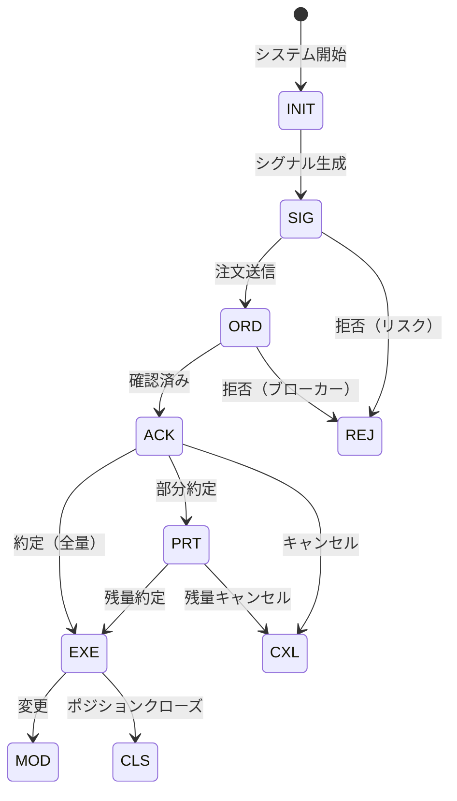

# VeritasChain Protocol (VCP) 仕様書
## バージョン 1.2

**ステータス:** Release Candidate (RC1)  
**カテゴリ:** 金融技術 / 監査標準  
**日付:** 2026-05-31  
**管理者:** VeritasChain Standards Organization (VSO)  
**ライセンス:** CC BY 4.0 International  
**ウェブサイト:** https://veritaschain.org

---

## 改訂履歴

| バージョン | 日付 | 変更内容 | 著者 |
|-----------|------|---------|------|
| 1.2 | 2026-05-31 | VCP-RECOVERY運用制約、ERASUREイベント（GDPR / 暗号消去）、バージョン互換性マトリクス、SCITT整合フィールド、レイテンシバジェット、アンカー継続性、マルチアクターXREF、Silverティアガイダンス | VSO技術委員会 |
| 1.1 | 2025-12-30 | 三層アーキテクチャ、外部アンカー必須化、ポリシー識別、VCP-XREF、完全性保証 | VSO技術委員会 |
| 1.0 | 2025-11-25 | 初版リリース | VSO技術委員会 |

---

## v1.1からの変更点サマリ

VCP v1.2は**プロトコル互換 / 認証厳格化**アップデートです。**破壊的変更はゼロ**であり、すべてのv1.0およびv1.1のイベントデータはv1.2の検証者と完全に相互運用可能です。v1.2はVC-Certified要件（特にVCP-RECOVERY制約）を厳格化し、GDPR消去、SCITT相互運用、マルチパーティ監査チェーンのためのオプトイン機能を追加します。

> v1.2のすべての変更の完全な規範的仕様は、本ディレクトリに**規範的付属書（Annex）**として同梱されている付属文書 **[VSO-SPEC-CHANGE-001](VSO-SPEC-CHANGE-001.md)**（「VCP v1.2変更提案」）に記載されています。本セクションはその要約です。本要約と付属書の詳細が異なる場合は、付属書が優先します。

### 変更分類

| カテゴリ | 件数 | 影響 |
|----------|------|------|
| 規範的（REQUIRED） | 7 | VC-Certified要件の厳格化 |
| 参考情報（RECOMMENDED） | 2 | ドキュメント / ガイダンス |
| 破壊的変更 | 0 | 完全な後方互換性を維持 |

### 変更一覧

| # | 変更 | 種別 | モジュール / セクション | Annex |
|---|------|------|------------------------|-------|
| 1 | VCP-RECOVERY制約の厳格化（SKIP/REBUILD/MERGE/CHECKPOINTの境界、緊急オーバーライド） | 規範的 | VCP-RECOVERY | §1 |
| 2 | 外部アンカーのブロックチェーン選定基準 | 規範的 | レイヤ3（§6.3） | §2 |
| 3 | ERASUREイベントタイプ（GDPR第17条 / 暗号消去） | 規範的 | VCP-PRIVACY、イベントレジストリ（§3.2.2） | §3 |
| 4 | バージョン互換性マトリクス | 参考情報 | 移行（§10.5） | §4 |
| 5 | SCITT整合フィールド（COSE Receipts、透明性サービス） | 規範的（オプトイン） | VCP-CORE / §6 | §5 |
| 6 | レイテンシバジェットの明確化 | 参考情報 | ティア（§2） / §7 | §6 |
| 7 | アンカーターゲット継続性計画 | 規範的 | レイヤ3（§6.3） | §7 |
| 8 | リファレンス実装ベンチマーク | 参考情報 | §7 | §8 |
| 9 | マルチアクターチェーンリンク（クロスパーティVCP-XREF） | 規範的（使用時） | VCP-XREF（§5.6） | §9 |

> **注**: マルチアクターチェーンリンク（#9）は、使用時にMUSTレベルの要件を課すため規範的に分類されます。ただしその採用自体はOPTIONALです。

### 認証とアルゴリズムに関する注記

- **VC-Certified v1.2**は、厳格化されたVCP-RECOVERY制約（Annex §1）と文書化されたアンカー継続性計画（Annex §7）への準拠を追加で要求します。v1.0/v1.1で認証された実装はプロトコル互換のままですが、v1.2認証にはこれらの制約を満たす必要があります。
- **耐量子署名**（`DILITHIUM2`、`FALCON512`）は、v1.2で*FUTURE*（予約）から*EXPERIMENTAL*へと進みます。テストおよびハイブリッド（古典＋PQC）デプロイメントで利用可能ですが、**まだ認証要件ではありません**。`Ed25519`はDEFAULTのままです。§1.5.1および付録Eを参照してください。

---

## v1.0からの変更点サマリ

### 破壊的変更

**認証レベルの破壊的変更のみ。**

VCP v1.1は、VC-Certifiedステータスに影響を与える新しい必須認証要件（外部アンカーとポリシー識別）を導入します。

| 変更 | プロトコル互換性 | 認証への影響 |
|------|----------------|-------------|
| PrevHash → OPTIONAL | ✅ 完全互換 | 影響なし（緩和） |
| 外部アンカー → REQUIRED | ✅ 完全互換 | ⚠️ Silverティアはアンカリング追加が必要 |
| ポリシー識別 → REQUIRED | ✅ 完全互換 | ⚠️ 全ティアでフィールド追加が必要 |

**サマリ**: 既存のv1.0実装は**プロトコル互換性**を維持します（v1.1システムと相互運用可能）が、**v1.1 VC-Certified**ステータス取得には追加コンポーネントが必要な場合があります。

> ※ v1.1は **protocol-compatible / certification-stricter** な更新です。

### 主要変更

| # | 変更 | 影響 | 移行 |
|---|------|------|------|
| 1 | **三層アーキテクチャ** | セクション6を再構成 | ドキュメントのみ |
| 2 | **PrevHashがOPTIONALに** | ハッシュチェーン連結が不要に | なし（緩和） |
| 3 | **外部アンカーが全ティアでREQUIRED** | Silverティアは日次アンカリング実装が必要 | 実装が必要 |
| 4 | **ポリシー識別追加** | 新セクション5.5 | 実装が必要 |
| 5 | **VCP-XREF二重記録追加** | 新セクション5.6 | OPTIONAL拡張 |

### 設計根拠

v1.0仕様は、Silverティア実装に対して外部アンカーをオプションにすることで柔軟性を優先していました。しかし、コミュニティからのフィードバックにより、必須の外部アンカリングなしでは「Verify, Don't Trust」の原則を完全に実現できないことが指摘されました—ログ生成者がアンカリング前にMerkle Rootを理論上変更できるためです。

v1.1はこれを以下により強化します：
1. 全ティアで外部アンカーをREQUIREDに（ティア適切な頻度とSilver向け軽量オプションあり）
2. ハッシュチェーン（PrevHash）が外部検証可能性を補完するがそれに代わるものではないOPTIONALなローカル完全性メカニズムであることを明確化
3. 懸念事項を分離し、完全性保証がどこから生じるかを明確にする三層アーキテクチャの確立

---

## 目次

1. [イントロダクション](#1-イントロダクション)
2. [準拠ティア](#2-準拠ティア)
3. [イベントライフサイクル](#3-イベントライフサイクル)
4. [データモデル](#4-データモデル)
5. [拡張モジュール](#5-拡張モジュール)
6. [完全性とセキュリティレイヤ（三層アーキテクチャ）](#6-完全性とセキュリティレイヤ三層アーキテクチャ)
7. [実装ガイドライン](#7-実装ガイドライン)
8. [規制準拠](#8-規制準拠)
9. [テスト要件](#9-テスト要件)
10. [v1.0からの移行](#10-v10からの移行)
11. [付録](#11-付録)
12. [参考文献](#12-参考文献)

---

## 1. イントロダクション

### 1.1 目的

VeritasChain Protocol（VCP）は、アルゴリズム取引の「意思決定」と「実行結果」を改ざん不可能で検証可能な形式で記録するためのグローバル標準仕様です。VCPは、取引運用における真実（"Veritas"）を確立する暗号学的に保護された証拠チェーンを提供し、MiFID II、GDPR、EU AI Act、および新興の耐量子セキュリティ要件を含む国際規制への準拠を確保します。

> **完全性保証（v1.1で新規）:** VCP v1.1は改ざん証拠を**完全性保証**に拡張し、サードパーティがイベントが改ざんされていないことだけでなく、**必須イベントが省略されていない**こと（省略攻撃/スプリットビュー攻撃）を暗号学的に検証できるようにします。これは全ティアでの必須Merkle Tree構築と外部アンカリングにより達成され、イベントバッチがアンカリング時に証明可能に完全であることを保証します。

### 1.2 適用範囲

VCPは以下に適用されます：
- **高頻度取引（HFT）**システム
- **アルゴリズムおよびAI駆動取引**プラットフォーム
- **リテール取引システム**（MT4/MT5）
- **暗号資産取引所**
- **規制報告システム**

### 1.3 バージョニング

VCPはSemantic Versioning 2.0.0を採用します：
- **MAJOR**バージョン：互換性のないAPI変更
- **MINOR**バージョン：後方互換性のある機能追加
- **PATCH**バージョン：後方互換性のあるバグ修正

v1.xシリーズ内では完全な後方互換性が保証されます。

### 1.4 暗号アジリティ

VCPは将来にわたるセキュリティを確保するため暗号アジリティを実装します：
- **現在のデフォルト**: Ed25519（パフォーマンスとセキュリティを最適化）
- **サポートアルゴリズム**: Ed25519, ECDSA_SECP256K1, RSA_2048
- **実験的（v1.2で新規）**: 耐量子アルゴリズム（DILITHIUM2 / ML-DSA、FALCON512 / FN-DSA）— テストおよびハイブリッド（古典＋PQC）デプロイメントで利用可能。まだ認証要件ではありません
- **移行パス**: 自動アルゴリズムアップグレード機能（PQC移行ロードマップは付録Eを参照）

### 1.5 標準列挙型

#### 1.5.1 SignAlgo列挙型

| 値 | アルゴリズム | 説明 | ステータス |
|----|------------|------|----------|
| **ED25519** | Ed25519 | エドワーズ曲線デジタル署名 | DEFAULT |
| **ECDSA_SECP256K1** | ECDSA secp256k1 | Bitcoin/Ethereum互換 | SUPPORTED |
| **RSA_2048** | RSA 2048ビット | レガシーシステム | DEPRECATED |
| **DILITHIUM2** | ML-DSA (FIPS 204) | 耐量子（NISTレベル2） | EXPERIMENTAL |
| **FALCON512** | FN-DSA (FIPS 206 draft) | 耐量子（NISTレベル1） | EXPERIMENTAL |

#### 1.5.2 HashAlgo列挙型

| 値 | アルゴリズム | 説明 | ステータス |
|----|------------|------|----------|
| **SHA256** | SHA-256 | SHA-2ファミリー、256ビット | DEFAULT |
| **SHA3_256** | SHA3-256 | SHA-3ファミリー、256ビット | SUPPORTED |
| **BLAKE3** | BLAKE3 | 高性能ハッシュ | SUPPORTED |
| **SHA3_512** | SHA3-512 | SHA-3ファミリー、512ビット | FUTURE |

#### 1.5.3 ClockSyncStatus列挙型

| 値 | 説明 | 適用ティア |
|----|------|----------|
| **PTP_LOCKED** | PTP同期ロック済み | Platinum |
| **NTP_SYNCED** | NTP同期済み | Gold |
| **BEST_EFFORT** | ベストエフォート同期 | Silver |
| **UNRELIABLE** | 信頼できる同期なし | Silver（劣化） |

#### 1.5.4 TimestampPrecision列挙型

| 値 | 説明 | 小数点以下桁数 |
|----|------|--------------|
| **NANOSECOND** | ナノ秒精度 | 9 |
| **MICROSECOND** | マイクロ秒精度 | 6 |
| **MILLISECOND** | ミリ秒精度 | 3 |

### 1.6 コアモジュール

- **VCP-CORE**: 標準ヘッダーとセキュリティレイヤ
- **VCP-TRADE**: 取引データペイロードスキーマ
- **VCP-GOV**: アルゴリズムガバナンスとAI透明性
- **VCP-RISK**: リスク管理パラメータ記録
- **VCP-PRIVACY**: 暗号シュレッディングによるプライバシー保護
- **VCP-RECOVERY**: チェーン中断回復メカニズム
- **VCP-XREF**: クロスリファレンスと二重記録（v1.1で新規）

---

## 2. 準拠ティア

### 2.1 ティア定義

| ティア | 対象 | 時刻同期 | シリアライゼーション | 署名 | 外部アンカー | 精度 |
|--------|------|---------|-------------------|------|-------------|------|
| **Platinum** | HFT/取引所 | PTPv2 (<1µs) | SBE | Ed25519（ハードウェア） | **REQUIRED（10分）** | NANOSECOND |
| **Gold** | プロップ/機関 | NTP (<1ms) | JSON | Ed25519（クライアント） | **REQUIRED（1時間）** | MICROSECOND |
| **Silver** | リテール/MT4/5 | ベストエフォート | JSON | Ed25519（委任） | **REQUIRED（24時間）** | MILLISECOND |

> **v1.0からの変更**: 外部アンカーが全ティアでREQUIREDになりました。外部検証可能な完全性を確保するためです。Silverティアでは軽量メカニズム（例：OpenTimestamps、FreeTSA）が明示的に許容されます。この変更はすべてのティアをVCPの「Verify, Don't Trust」原則に整合させます。

### 2.2 ティア別要件

#### 2.2.1 Platinumティア
```yaml
要件:
  時刻:
    プロトコル: PTPv2 (IEEE 1588-2019)
    精度: <1マイクロ秒
    ステータス: PTP_LOCKED必須
  パフォーマンス:
    スループット: >1Mイベント/秒
    レイテンシ: <10µs/イベント
    ストレージ: バイナリ (SBE/FlatBuffers)
  外部アンカー:
    頻度: 10分ごと
    対象: ブロックチェーンまたはRFC 3161 TSA
    証明タイプ: 完全Merkle証明
  実装:
    言語: [C++, Rust, FPGA]
    技術: [カーネルバイパス, RDMA, ゼロコピー]
```

#### 2.2.2 Goldティア
```yaml
要件:
  時刻:
    プロトコル: NTP/Chrony
    精度: <1ミリ秒
    ステータス: NTP_SYNCED必須
  パフォーマンス:
    スループット: >100Kイベント/秒
    レイテンシ: <100µs/イベント
    永続化: WAL/キュー必須 (Kafka, Redis)
  外部アンカー:
    頻度: 1時間ごと
    対象: RFC 3161 TSAまたはサードパーティ証明付きデータベース
    証明タイプ: Merkle root + 監査パス
  実装:
    言語: [Python, Java, C#]
    デプロイ: クラウド対応 (AWS/GCP/Azure)
```

#### 2.2.3 Silverティア
```yaml
要件:
  時刻:
    プロトコル: システム時刻
    精度: ベストエフォート
    ステータス: BEST_EFFORT/UNRELIABLE許容
  パフォーマンス:
    スループット: >1Kイベント/秒
    レイテンシ: <1秒
    通信: 非同期推奨
  外部アンカー:
    頻度: 24時間ごと（日次）
    対象: 完全性証明付きデータベースまたは公開タイムスタンプサービス
    証明タイプ: Merkle rootのみ
  実装:
    言語: [MQL5, Python]
    互換性: MT4/MT5 DLL統合
```

> **注意**: Silverティアは、MiFID II RTS 25、SEC Rule 17a-4、または同等の時刻同期要件の対象となる規制グレードのアルゴリズム取引システムを意図していません。Silverティアは開発、テスト、バックテスト分析、および非規制取引シナリオに適しています。

> **準規制用途に関するガイダンス**: 実際には、Silverティアログは間接的な規制上の意味を持つコンテキストで使用される場合があります（例：監督当局へのバックテスト結果の提示、内部監査文書）。そのような場合：
> 
> | 側面 | Silverティア能力 | 合理的保証レベル |
> |------|----------------|-----------------|
> | **タイムスタンプ精度** | BEST_EFFORT（システムクロック） | 参考のみ；レイテンシ紛争には不適 |
> | **イベント完全性** | 日次Merkleアンカー | バッチレベルの完全性；24時間窓内でギャップ可能 |
> | **チェーン連続性** | PrevHash OPTIONAL | 有効化しない限りリアルタイムギャップ検出なし |
> 
> 24時間窓内でより高い保証が必要な場合、実装は**日中手動アンカリング**（例：取引セッション終了時）を実行するか、アンカー間隔を12時間に短縮することができます（MAY）。これによりティア分類は変わりませんが、監査可能性が向上します。
>
> **完全性保証の範囲:** Silverティアはアンカー時点でのバッチレベルの完全性保証を提供し、継続的なリアルタイム完全性ではありません。
>
> 規制説明にSilverティアログを使用する組織は、これらの制限を当局に明確に開示すべきです。より高い保証が必要な場合は、Goldティアにアップグレードしてください。

---

## 3. イベントライフサイクル

*[セクション3はv1.0から継承]*

### 3.1 イベント状態図



### 3.2 イベントタイプレジストリ

*[コアイベントタイプはv1.0から継承]*

#### 3.2.1 エラーイベントタイプ（v1.1で新規）

VCP v1.1は、実装間で一貫したエラー記録を確保するための標準化されたエラーイベントタイプを導入します。

| EventType | カテゴリ | 説明 | 重大度 |
|-----------|---------|------|--------|
| **ERR_CONN** | 接続 | 接続障害（ブローカー、取引所、データフィード） | CRITICAL |
| **ERR_AUTH** | 認証 | 認証/認可の失敗 | CRITICAL |
| **ERR_TIMEOUT** | タイムアウト | 操作タイムアウト（注文、クエリ、ハートビート） | WARNING |
| **ERR_REJECT** | 拒否 | カウンターパーティによる注文/リクエスト拒否 | WARNING |
| **ERR_PARSE** | データ | メッセージ解析または検証の失敗 | WARNING |
| **ERR_SYNC** | 同期 | 時刻同期喪失、シーケンスギャップ検出 | WARNING |
| **ERR_RISK** | リスク | リスク制限違反、ポジション制限超過 | CRITICAL |
| **ERR_SYSTEM** | システム | 内部システムエラー、リソース枯渇 | CRITICAL |
| **ERR_RECOVER** | 回復 | 回復アクション開始（再接続、再同期） | INFO |

##### エラーイベントスキーマ拡張

```json
{
  "Header": {
    "EventType": "ERR_CONN",
    "Timestamp": 1735520400000000,
    "TimestampISO": "2025-12-30T00:00:00.000000Z"
  },
  "ErrorDetails": {
    "ErrorCode": "string",           // 実装固有のコード
    "ErrorMessage": "string",        // 人間が読める説明
    "Severity": "enum",              // CRITICAL | WARNING | INFO
    "AffectedComponent": "string",   // 例: "broker-gateway", "price-feed"
    "RecoveryAction": "string",      // OPTIONAL: 実行または推奨されるアクション
    "CorrelatedEventID": "uuid"      // OPTIONAL: エラーを引き起こした関連イベント
  }
}
```

##### 要件

| 要件 | レベル | 注記 |
|------|-------|------|
| エラーイベント記録 | REQUIRED | 全ティアでエラーイベントを記録する必要あり |
| ErrorDetails.Severity | REQUIRED | すべてのエラーを分類する必要あり |
| ErrorDetails.ErrorMessage | REQUIRED | 人間が読める説明 |
| ErrorDetails.RecoveryAction | RECOMMENDED | インシデント分析を支援 |
| CorrelatedEventID | OPTIONAL | トリガーイベントへのリンク |

> **実装上の注意**: エラーイベントは、すべてのVCPイベントと同じ完全性要件（EventHash、Merkle包含、アンカリング）に従います。エラーイベントはアンカーバッチからフィルタリングしてはなりません（MUST NOT）。

#### 3.2.2 ERASUREイベントタイプ（v1.2で新規）

VCP v1.2は、GDPRの消去権（第17条）と追記型・改ざん検知可能な監査証跡とを両立させるため、**ERASURE**イベントタイプを導入します。ERASUREは過去のイベントを削除・書き換えしません。指定された保護対象フィールドの*平文*が、**暗号消去（crypto-shredding、サブジェクト単位のデータ暗号化鍵の破棄）**によって復元不能にされたことを、新たな不変イベントとして記録します。対象イベントの元のEventHash、Merkle包含、外部アンカーは引き続き検証可能なまま保たれます。

| フィールド | 型 | 要件 | 注記 |
|-----------|----|------|------|
| `ErasureTargetEventIDs` | ["uuid"] | REQUIRED | 保護対象フィールドが暗号消去されるイベント |
| `ErasureReason` | enum | REQUIRED | `SUBJECT_REQUEST` \| `RETENTION_EXPIRED` \| `LEGAL_ORDER` |
| `KeyDestructionProof` | string | REQUIRED | DEKが破棄された証拠（例: HSM/KMSのアテステーション） |
| `RetentionExemption` | string | OPTIONAL | 保持義務が消去に優先する場合の法的根拠（例: MiFID II第16条(7)） |
| `OperatorID` | string | REQUIRED | 消去を承認する主体 |

> **適用範囲と法的注記（honest scoping）:** ERASUREは消去義務を支援する*技術的*メカニズム（暗号消去）を提供するものであり、**法的判断ではありません**。暗号消去がGDPR上の「消去」に該当するかは、法域および係属中の判例に依存します（cf. 仮名化に関するEDPBガイドライン01/2025、本書執筆時点で係属中のCJEU C-413/23 P）。VCPは法的結論を保証しません。また、SEC Rule 17a-4の監査証跡統制のような再現性要件との緊張にも留意が必要です。DEKが破棄されると、設計上、元の平文は**再現不可能**になります。保持義務の例外処理を含む完全な仕様はAnnex §3を参照してください。

---

## 4. データモデル

*[セクション4はv1.0から変更なし]*

---

## 5. 拡張モジュール

*[セクション5.1-5.4はv1.0から変更なし]*

### 5.5 ポリシー識別（v1.1で新規）

#### 5.5.1 目的

ポリシー識別は、すべてのVCPイベントがその準拠ティアと登録ポリシーを明示的に宣言することを確保します。これにより検証者は適切な検証ルールを適用でき、マルチティアデプロイメントをサポートします。

#### 5.5.2 スキーマ定義

```json
{
  "PolicyIdentification": {
    "Version": "1.1",
    "PolicyID": "string",           // REQUIRED: 一意のポリシー識別子
    "ConformanceTier": "enum",      // REQUIRED: SILVER | GOLD | PLATINUM
    "RegistrationPolicy": {
      "Issuer": "string",           // ポリシーを運用する組織
      "PolicyURI": "string",        // ポリシー文書へのURI
      "EffectiveDate": "int64",     // ポリシー有効開始タイムスタンプ
      "ExpirationDate": "int64"     // ポリシー有効期限（オプション）
    },
    "VerificationDepth": {
      "HashChainValidation": "boolean",   // ハッシュチェーン使用有無
      "MerkleProofRequired": "boolean",   // v1.1では常にtrue
      "ExternalAnchorRequired": "boolean" // v1.1では常にtrue
    }
  }
}
```

#### 5.5.3 要件

| フィールド | 要件 | 説明 |
|-----------|------|------|
| PolicyID | REQUIRED | 登録ポリシーの一意識別子 |
| ConformanceTier | REQUIRED | SILVER, GOLD, PLATINUMのいずれか |
| RegistrationPolicy.Issuer | REQUIRED | 組織名または識別子 |
| VerificationDepth | REQUIRED | 検証能力を宣言 |

#### 5.5.4 PolicyID命名規則（v1.1で新規）

中央レジストリを必要とせずにグローバルな一意性を確保するため、PolicyIDは**発行者ドメイン + ローカルID**形式に従うべきです（SHOULD）：

```
PolicyID = <逆ドメイン>:<ローカル識別子>

例：
  org.veritaschain.prod:hft-system-001
  com.example.trading:gold-algo-v2
  jp.co.broker:silver-mt5-bridge
```

| コンポーネント | 形式 | 例 |
|--------------|------|-----|
| **逆ドメイン** | 発行者ドメインの逆DNS表記 | `org.veritaschain` |
| **セパレータ** | コロン（`:`） | `:` |
| **ローカル識別子** | 発行者定義、英数字とハイフン | `prod-hft-001` |

> **注意**: VSOはPolicyIDレジストリを運用しません。一意性はドメイン所有権により達成されます。ドメインを持たない組織は`local:<組織名>:<ローカルID>`形式を使用できますが（MAY）、一意性保証は弱くなります。

#### 5.5.5 準拠ティアとの関係

準拠ティア（Silver/Gold/Platinum）は**検証深度**を表し、別個の登録ポリシーではありません。単一の組織が異なるユースケースに対して異なるティアで複数のポリシーを運用できます：

- **Platinum**: 本番HFTシステム
- **Gold**: 標準アルゴリズム取引
- **Silver**: 開発、テスト、バックテスト

登録ポリシー識別子は、すべてのVCPイベントのペイロードまたはメタデータに明示的に含める必要があります（MUST）。

### 5.6 VCP-XREF: クロスリファレンスと二重記録（v1.1で新規）

#### 5.6.1 目的

VCP-XREFは**二重記録（Dual Logging）**を可能にします—複数の当事者からの独立したVCPイベントストリームをクロスリファレンスして不一致を検出できます。これにより、記録を検出されずに操作するには当事者間の共謀が必要となり、単一当事者ログよりも高いレベルの保証を提供します。

```
┌──────────────────┐          ┌──────────────────┐
│  取引アルゴ      │─────────▶│     ブローカー    │
└────────┬─────────┘          └────────┬─────────┘
         │                             │
         ▼                             ▼
┌──────────────────┐          ┌──────────────────┐
│   VCP Sidecar    │          │   Broker VCP     │
│  （トレーダー側） │          │  （ブローカー側） │
└────────┬─────────┘          └────────┬─────────┘
         │                             │
         └───────────┬─────────────────┘
                     ▼
            ┌─────────────────┐
            │ クロスリファレンス │
            │     検証        │
            └─────────────────┘

保証: 両当事者が共謀しない限り、
      一方による省略または変更は
      他方で検出可能。
```

#### 5.6.2 ユースケース

| シナリオ | 当事者A | 当事者B | 利点 |
|---------|--------|--------|------|
| **プロップファーム取引** | トレーダー | プロップファーム | 支払い紛争防止 |
| **ブローカー執行** | アルゴ提供者 | ブローカー | 最良執行検証 |
| **マルチベニュー** | スマートオーダールーター | 取引所 | クロスベニュー監査 |
| **規制監査** | 取引会社 | 規制当局 | 独立検証 |

#### 5.6.3 スキーマ定義

```json
{
  "VCP-XREF": {
    "Version": "1.1",
    "CrossReferenceID": "uuid",          // REQUIRED: 共有参照ID
    "PartyRole": "enum",                  // REQUIRED: INITIATOR | COUNTERPARTY | OBSERVER
    "CounterpartyID": "string",           // REQUIRED: 相手方の識別子
    "SharedEventKey": {
      "OrderID": "string",                // 主要相関キー
      "AlternateKeys": ["string"],        // 追加相関キー
      "Timestamp": "int64",               // マッチング用イベントタイムスタンプ
      "ToleranceMs": "int32"              // タイムスタンプマッチング許容差
    },
    "ExpectedCounterpartyHash": "string", // OPTIONAL: 相手方からの期待ハッシュ
    "ReconciliationStatus": "enum",       // PENDING | MATCHED | DISCREPANCY | TIMEOUT
    "DiscrepancyDetails": {
      "Field": "string",
      "LocalValue": "string",
      "CounterpartyValue": "string",
      "Severity": "enum"                  // INFO | WARNING | CRITICAL
    }
  }
}
```

#### 5.6.4 当事者ロール

| ロール | 説明 | 責務 |
|--------|------|------|
| **INITIATOR** | 取引を開始する当事者 | CrossReferenceID生成、最初にログ |
| **COUNTERPARTY** | 取引を受信/執行する当事者 | CrossReferenceID参照、応答をログ |
| **OBSERVER** | サードパーティオブザーバー（例：規制当局） | 読み取り専用クロスリファレンスアクセス |

#### 5.6.5 セキュリティ考慮事項

| 脅威 | 緩和策 |
|------|--------|
| **単一当事者による操作** | 相手方ログが独立した証拠を提供 |
| **共謀** | 外部アンカリングにより事後共謀が検出可能 |
| **リプレイ攻撃** | CrossReferenceID + タイムスタンプの一意性 |
| **ログ拒否** | 相手方記録の欠如自体が証拠 |

> **主要保証**: 当事者Aがイベント発生を主張し当事者Bが否定した場合、両当事者からのVCP-XREFレコードの有無が**否認不可能な証拠**を提供します。操作には両当事者の共謀と外部アンカーの侵害が必要です。

#### 5.6.6 要件

| 要件 | レベル | 注記 |
|------|-------|------|
| VCP-XREF拡張 | OPTIONAL | 紛争発生しやすいシナリオではRECOMMENDED |
| CrossReferenceID形式 | UUID v4またはv7 | グローバルに一意である必要あり |
| SharedEventKey | 少なくとも1つのキー | OrderID推奨 |
| 外部アンカー | REQUIRED | 両当事者が独立してアンカーする必要あり |
| 保持 | 規制最小値に一致 | 通常7年 |

---

## 6. 完全性とセキュリティレイヤ（三層アーキテクチャ）

### 6.0 アーキテクチャ概要（v1.1で新規）

VCP v1.1は完全性とセキュリティのための明確な**三層アーキテクチャ**を導入します。この構造は、異なる暗号メカニズムがどのように連携し、各レイヤの保証がどこから生じるかを明確にします。

```
┌─────────────────────────────────────────────────────────────────────┐
│                                                                     │
│  レイヤ3: 外部検証可能性                                            │
│  ─────────────────────                                              │
│  目的: 生成者を信頼せずにサードパーティ検証                          │
│                                                                     │
│  コンポーネント:                                                    │
│  ├─ デジタル署名 (Ed25519/Dilithium): REQUIRED                     │
│  ├─ タイムスタンプ (二重形式 ISO+int64): REQUIRED                   │
│  └─ 外部アンカー (ブロックチェーン/TSA): REQUIRED                   │
│                                                                     │
│  頻度: ティア依存 (10分 / 1時間 / 24時間)                           │
│                                                                     │
├─────────────────────────────────────────────────────────────────────┤
│                                                                     │
│  レイヤ2: コレクション完全性    ← 外部検証可能性のコア              │
│  ────────────────────────                                           │
│  目的: イベントバッチの完全性を証明                                  │
│                                                                     │
│  コンポーネント:                                                    │
│  ├─ Merkle Tree (RFC 6962): REQUIRED                               │
│  ├─ Merkle Root: REQUIRED                                          │
│  └─ 監査パス (検証用): REQUIRED                                     │
│                                                                     │
│  注: サードパーティによるバッチ完全性検証を可能に                    │
│                                                                     │
├─────────────────────────────────────────────────────────────────────┤
│                                                                     │
│  レイヤ1: イベント完全性                                            │
│  ──────────────────                                                 │
│  目的: 個別イベントの完全性                                         │
│                                                                     │
│  コンポーネント:                                                    │
│  ├─ EventHash (正規化イベントのSHA-256): REQUIRED                  │
│  └─ PrevHash (前イベントへのリンク): OPTIONAL                       │
│                                                                     │
│  注: PrevHashはリアルタイム検出を提供 (v1.1ではOPTIONAL)            │
│                                                                     │
└─────────────────────────────────────────────────────────────────────┘
```

#### 6.0.1 レイヤ責務

| レイヤ | 目的 | REQUIREDコンポーネント | OPTIONALコンポーネント |
|--------|------|----------------------|----------------------|
| **レイヤ3** | 外部検証可能性 | 署名、タイムスタンプ、外部アンカー | デュアル署名（PQC） |
| **レイヤ2** | コレクション完全性 | Merkle Tree、Merkle Root、監査パス | - |
| **レイヤ1** | イベント完全性 | EventHash | PrevHash（ハッシュチェーン） |

#### 6.0.2 このアーキテクチャの理由

**質問**: なぜv1.1ではハッシュチェーン（PrevHash）がOPTIONALになったのに、v1.0ではREQUIREDだったのですか？

**回答**: 

PrevHashベースのハッシュチェーンは、リアルタイムのプロセス内改ざん検出を優先するためにv1.0ではREQUIREDでした。これは依然として有効で価値のある完全性メカニズムです。

v1.1では、Merkleベースのコレクション完全性（レイヤ2）と必須の外部アンカリング（レイヤ3）を組み合わせることで、同等以上の完全性保証を達成できるため、PrevHashはOPTIONALになりました。

この変更により：
1. 外部検証可能性を犠牲にせずに**Silverティア実装を簡素化**
2. 外部検証可能な証明を強調することで**「Verify, Don't Trust」原則に整合**
3. ハッシュチェーンを使用するv1.0実装との**完全な後方互換性を維持**

リアルタイム改ざん検出の恩恵を受ける実装（例：HFTシステム）はPrevHashを引き続き使用すべきです（SHOULD）。

---

### 6.1 レイヤ1: イベント完全性

*[EventHash計算のコード例はv1.0から継承、PrevHashはOPTIONALに更新]*

### 6.2 レイヤ2: コレクション完全性

*[RFC 6962準拠のMerkle Tree構築はv1.0から継承]*

### 6.3 レイヤ3: 外部検証可能性

#### 6.3.3 外部アンカリング（REQUIRED - v1.1で変更）

**重要な変更**: 外部アンカリングは外部検証可能な完全性を達成するために全ティアでREQUIREDです。

Silverティアでは、軽量または委任されたアンカリングメカニズムが明示的に許容され、期待されています。この要件により、最も単純なVCP実装でもサードパーティが検証可能な完全性の証明を提供することが保証されます。

| ティア | 頻度 | アンカー対象 | 証明タイプ |
|--------|------|-------------|-----------|
| **Platinum** | 10分 | ブロックチェーン（Ethereum等）またはRFC 3161 TSA | 完全Merkle証明 |
| **Gold** | 1時間 | RFC 3161 TSAまたは証明付きデータベース | Merkle root + 監査パス |
| **Silver** | 24時間 | 公開タイムスタンプサービスまたは証明付きデータベース | Merkle rootのみ |

##### 証明付きデータベース要件（v1.1で新規）

「証明付きデータベース」がアンカー対象として適格となるには、以下の最小基準を満たす必要があります（MUST）：

| 基準 | 要件 | 検証 |
|------|------|------|
| **サードパーティ監査** | 独立した当事者による年次監査 | 監査報告書が利用可能 |
| **改ざん検出** | 暗号学的完全性チェック（ハッシュチェーン、Merkle、または同等） | 技術文書 |
| **アクセス制御** | 監査ログ付きロールベースアクセス | SOC 2 Type IIまたは同等 |
| **保持ポリシー** | データ保持 ≥ 規制最小値（通常7年） | ポリシー文書 |
| **可用性SLA** | ≥ 99.9%アップタイムコミットメント | SLA文書 |

> **注意**: 「公開タイムスタンプサービス」（Silverティア）には証明要件がありませんが、より弱い保証を提供します。規制ユースケースでは、証明付きデータベース以上を推奨します。

##### 証明付きデータベースの例（非網羅的）

| 例 | 証明レベル | 注記 |
|----|----------|------|
| AWS QLDB + SOC 2 Type II | 高 | 年次監査付き不変台帳 |
| Azure SQL Ledger + SOC 2 | 高 | 暗号学的検証組み込み |
| Google Cloud Spanner + SOC 2 | 高 | 監査証跡付き分散データベース |
| セルフホストPostgreSQL + 年次暗号監査 | 中 | サードパーティハッシュ検証が必要 |
| 証明なし内部データベース | **不可** | 「証明付き」基準を満たさない |

詳細な証明受け入れ基準については、**VSO-CAB-REQ-001**（CAB認定要件）を参照してください。

##### アンカー対象の利用不可（v1.1で新規）

実装はアンカー対象の利用不可を処理する必要があります（MUST）：

| シナリオ | 必須アクション |
|---------|--------------|
| **一時的な停止** | アンカリングリクエストをキューイング；指数バックオフでリトライ |
| **恒久的な中止** | 30日以内に代替アンカー対象に移行 |
| **アンカー検証失敗** | バックアップ証明としてローカルAnchorRecordコピーを保持 |

実装は、元のアンカー対象が利用不可能になっても検証を可能にするため、すべてのAnchorRecordの完全なローカルコピーを維持すべきです（SHOULD）。

---

## 7. 実装ガイドライン

*[セクション7はv1.0から大部分継承、三層アーキテクチャの更新あり]*

---

## 8. 規制準拠

*[コア要件はv1.0から変更なし]*

### 8.1 規制コンテキストでのClockSyncStatus使用（v1.1で新規）

VCPはタイムスタンプの**精度**（ストレージ形式）と**正確度**（時刻同期）を区別します。規制評価では両方を考慮すべきです：

#### 8.1.1 準拠のためのClockSyncStatus解釈

| ClockSyncStatus | 規制上の解釈 | 適用標準 |
|-----------------|-------------|---------|
| **PTP_LOCKED** | 権威あるタイムスタンプ；レイテンシ紛争に適 | MiFID II RTS 25（ゲートウェイレベル） |
| **NTP_SYNCED** | 信頼できるタイムスタンプ；注文順序付けに適 | MiFID II RTS 25（一般）、CAT Rule 613 |
| **BEST_EFFORT** | 参考タイムスタンプ；正確な順序付けには不適 | 内部監査のみ |
| **UNRELIABLE** | タイムスタンプが大幅に不正確な可能性 | 開発/テストのみ |

---

## 9. テスト要件

### 9.1 適合性テストスイート（v1.1で更新）

#### 9.1.1 ティア要件マトリクス

| テストカテゴリ | Silver | Gold | Platinum |
|--------------|--------|------|----------|
| スキーマ検証 | Required | Required | Required |
| UUID v7形式 | Required | Required | Required |
| タイムスタンプ（MILLISECOND） | Required | Required | Required |
| タイムスタンプ（MICROSECOND） | Optional | Required | Required |
| タイムスタンプ（NANOSECOND） | Optional | Optional | Required |
| EventHash計算 | Required | Required | Required |
| ハッシュチェーン（PrevHash） | **Optional** | **Optional** | **Optional** |
| デジタル署名 | Required | Required | Required |
| Merkle Tree構築 | Required | Required | Required |
| Merkle証明検証 | Required | Required | Required |
| **外部アンカー** | **Required** | **Required** | **Required** |
| **ポリシー識別** | **Required** | **Required** | **Required** |
| 時刻同期（BEST_EFFORT） | Required | Required | Required |
| 時刻同期（NTP_SYNCED） | Optional | Required | Required |
| 時刻同期（PTP_LOCKED） | Optional | Optional | Required |

> **v1.0からの変更**:
> - ハッシュチェーン: 全ティアでRequiredからOptionalに変更
> - 外部アンカー: Optional/Recommended/Requiredから全ティアでRequiredに変更
> - ポリシー識別: 全ティアで新規要件

> **SilverティアのMerkle証明検証に関する注意**: Silverティアでは、「Merkle証明検証」は、指定されたEventHashがアンカーされたMerkle Rootに含まれていることを検証できる能力（バッチレベル検証）を指します。イベントごとの監査パス**保存**は省略可能（MAY）ですが、実装は監査または規制照会の要求時に**監査パスをオンデマンドで生成**するのに十分なデータを保持する必要があります（MUST）。GoldおよびPlatinumティアはイベントごとの完全な監査パス生成と保存をサポートする必要があります（MUST）。

#### 9.1.2 クリティカルテスト

一部のテストは**CRITICAL**としてマークされています。クリティカルテストでの失敗は自動的な認証失格となります。

v1.1のクリティカルテスト：

| テストID | 説明 | v1.0 | v1.1 |
|---------|------|------|------|
| SCH-001 | イベント構造検証 | Critical | Critical |
| UID-001 | UUID v7形式 | Critical | Critical |
| HCH-001 | Genesisイベントprev_hash | Critical | **削除** |
| HCH-003 | ハッシュ計算アルゴリズム | Critical | Critical（EventHashのみ） |
| SIG-001 | 署名アルゴリズム準拠 | Critical | Critical |
| **MKL-001** | Merkle tree構築 | - | **Critical（新規）** |
| **MKL-002** | Merkle証明検証 | - | **Critical（新規）** |
| **ANC-001** | 外部アンカー存在 | - | **Critical（新規）** |
| **POL-001** | ポリシー識別 | - | **Critical（新規）** |

#### 9.1.3 非クリティカルテスト（v1.1で新規）

非クリティカルテストは自動的な認証失格を引き起こしませんが、認証レポートに報告されます。繰り返しの非クリティカル失敗は認証更新に影響を与える可能性があります。

| テストID | 説明 | Silver | Gold | Platinum | 注記 |
|---------|------|--------|------|----------|------|
| **HCH-002** | ハッシュチェーン有効化（PrevHash） | Optional | Recommended | Recommended | RTS25/CAT整合のため |
| **ANC-002** | アンカリング遅延閾値 | Warning >24h | Warning >1h | Warning >10min | 2倍閾値で違反 |
| **ANC-003** | アンカー対象可用性 | Check | Check | Check | バックアップアンカー推奨 |
| **CLK-001** | 時刻同期ステータス一貫性 | Report | Verify NTP | Verify PTP | セクション8.1参照 |
| **XREF-001** | クロスリファレンスID一意性 | Optional | Optional | Optional | VCP-XREF有効時 |
| **XREF-002** | クロスリファレンス照合 | Optional | Optional | Optional | VCP-XREF有効時 |

> **HCH-002に関する注意**: v1.1ではPrevHashはOPTIONALですが、規制ユースケース（MiFID II RTS 25、SEC CAT Rule 613）をターゲットとする実装はハッシュチェーン連結を有効にすべきです（SHOULD）。GoldおよびPlatinumティア実装はこの機能を有効にすることを推奨します（RECOMMENDED）。

### 9.2 認証ガバナンス

VC-Certified認証は、VSOではなくVSO認定適合性評価機関（CAB）によって発行されます。VSOは**スキームオーナー**として機能し、標準開発とCAB認定に責任を負います。

```
VSO（スキームオーナー）
  │
  │  認定（Accreditation）
  ▼
認定CAB（複数）
  │
  │  認証（Certification）
  ▼
VCP導入企業
```

| エンティティ | 役割 | 責務 |
|-------------|------|------|
| **VSO** | スキームオーナー | 標準開発、CAB認定、テスト基準 |
| **認定CAB** | 認証機関 | 認証発行、適合性評価 |

詳細なガバナンス構造については、**VSO-GOV-SCHEME-001**（VC-Certifiedスキームガバナンス構造）を参照してください。

---

## 10. v1.0からの移行

### 10.1 後方互換性

VCP v1.1はv1.0と完全な後方互換性があります：

| v1.0機能 | v1.1動作 |
|---------|---------|
| PrevHash付きイベント | 完全サポート、継続動作 |
| 外部アンカーなしイベント | **アンカリング追加必須**（猶予期間あり） |
| ポリシーIDなしイベント | **ポリシーID追加必須**（猶予期間あり） |

### 10.2 移行手順

#### Silverティア実装向け

1. **外部アンカリング追加**（REQUIRED）
   - 日次Merkle rootアンカリング実装
   - アンカー対象選択（簡易性にはOpenTimestamps推奨）
   - SecurityオブジェクトをMerkleRootとAnchorReferenceで更新

2. **ポリシー識別追加**（REQUIRED）
   - 実装用PolicyIDを定義
   - 全イベントにPolicyIdentificationを追加

3. **オプション: ハッシュチェーン削除**
   - ハッシュチェーンが複雑さを増す場合、削除可能
   - PrevHashをnullに設定または完全に省略

### 10.3 猶予期間

| 要件 | 猶予期間 | 厳格な期限 |
|------|---------|-----------|
| 外部アンカー（Silver） | 6ヶ月 | 2026-06-25 |
| ポリシー識別 | 3ヶ月 | 2026-03-25 |
| Security内Merkleフィールド | 3ヶ月 | 2026-03-25 |

厳格な期限後、v1.0のみの実装は新規認証でVC-Certifiedステータスを取得できません。

### 10.4 v1.1からv1.2への移行

v1.2は**破壊的変更を導入しません**。既存のv1.1実装は変更なしでv1.2検証者と相互運用でき、すべてのv1.1イベントは有効なv1.2イベントのままです。**VC-Certified v1.2**を取得するには、実装は追加で以下を満たす必要があります：

1. **VCP-RECOVERY制約の採用**（REQUIRED）— ティア別のSKIP/REBUILD/MERGE/CHECKPOINT境界と緊急オーバーライド承認を強制（Annex §1）。
2. **アンカー継続性の文書化**（REQUIRED）— フォールバックアンカーターゲットとフェイルオーバー手順を宣言（Annex §7）。
3. **オプションで採用**: ERASURE（GDPR）、SCITT整合フィールド、マルチアクターXREF（Annex §3、§5、§9）。

データ移行は不要です。

### 10.5 バージョン互換性マトリクス

#### データフォーマット互換性

| プロデューサ | コンシューマ | 互換性 | 注記 |
|-------------|-------------|--------|------|
| v1.0 | v1.2 | 完全 | v1.2はすべてのv1.0イベントを受理 |
| v1.1 | v1.2 | 完全 | v1.2はすべてのv1.1イベントを受理 |
| v1.2 | v1.0 | 部分 | ERASUREと新フィールドは無視される |
| v1.2 | v1.1 | 部分 | ERASUREイベントはv1.1に未知 |
| v1.2 | v1.2 | 完全 | — |

#### 検証互換性

| 証明 | 検証者 | 互換性 | 注記 |
|------|--------|--------|------|
| v1.0 / v1.1の証明 | v1.2検証者 | 完全 | すべての旧証明が検証可能 |
| v1.2の証明 | v1.0 / v1.1検証者 | 部分 | 新しい証明タイプはグレースフルに失敗 |

> 完全なマトリクス（認証互換性とアルゴリズム廃止タイムラインを含む）はAnnex §4を参照してください。

---

## 11. 付録

### 付録D: 三層アーキテクチャサマリ（新規）

```
┌─────────────────────────────────────────────────────────────┐
│  VCP v1.1 三層アーキテクチャ                                 │
├─────────────────────────────────────────────────────────────┤
│                                                             │
│  「Verify, Don't Trust」                                    │
│                                                             │
│  レイヤ3: 外部検証可能性                                    │
│  ┌─────────────────────────────────────────────────────┐   │
│  │ • 署名: REQUIRED                                    │   │
│  │ • タイムスタンプ: REQUIRED                          │   │
│  │ • 外部アンカー: REQUIRED（ティア依存頻度）          │   │
│  │                                                     │   │
│  │ → サードパーティが生成者を信頼せず検証可能          │   │
│  └─────────────────────────────────────────────────────┘   │
│                           │                                 │
│                           ▼                                 │
│  レイヤ2: コレクション完全性 ← 外部検証可能性のコア        │
│  ┌─────────────────────────────────────────────────────┐   │
│  │ • Merkle Tree (RFC 6962): REQUIRED                  │   │
│  │ • Merkle Root: REQUIRED                             │   │
│  │ • 監査パス: REQUIRED                                │   │
│  │                                                     │   │
│  │ → バッチ完全性を証明                                │   │
│  └─────────────────────────────────────────────────────┘   │
│                           │                                 │
│                           ▼                                 │
│  レイヤ1: イベント完全性                                   │
│  ┌─────────────────────────────────────────────────────┐   │
│  │ • EventHash: REQUIRED                               │   │
│  │ • PrevHash (ハッシュチェーン): OPTIONAL             │   │
│  │                                                     │   │
│  │ → 個別イベントの完全性                              │   │
│  └─────────────────────────────────────────────────────┘   │
│                                                             │
└─────────────────────────────────────────────────────────────┘
```

### 付録E: 耐量子暗号移行ガイダンス（非規範的）

この付録は、耐量子暗号（PQC）移行を計画する実装向けの非拘束ガイダンスを提供します。これらの推奨は情報提供であり、v1.1要件を構成しません。

#### E.1 デュアル署名戦略

PQC移行期間中、実装は後方互換性を維持しながら耐量子性を追加するためにデュアル署名を使用できます（MAY）：

```json
{
  "Security": {
    "Signature": "base64(Ed25519_signature)",
    "SignAlgo": "ED25519",
    "PQCSignature": "base64(Dilithium2_signature)",
    "PQCSignAlgo": "DILITHIUM2"
  }
}
```

#### E.2 推奨アルゴリズム組み合わせ

| ユースケース | 古典 | 耐量子 | 注記 |
|------------|------|--------|------|
| **標準** | ED25519 | DILITHIUM2 | セキュリティ/パフォーマンスのバランス |
| **コンパクト** | ED25519 | FALCON512 | より小さな署名 |
| **高保証** | ED25519 | DILITHIUM3 | NISTレベル3 |

#### E.3 移行タイムライン推奨

| フェーズ | タイムライン | アクション |
|---------|------------|----------|
| **準備** | 2025-2026 | デュアル署名機能を実装 |
| **ハイブリッド** | 2027-2029 | 本番でデュアル署名をデプロイ |
| **移行** | 2030+ | 古典のみ署名を段階的廃止 |

> **注意**: このタイムラインは助言的です。実際の移行はNIST PQC標準化の進捗と規制ガイダンスに合わせるべきです。

---

### 付録F: サイドカーアーキテクチャリファレンス（v1.1で新規）

VCPは、コア取引ロジックやインフラストラクチャを変更せずに、既存の取引システムと並行して動作する**サイドカー**コンポーネントとして設計されています。

#### F.1 アーキテクチャ概要

```
┌─────────────────────────────────────────────────────────────────────────────┐
│                        既存の取引インフラストラクチャ                         │
│                           （変更不要）                                       │
├─────────────────────────────────────────────────────────────────────────────┤
│                                                                             │
│  ┌─────────────┐    ┌─────────────┐    ┌─────────────┐    ┌─────────────┐  │
│  │   取引      │    │   リスク     │    │   注文      │    │  マーケット  │  │
│  │ アルゴリズム │    │   管理      │    │   管理      │    │   データ     │  │
│  └──────┬──────┘    └──────┬──────┘    └──────┬──────┘    └──────┬──────┘  │
│         │                  │                  │                  │         │
│         └──────────────────┴────────┬─────────┴──────────────────┘         │
│                                     │                                       │
│                           [イベントストリーム / API]                          │
│                                     │                                       │
├─────────────────────────────────────┼───────────────────────────────────────┤
│                                     │                                       │
│                                     ▼                                       │
│  ┌─────────────────────────────────────────────────────────────────────┐   │
│  │                         VCP サイドカー                               │   │
│  │  ┌─────────────┐  ┌─────────────┐  ┌─────────────┐  ┌────────────┐  │   │
│  │  │  イベント   │  │  正規化     │  │   Merkle    │  │   外部     │  │   │
│  │  │  キャプチャ │→ │  変換       │→ │    Tree     │→ │  アンカー   │  │   │
│  │  │            │  │  + ハッシュ  │  │   構築      │  │  サービス  │  │   │
│  │  └─────────────┘  └─────────────┘  └─────────────┘  └────────────┘  │   │
│  │         │                                                ↓          │   │
│  │         │         ┌─────────────┐              ┌────────────────┐   │   │
│  │         └────────→│  ローカル   │              │ ブロックチェーン │   │   │
│  │                   │  ストレージ │              │   / TSA        │   │   │
│  │                   └─────────────┘              └────────────────┘   │   │
│  └─────────────────────────────────────────────────────────────────────┘   │
│                                                                             │
│                              VCP レイヤ                                     │
└─────────────────────────────────────────────────────────────────────────────┘
```

#### F.2 統合パターン

##### パターンA: APIインターセプション（推奨）

```
取引システム ──[REST/FIX]──> ブローカー
       │
       └──[コピー]──> VCP サイドカー ──> 監査証跡
```

- **利点**: 取引パスへのレイテンシ影響ゼロ
- **欠点**: APIアクセスまたはネットワークタップが必要
- **最適**: Gold/Platinumティア、レイテンシ重視システム

##### パターンB: インプロセスフック

```
┌─────────────────────────────────┐
│  取引アプリケーション            │
│  ┌───────────┐  ┌────────────┐  │
│  │  取引     │──│ VCPフック  │  │──> 監査証跡
│  │  ロジック │  │ (ライブラリ)│  │
│  └───────────┘  └────────────┘  │
└─────────────────────────────────┘
```

- **利点**: 最もシンプルな統合、単一デプロイ
- **欠点**: インプロセス依存関係が追加される
- **最適**: Silverティア、MT4/MT5 EA統合

##### パターンC: メッセージキュータップ

```
取引システム ──> [Kafka/Redis] ──> ブローカー
                        │
                        └──> VCPコンシューマ ──> 監査証跡
```

- **利点**: 疎結合、スケーラブル、リプレイ機能
- **欠点**: メッセージインフラが必要
- **最適**: Gold/Platinumティア、機関投資家システム

#### F.3 プラットフォーム別統合

| プラットフォーム | 統合方法 | VCPコンポーネント |
|----------------|---------|------------------|
| **MT4/MT5** | DLL + EAフック | vcp-mql-bridge |
| **cTrader** | cBotプラグイン | vcp-ctrader-plugin |
| **FIXエンジン** | FIXアダプター | vcp-fix-sidecar |
| **カスタムアルゴ** | REST/gRPC API | vcp-core-py / vcp-core-cpp |

#### F.4 主要設計原則

| 原則 | 説明 |
|------|------|
| **非侵襲的** | 既存の取引ロジックやデータベーススキーマを変更しない |
| **フェイルセーフ** | VCP障害が取引運用に影響を与えてはならない |
| **非同期優先** | 可能な限りイベントキャプチャは非同期で行う |
| **冪等性** | 重複イベント処理が安全でなければならない |
| **回復可能** | 障害後のリプレイとギャップ補填をサポート |

> **重要**: VCPサイドカー障害が取引システム障害を引き起こしてはなりません（MUST NOT）。サーキットブレーカーとフォールバックモードを実装してください。

#### F.5 デプロイチェックリスト

```
[ ] イベントキャプチャポイントを特定
[ ] ネットワーク/APIアクセスを確認
[ ] ストレージをプロビジョニング（ローカル + アンカー対象）
[ ] 時刻同期を設定（ティア要件に従って）
[ ] フェイルオーバー/回復手順を文書化
[ ] パフォーマンス影響を測定（<1%レイテンシオーバーヘッド目標）
[ ] 鍵管理手順を確立
```

---

## 12. 参考文献

### 標準
- **RFC 9562**: Universally Unique IDentifier (UUID) v7
- **RFC 8785**: JSON Canonicalization Scheme (JCS)
- **RFC 6962**: Certificate Transparency
- **RFC 9162**: Certificate Transparency Version 2.0
- **RFC 3161**: Time-Stamp Protocol (TSP)
- **IEEE 1588-2019**: Precision Time Protocol (PTP)
- **ISO 20022**: Universal financial industry message scheme
- **draft-ietf-scitt-architecture**: SCITT — Supply Chain Integrity, Transparency and Trust（IETF、策定中）
- **draft-ietf-cose-merkle-tree-proofs**: COSE Receipts（IETF、策定中）
- **draft-kamimura-scitt-vcp**: 金融取引監査証跡のためのSCITTプロファイル — VCP（IETF Internet-Draft、個人提出、IETF公式ステータスなし）

### 規制
- **MiFID II / MiFIR**: Markets in Financial Instruments Directive / Regulation（2024年のMiFID III / MiFIR IIレビューを含む）
- **RTS 6 / RTS 24 / RTS 25**: Regulatory Technical Standards（アルゴリズム取引の組織要件、注文記録保持、業務時計同期）
- **CAT Rule 613**: Consolidated Audit Trail
- **SEC Rule 17a-4 / 18a-6**: 電子記録保持（WORMまたは監査証跡代替、2022年改正）
- **GDPR**: General Data Protection Regulation（第17条 消去権を含む）
- **EU AI Act**: Regulation (EU) 2024/1689（第12条 記録保持を含む）

### 暗号
- **FIPS 186-5**: Digital Signature Standard
- **FIPS 204**: Module-Lattice-Based Digital Signature Standard (Dilithium)
- **NIST SP 800-208**: Post-Quantum Cryptography
- **RFC 8032**: Edwards-Curve Digital Signature Algorithm (EdDSA)

### 実装
- **FIX Protocol**: Financial Information eXchange
- **SBE**: Simple Binary Encoding
- **FlatBuffers**: Memory Efficient Serialization Library
- **Apache Kafka**: Distributed Event Streaming
- **Redis Streams**: In-memory data structure store

### VSO規範的付属書（Annex）
- **VSO-SPEC-CHANGE-001**: VCP v1.2変更提案 — v1.2のすべての変更の完全な規範的仕様（[VSO-SPEC-CHANGE-001.md](VSO-SPEC-CHANGE-001.md)）

---

## 連絡先情報

**VeritasChain Standards Organization (VSO)**  
ウェブサイト: https://veritaschain.org  
メール: standards@veritaschain.org  
GitHub: https://github.com/veritaschain  
技術サポート: support@veritaschain.org

---

## ライセンス

本仕様はCreative Commons Attribution 4.0 International (CC BY 4.0)でライセンスされています。

以下が可能です：
- **共有**: あらゆるメディアや形式で素材をコピーし再配布
- **翻案**: 素材をリミックス、変形、および構築

以下の条件の下で：
- **表示**: VSOに適切なクレジットを与える必要があります

---

## 謝辞

VeritasChain Protocol v1.1は以下からの貴重なフィードバックにより開発されました：
- Dick Brooks（IETF SCITT WGポリシー識別に関するフィードバック）
- 金融業界実務者
- 規制準拠専門家
- 暗号研究者
- オープンソースコミュニティ貢献者

v1.0の外部アンカー要件における論理的不整合を特定した早期採用者およびベータテスターに特別な感謝を表します。

---

*VeritasChain Protocol (VCP) 仕様書 v1.2 終わり*
