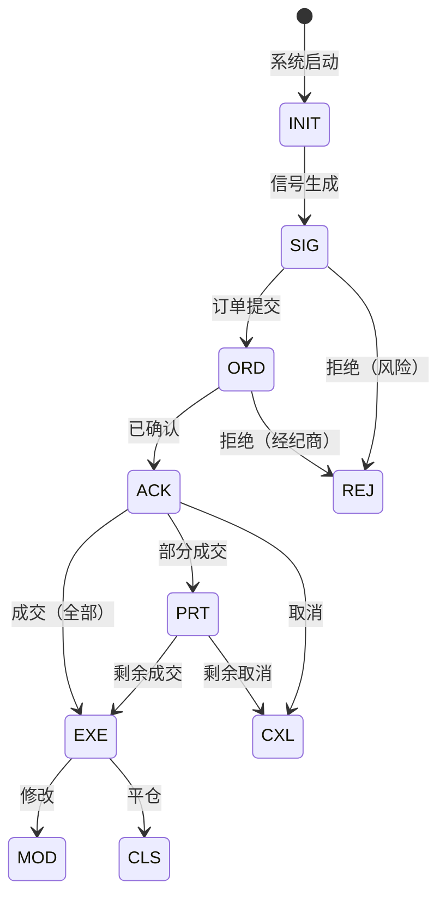

# VeritasChain Protocol (VCP) 规范
## 版本 1.1

**状态:** Production Ready  
**类别:** 金融科技 / 审计标准  
**日期:** 2025-12-30  
**维护者:** VeritasChain Standards Organization (VSO)  
**许可证:** CC BY 4.0 International  
**网站:** https://veritaschain.org

---

## 修订历史

| 版本 | 日期 | 变更内容 | 作者 |
|-----|------|---------|------|
| 1.1 | 2025-12-30 | 三层架构、外部锚定必需化、策略标识、VCP-XREF、完整性保证 | VSO技术委员会 |
| 1.0 | 2025-11-25 | 初始发布 | VSO技术委员会 |

---

## v1.0变更摘要

### 破坏性变更

**仅认证级别的破坏性变更。**

VCP v1.1引入了影响VC-Certified状态的新强制认证要求（外部锚定和策略标识）。

| 变更 | 协议兼容性 | 认证影响 |
|-----|----------|---------|
| PrevHash → OPTIONAL | ✅ 完全兼容 | 无影响（放宽） |
| 外部锚定 → REQUIRED | ✅ 完全兼容 | ⚠️ Silver层需添加锚定 |
| 策略标识 → REQUIRED | ✅ 完全兼容 | ⚠️ 所有层需添加字段 |

**摘要**: 现有v1.0实现保持**协议兼容**（可与v1.1系统互操作），但获取**v1.1 VC-Certified**状态可能需要额外组件。

> ※ v1.1是 **protocol-compatible / certification-stricter** 的更新。

### 主要变更

| # | 变更 | 影响 | 迁移 |
|---|------|------|------|
| 1 | **三层架构** | 第6节重构 | 仅文档 |
| 2 | **PrevHash变为OPTIONAL** | 哈希链链接不再必需 | 无（放宽） |
| 3 | **外部锚定对所有层REQUIRED** | Silver层必须实现每日锚定 | 需要实现 |
| 4 | **添加策略标识** | 新第5.5节 | 需要实现 |
| 5 | **添加VCP-XREF双重日志** | 新第5.6节 | OPTIONAL扩展 |

### 设计理由

v1.0规范通过为Silver层实现使外部锚定可选来优先考虑灵活性。然而，社区反馈指出，没有强制外部锚定，"Verify, Don't Trust"原则无法完全实现——因为日志生产者理论上可以在锚定前修改Merkle Root。

v1.1通过以下方式强化了这一点：
1. 使外部锚定对所有层REQUIRED（具有层适当的频率和Silver的轻量级选项）
2. 明确哈希链（PrevHash）是补充而非替代外部可验证性的OPTIONAL本地完整性机制
3. 建立分离关注点并明确完整性保证来源的三层架构

---

## 目录

1. [简介](#1-简介)
2. [合规层级](#2-合规层级)
3. [事件生命周期](#3-事件生命周期)
4. [数据模型](#4-数据模型)
5. [扩展模块](#5-扩展模块)
6. [完整性和安全层（三层架构）](#6-完整性和安全层三层架构)
7. [实现指南](#7-实现指南)
8. [监管合规](#8-监管合规)
9. [测试要求](#9-测试要求)
10. [从v1.0迁移](#10-从v10迁移)
11. [附录](#11-附录)
12. [参考文献](#12-参考文献)

---

## 1. 简介

### 1.1 目的

VeritasChain Protocol（VCP）是一个全球标准规范，用于以不可篡改和可验证的格式记录算法交易的"决策"和"执行结果"。VCP提供加密保护的证据链，在交易操作中建立真相（"Veritas"），确保符合包括MiFID II、GDPR、EU AI Act和新兴抗量子安全要求在内的国际法规。

> **完整性保证（v1.1新增）:** VCP v1.1将防篡改证据扩展到**完整性保证**，使第三方能够通过加密方式验证不仅事件未被篡改，而且**没有必需事件被省略**（省略攻击/分裂视图攻击）。这通过所有层的强制Merkle Tree构建和外部锚定实现，确保事件批次在锚定时可证明是完整的。

### 1.2 范围

VCP适用于：
- **高频交易（HFT）**系统
- **算法和AI驱动交易**平台
- **零售交易系统**（MT4/MT5）
- **加密货币交易所**
- **监管报告系统**

### 1.3 版本控制

VCP遵循语义化版本2.0.0：
- **主版本**：不兼容的API变更
- **次版本**：向后兼容的功能添加
- **修订版本**：向后兼容的bug修复

v1.x系列内保证完全向后兼容。

### 1.4 加密敏捷性

VCP实现加密敏捷性以确保未来安全：
- **当前默认**: Ed25519（为性能和安全优化）
- **支持算法**: Ed25519, ECDSA_SECP256K1, RSA_2048
- **未来保留**: 抗量子算法（DILITHIUM, FALCON）
- **迁移路径**: 自动算法升级功能

### 1.5 标准枚举

#### 1.5.1 SignAlgo枚举

| 值 | 算法 | 描述 | 状态 |
|---|------|------|-----|
| **ED25519** | Ed25519 | Edwards曲线数字签名 | DEFAULT |
| **ECDSA_SECP256K1** | ECDSA secp256k1 | Bitcoin/Ethereum兼容 | SUPPORTED |
| **RSA_2048** | RSA 2048位 | 遗留系统 | DEPRECATED |
| **DILITHIUM2** | CRYSTALS-Dilithium | 抗量子（NIST Level 2） | FUTURE |
| **FALCON512** | FALCON-512 | 抗量子（NIST Level 1） | FUTURE |

#### 1.5.2 HashAlgo枚举

| 值 | 算法 | 描述 | 状态 |
|---|------|------|-----|
| **SHA256** | SHA-256 | SHA-2系列，256位 | DEFAULT |
| **SHA3_256** | SHA3-256 | SHA-3系列，256位 | SUPPORTED |
| **BLAKE3** | BLAKE3 | 高性能哈希 | SUPPORTED |
| **SHA3_512** | SHA3-512 | SHA-3系列，512位 | FUTURE |

#### 1.5.3 ClockSyncStatus枚举

| 值 | 描述 | 适用层级 |
|---|------|---------|
| **PTP_LOCKED** | PTP同步锁定 | Platinum |
| **NTP_SYNCED** | NTP同步 | Gold |
| **BEST_EFFORT** | 尽力同步 | Silver |
| **UNRELIABLE** | 无可靠同步 | Silver（降级） |

#### 1.5.4 TimestampPrecision枚举

| 值 | 描述 | 小数位数 |
|---|------|---------|
| **NANOSECOND** | 纳秒精度 | 9 |
| **MICROSECOND** | 微秒精度 | 6 |
| **MILLISECOND** | 毫秒精度 | 3 |

### 1.6 核心模块

- **VCP-CORE**: 标准头部和安全层
- **VCP-TRADE**: 交易数据载荷模式
- **VCP-GOV**: 算法治理和AI透明度
- **VCP-RISK**: 风险管理参数记录
- **VCP-PRIVACY**: 通过加密粉碎进行隐私保护
- **VCP-RECOVERY**: 链中断恢复机制
- **VCP-XREF**: 交叉引用和双重日志（v1.1新增）

---

## 2. 合规层级

### 2.1 层级定义

| 层级 | 目标 | 时钟同步 | 序列化 | 签名 | 外部锚定 | 精度 |
|-----|------|---------|--------|-----|---------|-----|
| **Platinum** | HFT/交易所 | PTPv2 (<1µs) | SBE | Ed25519（硬件） | **REQUIRED（10分钟）** | NANOSECOND |
| **Gold** | 自营/机构 | NTP (<1ms) | JSON | Ed25519（客户端） | **REQUIRED（1小时）** | MICROSECOND |
| **Silver** | 零售/MT4/5 | 尽力而为 | JSON | Ed25519（委托） | **REQUIRED（24小时）** | MILLISECOND |

> **v1.0变更**: 外部锚定现在对所有层级REQUIRED，以确保外部可验证的完整性。对于Silver层，明确允许轻量级机制（例如OpenTimestamps、FreeTSA）。此变更使所有层级与VCP的"Verify, Don't Trust"原则保持一致。

### 2.2 层级特定要求

#### 2.2.1 Platinum层级
```yaml
要求:
  时钟:
    协议: PTPv2 (IEEE 1588-2019)
    精度: <1微秒
    状态: 必须PTP_LOCKED
  性能:
    吞吐量: >1M事件/秒
    延迟: <10µs/事件
    存储: 二进制 (SBE/FlatBuffers)
  外部锚定:
    频率: 每10分钟
    目标: 区块链或RFC 3161 TSA
    证明类型: 完整Merkle证明
  实现:
    语言: [C++, Rust, FPGA]
    技术: [内核绕过, RDMA, 零拷贝]
```

#### 2.2.2 Gold层级
```yaml
要求:
  时钟:
    协议: NTP/Chrony
    精度: <1毫秒
    状态: 必须NTP_SYNCED
  性能:
    吞吐量: >100K事件/秒
    延迟: <100µs/事件
    持久化: 必须WAL/队列 (Kafka, Redis)
  外部锚定:
    频率: 每1小时
    目标: RFC 3161 TSA或第三方认证数据库
    证明类型: Merkle root + 审计路径
  实现:
    语言: [Python, Java, C#]
    部署: 云就绪 (AWS/GCP/Azure)
```

#### 2.2.3 Silver层级
```yaml
要求:
  时钟:
    协议: 系统时钟
    精度: 尽力而为
    状态: 允许BEST_EFFORT/UNRELIABLE
  性能:
    吞吐量: >1K事件/秒
    延迟: <1秒
    通信: 推荐异步
  外部锚定:
    频率: 每24小时（每日）
    目标: 带完整性认证的数据库或公共时间戳服务
    证明类型: 仅Merkle root
  实现:
    语言: [MQL5, Python]
    兼容性: MT4/MT5 DLL集成
```

> **注意**: Silver层级不适用于受MiFID II RTS 25、SEC Rule 17a-4或同等时钟同步要求约束的监管级算法交易系统。Silver层级适用于开发、测试、回测分析和非监管交易场景。

> **半监管用例指南**: 实际上，Silver层级日志可能用于具有间接监管含义的场景（例如向监管机构展示回测结果、内部审计文档）。在这种情况下：
> 
> | 方面 | Silver层级能力 | 合理保证水平 |
> |-----|--------------|------------|
> | **时间戳精度** | BEST_EFFORT（系统时钟） | 仅供参考；不适用于延迟纠纷 |
> | **事件完整性** | 每日Merkle锚定 | 批量级完整性；24小时窗口内可能存在间隙 |
> | **链连续性** | PrevHash OPTIONAL | 除非启用，否则无实时间隙检测 |
> 
> 为在24小时窗口内获得更高保证，实现可以执行**日内手动锚定**（例如在交易时段结束时）或将锚定间隔缩短至12小时。这不会改变层级分类，但会提高可审计性。
>
> **完整性保证范围:** Silver层级在锚定时提供批量级完整性保证，而非持续实时完整性。
>
> 使用Silver层级日志进行监管解释的组织应向当局明确披露这些限制。如需更高保证，请升级到Gold层级。

---

## 3. 事件生命周期

*[第3节从v1.0继承]*

### 3.1 事件状态图



### 3.2 事件类型注册表

*[事件类型注册表从v1.0未变更 - 完整列表请参阅v1.0规范]*

---

## 4. 数据模型

*[第4节从v1.0未变更]*

---

## 5. 扩展模块

*[第5.1-5.4节从v1.0未变更]*

### 5.5 策略标识（v1.1新增）

#### 5.5.1 目的

策略标识确保每个VCP事件明确声明其合规层级和注册策略。这使验证者能够应用适当的验证规则，并支持多层级部署。

#### 5.5.2 模式定义

```json
{
  "PolicyIdentification": {
    "Version": "1.1",
    "PolicyID": "string",           // REQUIRED: 唯一策略标识符
    "ConformanceTier": "enum",      // REQUIRED: SILVER | GOLD | PLATINUM
    "RegistrationPolicy": {
      "Issuer": "string",           // 运营策略的组织
      "PolicyURI": "string",        // 策略文档的URI
      "EffectiveDate": "int64",     // 策略生效时间戳
      "ExpirationDate": "int64"     // 策略过期时间（可选）
    },
    "VerificationDepth": {
      "HashChainValidation": "boolean",   // 是否使用哈希链
      "MerkleProofRequired": "boolean",   // v1.1中始终为true
      "ExternalAnchorRequired": "boolean" // v1.1中始终为true
    }
  }
}
```

#### 5.5.3 要求

| 字段 | 要求 | 描述 |
|-----|------|-----|
| PolicyID | REQUIRED | 注册策略的唯一标识符 |
| ConformanceTier | REQUIRED | 必须是以下之一：SILVER, GOLD, PLATINUM |
| RegistrationPolicy.Issuer | REQUIRED | 组织名称或标识符 |
| VerificationDepth | REQUIRED | 声明验证能力 |

#### 5.5.4 PolicyID命名约定（v1.1新增）

为确保全局唯一性而无需中央注册表，PolicyID应遵循**发行者域名 + 本地ID**格式：

```
PolicyID = <反向域名>:<本地标识符>

示例：
  org.veritaschain.prod:hft-system-001
  com.example.trading:gold-algo-v2
  jp.co.broker:silver-mt5-bridge
```

| 组件 | 格式 | 示例 |
|-----|------|-----|
| **反向域名** | 发行者域名的反向DNS表示法 | `org.veritaschain` |
| **分隔符** | 冒号（`:`） | `:` |
| **本地标识符** | 发行者定义，字母数字和连字符 | `prod-hft-001` |

> **注意**: VSO不运营PolicyID注册表。唯一性通过域名所有权实现。没有域名的组织可以使用`local:<组织名>:<本地ID>`格式，但唯一性保证较弱。

#### 5.5.5 与合规层级的关系

合规层级（Silver/Gold/Platinum）代表**验证深度**，而非独立的注册策略。单个组织可以为不同用例在不同层级运营多个策略：

- **Platinum**: 生产HFT系统
- **Gold**: 标准算法交易
- **Silver**: 开发、测试、回测

注册策略标识符必须明确包含在每个VCP事件的载荷或元数据中。

### 5.6 VCP-XREF: 交叉引用和双重日志（v1.1新增）

#### 5.6.1 目的

VCP-XREF启用**双重日志**——来自多方的独立VCP事件流可以交叉引用以检测差异。这提供了比单方日志更高级别的保证，确保需要各方之间的串通才能不被发现地操纵记录。

```
┌──────────────────┐          ┌──────────────────┐
│   交易算法        │─────────▶│      经纪商       │
└────────┬─────────┘          └────────┬─────────┘
         │                             │
         ▼                             ▼
┌──────────────────┐          ┌──────────────────┐
│   VCP Sidecar    │          │   经纪商 VCP      │
│   （交易者侧）    │          │   （经纪商侧）     │
└────────┬─────────┘          └────────┬─────────┘
         │                             │
         └───────────┬─────────────────┘
                     ▼
            ┌─────────────────┐
            │    交叉引用      │
            │      验证       │
            └─────────────────┘

保证: 除非双方串通，
      一方的省略或修改
      可被另一方检测到。
```

#### 5.6.2 用例

| 场景 | 方A | 方B | 优势 |
|-----|-----|-----|-----|
| **自营公司交易** | 交易者 | 自营公司 | 防止支付纠纷 |
| **经纪商执行** | 算法提供者 | 经纪商 | 验证最佳执行 |
| **多场所** | 智能订单路由器 | 交易所 | 跨场所审计 |
| **监管审计** | 交易公司 | 监管机构 | 独立验证 |

#### 5.6.3 模式定义

```json
{
  "VCP-XREF": {
    "Version": "1.1",
    "CrossReferenceID": "uuid",          // REQUIRED: 共享引用ID
    "PartyRole": "enum",                  // REQUIRED: INITIATOR | COUNTERPARTY | OBSERVER
    "CounterpartyID": "string",           // REQUIRED: 对手方标识符
    "SharedEventKey": {
      "OrderID": "string",                // 主要关联键
      "AlternateKeys": ["string"],        // 附加关联键
      "Timestamp": "int64",               // 用于匹配的事件时间戳
      "ToleranceMs": "int32"              // 时间戳匹配容差
    },
    "ExpectedCounterpartyHash": "string", // OPTIONAL: 预期的对手方哈希
    "ReconciliationStatus": "enum",       // PENDING | MATCHED | DISCREPANCY | TIMEOUT
    "DiscrepancyDetails": {
      "Field": "string",
      "LocalValue": "string",
      "CounterpartyValue": "string",
      "Severity": "enum"                  // INFO | WARNING | CRITICAL
    }
  }
}
```

#### 5.6.4 参与方角色

| 角色 | 描述 | 职责 |
|-----|------|-----|
| **INITIATOR** | 发起交易的一方 | 生成CrossReferenceID，首先记录日志 |
| **COUNTERPARTY** | 接收/执行交易的一方 | 引用CrossReferenceID，记录响应 |
| **OBSERVER** | 第三方观察者（例如监管机构） | 只读交叉引用访问 |

#### 5.6.5 安全考虑

| 威胁 | 缓解措施 |
|-----|---------|
| **单方操纵** | 对手方日志提供独立证据 |
| **串通** | 外部锚定使事后串通可检测 |
| **重放攻击** | CrossReferenceID + 时间戳唯一性 |
| **拒绝记录** | 缺少对手方记录本身就是证据 |

> **关键保证**: 如果方A声称事件发生而方B否认，双方VCP-XREF记录的存在与否提供**不可否认的证据**。操纵需要双方串通和外部锚定被破坏。

#### 5.6.6 要求

| 要求 | 级别 | 注意 |
|-----|------|-----|
| VCP-XREF扩展 | OPTIONAL | 对于易发生纠纷的场景RECOMMENDED |
| CrossReferenceID格式 | UUID v4或v7 | 必须全局唯一 |
| SharedEventKey | 至少一个键 | 推荐OrderID作为主键 |
| 外部锚定 | REQUIRED | 双方必须独立锚定 |
| 保留 | 符合监管最低要求 | 通常7年 |

---

## 6. 完整性和安全层（三层架构）

### 6.0 架构概述（v1.1新增）

VCP v1.1引入了明确的**三层架构**用于完整性和安全性。此结构阐明了不同加密机制如何协同工作，以及每层的保证从何而来。

```
┌─────────────────────────────────────────────────────────────────────┐
│                                                                     │
│  第3层: 外部可验证性                                                 │
│  ─────────────────                                                  │
│  目的: 无需信任生产者的第三方验证                                     │
│                                                                     │
│  组件:                                                              │
│  ├─ 数字签名 (Ed25519/Dilithium): REQUIRED                         │
│  ├─ 时间戳 (双格式 ISO+int64): REQUIRED                             │
│  └─ 外部锚定 (区块链/TSA): REQUIRED                                 │
│                                                                     │
│  频率: 层级相关 (10分钟 / 1小时 / 24小时)                            │
│                                                                     │
├─────────────────────────────────────────────────────────────────────┤
│                                                                     │
│  第2层: 集合完整性    ← 外部可验证性的核心                           │
│  ─────────────────                                                  │
│  目的: 证明事件批次的完整性                                          │
│                                                                     │
│  组件:                                                              │
│  ├─ Merkle Tree (RFC 6962): REQUIRED                               │
│  ├─ Merkle Root: REQUIRED                                          │
│  └─ 审计路径 (用于验证): REQUIRED                                   │
│                                                                     │
│  注: 启用第三方验证批次完整性                                        │
│                                                                     │
├─────────────────────────────────────────────────────────────────────┤
│                                                                     │
│  第1层: 事件完整性                                                   │
│  ─────────────────                                                  │
│  目的: 单个事件的完整性                                              │
│                                                                     │
│  组件:                                                              │
│  ├─ EventHash (规范化事件的SHA-256): REQUIRED                       │
│  └─ PrevHash (链接到前一事件): OPTIONAL                             │
│                                                                     │
│  注: PrevHash提供实时检测 (v1.1中OPTIONAL)                          │
│                                                                     │
└─────────────────────────────────────────────────────────────────────┘
```

#### 6.0.1 层级职责

| 层级 | 目的 | REQUIRED组件 | OPTIONAL组件 |
|-----|------|-------------|-------------|
| **第3层** | 外部可验证性 | 签名、时间戳、外部锚定 | 双重签名（PQC） |
| **第2层** | 集合完整性 | Merkle Tree、Merkle Root、审计路径 | - |
| **第1层** | 事件完整性 | EventHash | PrevHash（哈希链） |

#### 6.0.2 此架构的原因

**问题**: 为什么PrevHash（哈希链）在v1.1中变为OPTIONAL，而在v1.0中是REQUIRED？

**回答**: 

基于PrevHash的哈希链在v1.0中是REQUIRED，以优先考虑实时、进程内的篡改检测。这仍然是一个有效且有价值的完整性机制。

在v1.1中，由于通过基于Merkle的集合完整性（第2层）结合强制外部锚定（第3层）可以实现同等或更强的完整性保证，PrevHash变为OPTIONAL。

此变更：
1. 在不牺牲外部可验证性的情况下**简化Silver层实现**
2. 通过强调外部可验证的证明来**与"Verify, Don't Trust"原则保持一致**
3. **与使用哈希链的v1.0实现保持完全向后兼容**

受益于实时篡改检测的实现（例如HFT系统）应继续使用PrevHash。

---

### 6.1 第1层: 事件完整性

*[EventHash计算代码示例从v1.0继承，PrevHash更新为OPTIONAL]*

### 6.2 第2层: 集合完整性

*[符合RFC 6962的Merkle Tree构造从v1.0继承]*

### 6.3 第3层: 外部可验证性

#### 6.3.3 外部锚定（REQUIRED - v1.1变更）

**重要变更**: 外部锚定对所有层级REQUIRED，以实现外部可验证的完整性。

对于Silver层，轻量级或委托的锚定机制被明确允许和预期。此要求确保即使是最简单的VCP实现也能提供第三方可验证的完整性证明。

| 层级 | 频率 | 锚定目标 | 证明类型 |
|-----|------|---------|---------|
| **Platinum** | 10分钟 | 区块链（Ethereum等）或RFC 3161 TSA | 完整Merkle证明 |
| **Gold** | 1小时 | RFC 3161 TSA或认证数据库 | Merkle root + 审计路径 |
| **Silver** | 24小时 | 公共时间戳服务或认证数据库 | 仅Merkle root |

##### 认证数据库要求（v1.1新增）

要使"认证数据库"成为合格的锚定目标，必须满足以下最低标准：

| 标准 | 要求 | 验证 |
|-----|------|-----|
| **第三方审计** | 独立方年度审计 | 审计报告可用 |
| **篡改检测** | 加密完整性检查（哈希链、Merkle或同等） | 技术文档 |
| **访问控制** | 带审计日志的基于角色的访问 | SOC 2 Type II或同等 |
| **保留策略** | 数据保留 ≥ 监管最低值（通常7年） | 策略文档 |
| **可用性SLA** | ≥ 99.9%正常运行时间承诺 | SLA文档 |

> **注意**: "公共时间戳服务"（Silver层）没有认证要求，但提供较弱的保证。对于监管用例，建议使用认证数据库或更高级别。

##### 认证数据库示例（非穷尽）

| 示例 | 认证级别 | 注意 |
|-----|---------|-----|
| AWS QLDB + SOC 2 Type II | 高 | 带年度审计的不可变账本 |
| Azure SQL Ledger + SOC 2 | 高 | 内置加密验证 |
| Google Cloud Spanner + SOC 2 | 高 | 带审计跟踪的分布式数据库 |
| 自托管PostgreSQL + 年度加密审计 | 中 | 需要第三方哈希验证 |
| 无认证的内部数据库 | **不可接受** | 不符合"认证"标准 |

有关详细的认证接受标准，请参阅：**VSO-CAB-REQ-001**（CAB认证要求）

##### 锚定目标不可用（v1.1新增）

实现必须处理锚定目标不可用的情况：

| 场景 | 必需操作 |
|-----|---------|
| **临时中断** | 将锚定请求排队；指数退避重试 |
| **永久停止** | 30天内迁移到替代锚定目标 |
| **锚定验证失败** | 保留本地AnchorRecord副本作为备份证明 |

实现应维护所有AnchorRecord的完整本地副本，以便即使原始锚定目标不可用也能进行验证。

---

## 7. 实现指南

*[第7节大部分从v1.0继承，包含三层架构更新]*

---

## 8. 监管合规

*[核心要求从v1.0未变更]*

### 8.1 监管上下文中的ClockSyncStatus使用（v1.1新增）

VCP区分时间戳**精度**（存储格式）和**准确度**（时钟同步）。监管评估应考虑两者：

#### 8.1.1 合规性的ClockSyncStatus解释

| ClockSyncStatus | 监管解释 | 适用标准 |
|-----------------|---------|---------|
| **PTP_LOCKED** | 权威时间戳；适用于延迟纠纷 | MiFID II RTS 25（网关级别） |
| **NTP_SYNCED** | 可靠时间戳；适用于订单排序 | MiFID II RTS 25（一般）、CAT Rule 613 |
| **BEST_EFFORT** | 指示性时间戳；不适用于精确排序 | 仅内部审计 |
| **UNRELIABLE** | 时间戳可能明显不准确 | 仅开发/测试 |

---

## 9. 测试要求

### 9.1 合规性测试套件（v1.1更新）

#### 9.1.1 层级要求矩阵

| 测试类别 | Silver | Gold | Platinum |
|---------|--------|------|----------|
| 模式验证 | Required | Required | Required |
| UUID v7格式 | Required | Required | Required |
| 时间戳（MILLISECOND） | Required | Required | Required |
| 时间戳（MICROSECOND） | Optional | Required | Required |
| 时间戳（NANOSECOND） | Optional | Optional | Required |
| EventHash计算 | Required | Required | Required |
| 哈希链（PrevHash） | **Optional** | **Optional** | **Optional** |
| 数字签名 | Required | Required | Required |
| Merkle Tree构造 | Required | Required | Required |
| Merkle证明验证 | Required | Required | Required |
| **外部锚定** | **Required** | **Required** | **Required** |
| **策略标识** | **Required** | **Required** | **Required** |
| 时钟同步（BEST_EFFORT） | Required | Required | Required |
| 时钟同步（NTP_SYNCED） | Optional | Required | Required |
| 时钟同步（PTP_LOCKED） | Optional | Optional | Required |

> **v1.0变更**:
> - 哈希链: 所有层从Required改为Optional
> - 外部锚定: 从Optional/Recommended/Required改为所有层Required
> - 策略标识: 所有层的新要求

> **关于Silver层Merkle证明验证的注意**: 对于Silver层，"Merkle证明验证"指的是能够验证给定EventHash包含在锚定的Merkle Root中（批量级验证）。可以省略每事件审计路径**存储**，但实现必须保留足够的数据以在审计或监管查询请求时**按需生成审计路径**。Gold和Platinum层必须支持完整的每事件审计路径生成和存储。

#### 9.1.2 关键测试

某些测试标记为**CRITICAL**。关键测试的任何失败都会导致自动认证失败。

v1.1中的关键测试：

| 测试ID | 描述 | v1.0 | v1.1 |
|-------|------|------|------|
| SCH-001 | 事件结构验证 | Critical | Critical |
| UID-001 | UUID v7格式 | Critical | Critical |
| HCH-001 | Genesis事件prev_hash | Critical | **已移除** |
| HCH-003 | 哈希计算算法 | Critical | Critical（仅EventHash） |
| SIG-001 | 签名算法合规 | Critical | Critical |
| **MKL-001** | Merkle tree构造 | - | **Critical（新增）** |
| **MKL-002** | Merkle证明验证 | - | **Critical（新增）** |
| **ANC-001** | 外部锚定存在 | - | **Critical（新增）** |
| **POL-001** | 策略标识 | - | **Critical（新增）** |

#### 9.1.3 非关键测试（v1.1新增）

非关键测试不会导致自动认证失败，但会在认证报告中报告。重复的非关键失败可能影响认证续期。

| 测试ID | 描述 | Silver | Gold | Platinum | 注意 |
|-------|------|--------|------|----------|-----|
| **HCH-002** | 哈希链启用（PrevHash） | Optional | Recommended | Recommended | 用于RTS25/CAT对齐 |
| **ANC-002** | 锚定延迟阈值 | Warning >24h | Warning >1h | Warning >10min | 2倍阈值为违规 |
| **ANC-003** | 锚定目标可用性 | Check | Check | Check | 建议备份锚定 |
| **CLK-001** | 时钟同步状态一致性 | Report | Verify NTP | Verify PTP | 见第8.1节 |
| **XREF-001** | 交叉引用ID唯一性 | Optional | Optional | Optional | 如果启用VCP-XREF |
| **XREF-002** | 交叉引用对账 | Optional | Optional | Optional | 如果启用VCP-XREF |

> **关于HCH-002的注意**: 虽然v1.1中PrevHash是OPTIONAL，但针对监管用例（MiFID II RTS 25、SEC CAT Rule 613）的实现应启用哈希链链接。建议Gold和Platinum层实现启用此功能。

### 9.2 认证治理

VC-Certified认证由VSO认可的合规评估机构（CAB）颁发，而非VSO直接颁发。VSO作为**方案所有者**，负责标准开发和CAB认可。

```
VSO（方案所有者）
  │
  │  认可（Accreditation）
  ▼
认可CAB（多个）
  │
  │  认证（Certification）
  ▼
VCP采用者
```

| 实体 | 角色 | 职责 |
|-----|------|-----|
| **VSO** | 方案所有者 | 标准开发、CAB认可、测试标准 |
| **认可CAB** | 认证机构 | 认证颁发、合规评估 |

有关详细的治理结构，请参阅：**VSO-GOV-SCHEME-001**（VC-Certified方案治理结构）

---

## 10. 从v1.0迁移

### 10.1 向后兼容性

VCP v1.1与v1.0完全向后兼容：

| v1.0功能 | v1.1行为 |
|---------|---------|
| 带PrevHash的事件 | 完全支持，继续工作 |
| 无外部锚定的事件 | **必须添加锚定**（有宽限期） |
| 无PolicyID的事件 | **必须添加PolicyID**（有宽限期） |

### 10.2 迁移步骤

#### 针对Silver层实现

1. **添加外部锚定**（REQUIRED）
   - 实现每日Merkle root锚定
   - 选择锚定目标（建议使用OpenTimestamps以简化）
   - 更新Security对象包含MerkleRoot和AnchorReference

2. **添加策略标识**（REQUIRED）
   - 为实现定义PolicyID
   - 向所有事件添加PolicyIdentification

3. **可选: 移除哈希链**
   - 如果哈希链增加复杂性，可以移除
   - 将PrevHash设置为null或完全省略

### 10.3 宽限期

| 要求 | 宽限期 | 硬性截止日期 |
|-----|-------|------------|
| 外部锚定（Silver） | 6个月 | 2026-06-25 |
| 策略标识 | 3个月 | 2026-03-25 |
| Security中的Merkle字段 | 3个月 | 2026-03-25 |

硬性截止日期后，仅v1.0的实现将无法为新认证获得VC-Certified状态。

---

## 11. 附录

### 附录D: 三层架构摘要（新增）

```
┌─────────────────────────────────────────────────────────────┐
│  VCP v1.1 三层架构                                          │
├─────────────────────────────────────────────────────────────┤
│                                                             │
│  "Verify, Don't Trust"                                      │
│                                                             │
│  第3层: 外部可验证性                                        │
│  ┌─────────────────────────────────────────────────────┐   │
│  │ • 签名: REQUIRED                                    │   │
│  │ • 时间戳: REQUIRED                                  │   │
│  │ • 外部锚定: REQUIRED（层级相关频率）                 │   │
│  │                                                     │   │
│  │ → 第三方可在不信任生产者的情况下验证                 │   │
│  └─────────────────────────────────────────────────────┘   │
│                           │                                 │
│                           ▼                                 │
│  第2层: 集合完整性 ← 外部可验证性的核心                     │
│  ┌─────────────────────────────────────────────────────┐   │
│  │ • Merkle Tree (RFC 6962): REQUIRED                  │   │
│  │ • Merkle Root: REQUIRED                             │   │
│  │ • 审计路径: REQUIRED                                │   │
│  │                                                     │   │
│  │ → 证明批次完整性                                    │   │
│  └─────────────────────────────────────────────────────┘   │
│                           │                                 │
│                           ▼                                 │
│  第1层: 事件完整性                                          │
│  ┌─────────────────────────────────────────────────────┐   │
│  │ • EventHash: REQUIRED                               │   │
│  │ • PrevHash (哈希链): OPTIONAL                       │   │
│  │                                                     │   │
│  │ → 单个事件的完整性                                  │   │
│  └─────────────────────────────────────────────────────┘   │
│                                                             │
└─────────────────────────────────────────────────────────────┘
```

### 附录E: 后量子密码学迁移指南（非规范性）

本附录为计划后量子密码学（PQC）迁移的实现提供非约束性指南。这些建议是信息性的，不构成v1.1要求。

#### E.1 双重签名策略

在PQC过渡期间，实现可以使用双重签名来保持向后兼容性同时添加量子抗性：

```json
{
  "Security": {
    "Signature": "base64(Ed25519_signature)",
    "SignAlgo": "ED25519",
    "PQCSignature": "base64(Dilithium2_signature)",
    "PQCSignAlgo": "DILITHIUM2"
  }
}
```

#### E.2 推荐算法组合

| 用例 | 经典 | 后量子 | 注意 |
|-----|------|-------|-----|
| **标准** | ED25519 | DILITHIUM2 | 平衡安全性/性能 |
| **紧凑** | ED25519 | FALCON512 | 更小的签名 |
| **高保证** | ED25519 | DILITHIUM3 | NIST Level 3 |

#### E.3 迁移时间线建议

| 阶段 | 时间线 | 操作 |
|-----|-------|-----|
| **准备** | 2025-2026 | 实现双重签名能力 |
| **混合** | 2027-2029 | 在生产中部署双重签名 |
| **过渡** | 2030+ | 逐步淘汰仅经典签名 |

> **注意**: 此时间线为建议性。实际迁移应与NIST PQC标准化进度和监管指导保持一致。

---

## 12. 参考文献

### 标准
- **RFC 9562**: Universally Unique IDentifier (UUID) v7
- **RFC 8785**: JSON Canonicalization Scheme (JCS)
- **RFC 6962**: Certificate Transparency
- **RFC 3161**: Time-Stamp Protocol (TSP)
- **IEEE 1588-2019**: Precision Time Protocol (PTP)
- **ISO 20022**: 通用金融行业消息方案

### 法规
- **MiFID II**: 金融工具市场指令
- **RTS 24/25**: 监管技术标准
- **CAT Rule 613**: 综合审计跟踪
- **GDPR**: 通用数据保护条例
- **EU AI Act**: 人工智能法案 (2024)

### 密码学
- **FIPS 186-5**: 数字签名标准
- **FIPS 204**: 基于模格的数字签名标准 (Dilithium)
- **NIST SP 800-208**: 后量子密码学
- **RFC 8032**: Edwards曲线数字签名算法 (EdDSA)

### 实现
- **FIX Protocol**: 金融信息交换
- **SBE**: 简单二进制编码
- **FlatBuffers**: 内存高效序列化库
- **Apache Kafka**: 分布式事件流
- **Redis Streams**: 内存数据结构存储

---

## 联系信息

**VeritasChain Standards Organization (VSO)**  
网站: https://veritaschain.org  
邮箱: standards@veritaschain.org  
GitHub: https://github.com/veritaschain  
技术支持: support@veritaschain.org

---

## 许可证

本规范根据Creative Commons Attribution 4.0 International (CC BY 4.0)许可。

您可以自由：
- **共享**: 以任何媒介或格式复制和再分发材料
- **改编**: 重新混合、转换和基于材料构建

遵循以下条款：
- **署名**: 您必须给予VSO适当的署名

---

## 致谢

VeritasChain Protocol v1.1的开发得益于以下方面的宝贵反馈：
- Dick Brooks（IETF SCITT WG关于策略标识的反馈）
- 金融行业从业者
- 监管合规专家
- 密码学研究人员
- 开源社区贡献者

特别感谢早期采用者和Beta测试人员，他们识别了v1.0中外部锚定要求的逻辑不一致性。

---

*VeritasChain Protocol (VCP) 规范 v1.1 结束*
